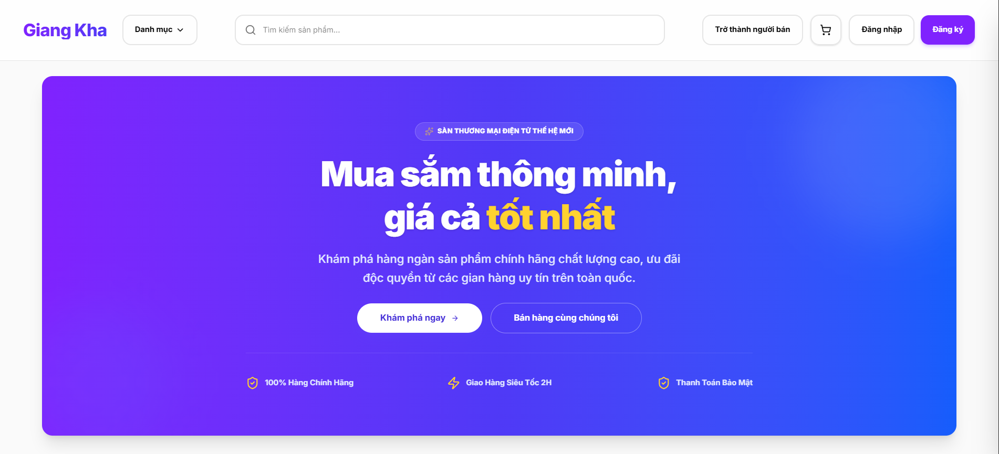
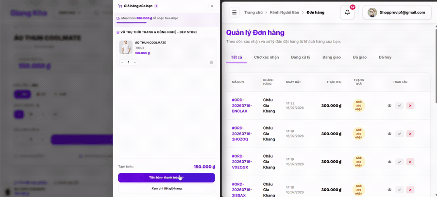
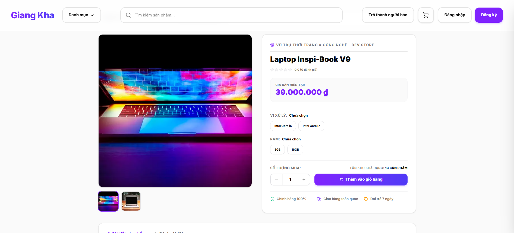
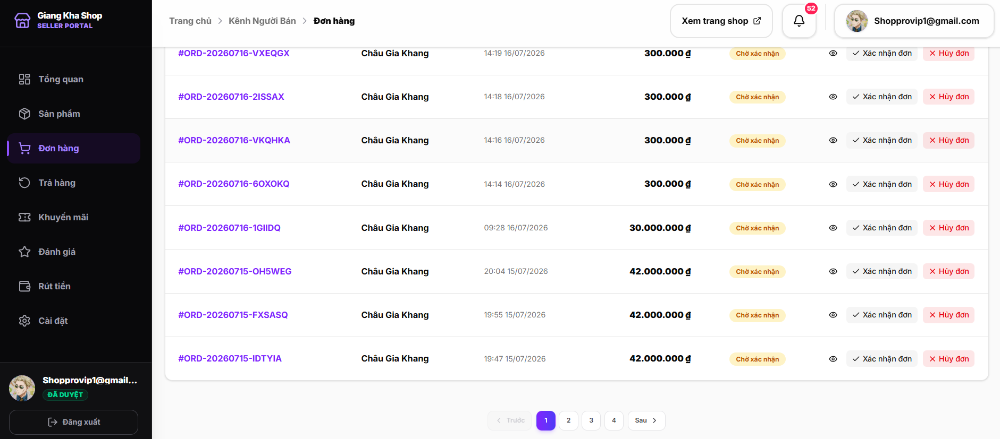
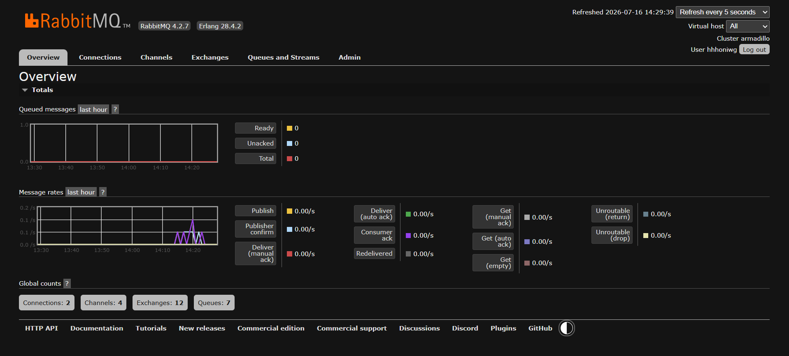
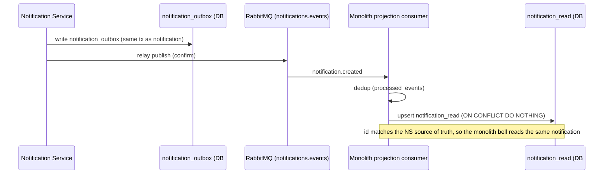
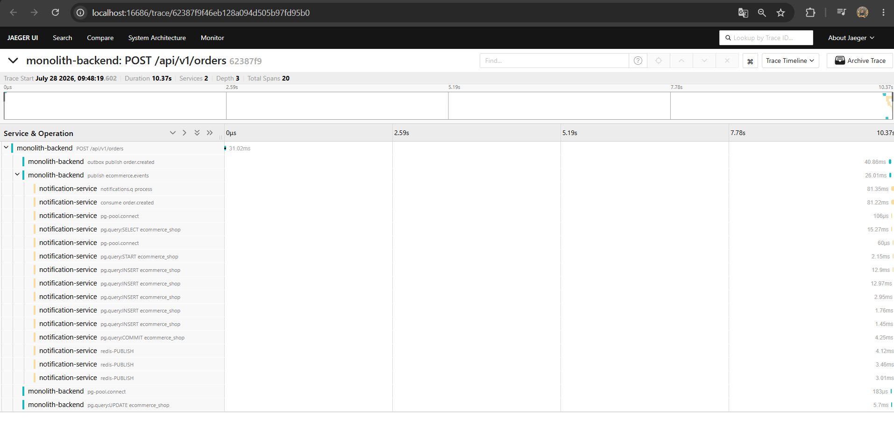
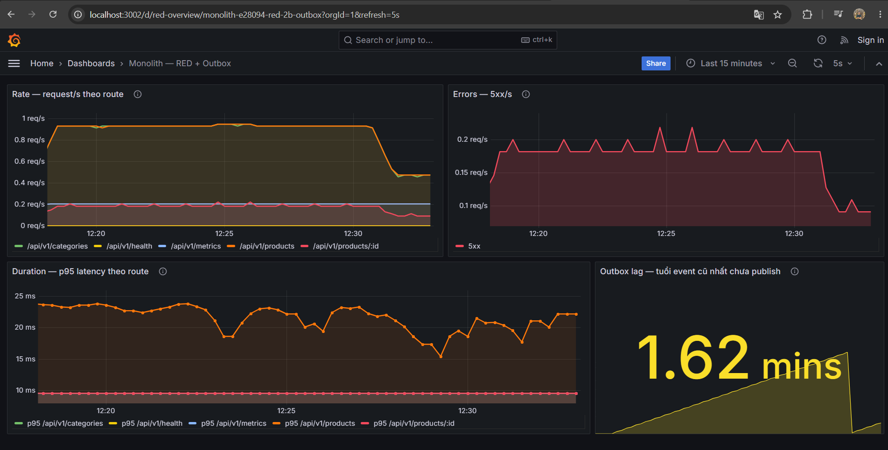

# Fullstack Multi-Vendor E-Commerce

A production-deployed multi-vendor marketplace (customer · seller · admin) built with **NestJS**,
**Next.js**, and **PostgreSQL** — featuring an **event-driven notification system split into its own
microservice** (transactional outbox, message broker, CQRS read model, cross-process WebSocket).

**🔗 [Live Demo](https://fullstack-multi-vendor-ecommerce.vercel.app)** ·
**[API Docs (Swagger)](https://fullstack-multi-vendor-ecommerce.onrender.com/api/docs)** ·
**[Source](https://github.com/chaugiakhang193/fullstack-multi-vendor-ecommerce)**

> ⏳ The API runs on a free-tier host — the **first request may take ~50s** to cold-start, then it's fast.

<!-- SCREENSHOT: storefront homepage — save as docs/screenshots/home.png -->


---

## ✨ Highlights

- **Distributed architecture** — notifications run as a **separate microservice** with its own database
  (database-per-service), communicating with the monolith over **RabbitMQ** + **Redis**.
- **Reliable messaging** — **transactional outbox** + **publisher confirms** + **idempotent consumers**
  with a dedup ledger and **DLQ retry** guarantee notifications are never lost or duplicated.
- **CQRS read model** — the microservice owns the source of truth; the monolith keeps an
  eventually-consistent read projection so the notification bell stays fast.
- **Cross-process realtime** — Socket.IO with a **Redis adapter/emitter** lets the microservice push
  WebSocket events to clients connected to the monolith.
- **Zero-downtime migration** — the notification path was carved out of the monolith using the
  **strangler-fig pattern** with a feature-flag cutover, verified in production.
- **End-to-end distributed tracing** — a single **OpenTelemetry** trace follows one request through the
  monolith, the **outbox table**, **RabbitMQ**, and into the notification service, so **both services
  appear under one trace id**, plus Prometheus/Grafana **RED dashboards** and a k6 load baseline.
- **Scale & scope** — **15 feature modules**, **113 REST endpoints**, **14 domain event types**,
  **2 services / 2 databases**.
- **Production-grade** — CI/CD (GitHub Actions → GHCR → Render), Docker multi-stage, structured
  logging (pino), Sentry, CodeQL, Dependabot.

---

## 🖼️ Screenshots

**Realtime notification across two users** — a customer places an order (left) and the seller receives
the matching order live (right, same order id), with no page refresh:



| Product detail | Seller portal |
|---|---|
|  |  |

---

## 🧩 Features

**Customer** — browse & search products, multi-shop cart, checkout with shipping & coupons, order
tracking, returns, product reviews, realtime notifications, Google login.

**Seller** — shop setup, product & variant management, order fulfilment, payouts, a stats dashboard,
and realtime new-order alerts.

**Admin** — user management, shop approval, product moderation (take-down / restore), payout approval.

---

## 🏛️ Architecture: distributed notification system

Notifications (new order, status change, review, payout, return…) are handled by a **dedicated
microservice**, carved out of the monolith with the **strangler-fig** pattern. An event's journey
guarantees notifications are **never lost or duplicated**, even when a service or the broker is flaky.

### Mechanisms (mapped to code)

| Mechanism | Where |
|-----------|-------|
| **Transactional outbox (both directions)** | `outbox_event` (monolith→NS) · `notification_outbox` (NS→monolith) — written in the same business transaction |
| **Polling publisher + publisher confirms** | `outbox.relay.ts` · `notification-outbox.relay.ts` — poll unpublished rows, mark `published_at` only after broker confirm |
| **Topic exchange + routing keys** | `ecommerce.events` (order.\* / review.\* / payout.\* / return.\* / shop.\*) |
| **DLX + TTL retry + parking-lot DLQ** | `notifications.dlx` → `notifications.retry` (TTL 30s, max 5) → `notifications.dlq` (manual inspect) |
| **Idempotent consumer** | `processed_events` (one per service) — dedup by `eventId`; unique-violation = already processed |
| **At-least-once → effectively-exactly-once** | outbox gives at-least-once; dedup + `ON CONFLICT DO NOTHING` makes it effectively exactly-once |
| **CQRS read model** | NS holds the **source of truth** (`notification`, DB#2); monolith keeps a **read projection** (`notification_read`, DB#1) for the bell |
| **Database-per-service** | DB#1 (monolith) and DB#2 (NS) are fully separate — they only talk via broker + Redis |
| **Cross-process WebSocket** | socket.io **redis-adapter** (monolith holds the client sockets) + **redis-emitter** (NS emits into the adapter) |
| **Scale-to-zero + event-driven wake** | NS sleeps when idle (free tier); the monolith relay "pokes" `/health` after publishing to wake it |
| **Strangler cutover** | feature-flag `NOTIFICATION_MODE` (inprocess→distributed), zero-downtime — see [Migration](#-migration-monolith--microservice-strangler-fig) |

### Architecture diagram


**Live RabbitMQ broker** — the exchanges/queues, DLX/retry/DLQ topology, and message rates in production:



### Sequence 🅐 — realtime to the client (via Redis)

```mermaid
sequenceDiagram
    participant U as User action
    participant BE as Monolith
    participant MQ as RabbitMQ
    participant NS as Notification Service
    participant R as Redis
    participant C as Client (socket)

    U->>BE: place order / change status
    BE->>BE: write outbox_event (same business tx)
    BE->>MQ: relay publish (confirm) → ecommerce.events
    MQ->>NS: notifications.q
    NS->>NS: dedup (processed_events) + write notification (DB#2)
    NS->>R: redis-emitter emits to user/shop/admin room
    R->>BE: redis-adapter (monolith holds the socket)
    BE->>C: realtime WS event
    Note over NS,C: WS is best-effort — a Redis failure does not block ack, and DB#2 stays source of truth
```



### Sequence 🅑 — projection back to the monolith (via RabbitMQ)



---

## 🔭 Observability

> 📖 **Deep dive:** [`docs/observability.md`](docs/observability.md) — the two pipelines, how trace
> context is carried across the outbox and the broker, and the known limitations.

The hard part of splitting a monolith is that a request stops being one thing you can follow. A
notification now crosses a database table, a broker, and a process boundary — so *"what happened to
**this** order's notification?"* becomes unanswerable from logs alone.

**One trace answers it.** A single request lands **both services under one trace id** — from the HTTP
handler, through the outbox row and RabbitMQ, to the notification service's `INSERT` and its WebSocket
publish (16–20 spans depending on the flow):



| Mechanism | Where |
|---|---|
| **Auto-instrumentation** | `backend/src/tracing.ts` · `notification-service/src/tracing.ts` — HTTP, TypeORM/`pg`, `amqplib`; Express/router layer spans disabled to keep waterfalls readable |
| **Trace context across the async gap** | `outbox_event.trace_parent` — the W3C `traceparent` is captured by an `@BeforeInsert` hook and restored by the relay before publishing (see ADR-7) |
| **Context over the broker** | injected into RabbitMQ message headers; the consumer extracts it and opens a `SpanKind.CONSUMER` span, so both services land in the same trace |
| **RED metrics** | `metrics.interceptor.ts` → `/api/v1/metrics` — request rate, error rate, duration histogram, plus an **outbox-lag gauge** (age of the oldest unpublished event) |
| **Dashboard as code** | `observability/grafana/**` provisioned at container start — the dashboard lives in git and survives `docker compose down -v` |
| **Load baseline** | [`observability/k6/baseline-search.js`](observability/k6/baseline-search.js) — three sequential stages at 10 / 50 / 100 VUs, measured before the search work began |

**RED dashboard** — request rate, error rate and p95 latency per route, plus outbox lag:



### Baseline before optimising

Product search currently runs `ILIKE '%q%'` in the monolith. Before replacing it, the current behaviour
was measured rather than assumed:

- **Latency** — p95 of **30 / 73 / 84 ms** at 10 / 50 / 100 virtual users, **0 errors** over 9,369 requests.
- **Query plan** — `EXPLAIN (ANALYZE, BUFFERS)` reports `Seq Scan on product` with
  `Rows Removed by Filter: 82`: a leading wildcard makes every B-tree index unusable, so the whole table
  is read and then filtered.
- **Functional gap** — searching `dien thoai` without diacritics returns **0** results; `điện thoại`
  returns **11**. Vietnamese users routinely type without diacritics, so those searches find nothing.

> **What these numbers do and do not prove.** The catalogue is 82 products — 104 kB, which sits entirely
> in `shared_buffers` (`Buffers: shared hit=8`, no disk reads). At that size the sequential scan costs
> ~1.3 ms, so the latency above is framework and queueing overhead, **not** scan cost. The load-bearing
> evidence is structural, not the milliseconds: a sequential scan is **O(n)**, so its cost grows linearly
> with the catalogue while an index does not. The functional gap, by contrast, is already real today.

> **Why the observability stack is local-only.** Jaeger, Prometheus and Grafana run from
> `docker-compose.observability.yml` on a developer machine, not in production. The hosting budget for
> this project is the free tier, which is spent on the things a visitor actually touches (API, databases,
> broker). Tracing is also **opt-in** behind `OTEL_ENABLED`, so the production write path pays nothing
> for instrumentation it isn't exporting.

---

## 🧭 Architecture Decision Records

Short records of the *expensive* decisions — **why this over the obvious alternative**, and the
trade-off accepted. (The full rationale for each lives in the commit history; these are the summaries.)

### ADR-1 — Transactional outbox instead of two-phase commit

- **Decision** — write the event to an `outbox_event` row **in the same DB transaction** as the business
  change, then a polling relay publishes it to the broker with publisher confirms.
- **Rejected** — a distributed transaction (2PC/XA) spanning PostgreSQL and RabbitMQ.
- **Why** — RabbitMQ has no practical XA support, and 2PC blocks on a coordinator (worse availability and
  throughput, heavy to operate). The outbox keeps the write **local and atomic**, then turns delivery into
  *at-least-once* which an idempotent consumer (`processed_events`) collapses into **effectively
  exactly-once**.
- **Trade-off** — extra moving parts (a relay + a dedup ledger) and eventual, not instant, delivery
  (bounded by the poll interval).

### ADR-2 — Strangler-fig + feature flag to split the microservice

- **Decision** — carve the notification path out of the monolith incrementally behind a
  `NOTIFICATION_MODE` flag: `inprocess` → `distributed` (shadow-verified in parallel) → cut-off.
- **Rejected** — a big-bang extract/rewrite in a single release.
- **Why** — **zero downtime**, the new service is verified against the old one *in production* before it
  owns the truth, and rollback is a single flag flip — the right risk profile for a solo project.
  See [Migration](#-migration-monolith--microservice-strangler-fig).
- **Trade-off** — dual code paths and extra complexity *during* the migration window (removed at cut-off).

### ADR-3 — Backend-owned auth (Passport) instead of NextAuth

- **Decision** — issue and own JWT access/refresh tokens and Google OAuth2 in **NestJS via Passport**;
  the frontend just carries tokens.
- **Rejected** — NextAuth, with session/auth state living on the Next.js side.
- **Why** — the API is consumed by **more than the web app** (Swagger, future mobile), so auth must live
  at the **API boundary**, not inside one client. One source of truth for sessions and refresh rotation,
  and a uniform contract for every client.
- **Trade-off** — I implement refresh rotation and guards myself instead of getting them off the shelf.

### ADR-4 — API-first codegen with a CI drift check

- **Decision** — the backend OpenAPI spec is the source of truth; the typed frontend client is
  **generated** from it (`gen-api`), and **CI fails if the committed schema drifts** from the backend.
- **Rejected** — hand-written frontend request/response types kept in sync manually.
- **Why** — eliminates frontend/backend type drift: a backend DTO change surfaces as a **compile error**
  on the frontend, and the CI check stops a stale schema from ever landing (learned the hard way).
- **Trade-off** — a codegen step in the workflow; you must run `gen-api` when DTOs change.

### ADR-5 — Database-per-service + CQRS read projection

- **Decision** — the notification service owns **its own database** (source of truth); the monolith keeps
  an eventually-consistent **read projection** (`notification_read`) for the bell.
- **Rejected** — a single database shared by the monolith and the notification service.
- **Why** — real service autonomy: independent schema and deploy, with **no coupling at the data layer**.
  The projection keeps the bell query fast and local instead of a synchronous cross-service call.
- **Trade-off** — eventual consistency and duplicated data, plus a projection consumer to maintain.

### ADR-6 — Pessimistic locking + idempotent checkout for correctness over throughput

- **Decision** — decrement stock under a **pessimistic row lock** (`SELECT … FOR UPDATE`) and make
  checkout **idempotent** via an idempotency key.
- **Rejected** — optimistic locking (retry-on-conflict) or no lock, letting clients retry freely.
- **Why** — overselling and double-charging are **real-money** failures; a pessimistic lock is the right
  call when contention on a row is high and the cost of a wrong answer is severe, and the idempotency key
  makes a page refresh or network retry safe instead of a second order.
- **Trade-off** — lower throughput on a hot row, so the lock is held for the shortest span possible
  (lock the bare row *first*, load relations *after* — TypeORM won't emit `FOR UPDATE` with a join).

### ADR-7 — Trace context persisted in the outbox row, not just in memory

- **Decision** — instrument both services with **OpenTelemetry** (vendor-neutral), and carry the W3C
  `traceparent` across the async boundary by **storing it in an `outbox_event.trace_parent` column**,
  restoring it in the relay, and injecting it into the RabbitMQ message headers.
- **Rejected** — (a) a vendor agent (Datadog/New Relic) bought with lock-in; (b) letting the trace end at
  the outbox write, leaving the consumer to start a fresh, unrelated trace.
- **Why** — the relay publishes on a **separate `@Interval` tick**, so by then the originating request's
  in-memory context is long gone. Without persisting it, you get two disconnected traces and can never
  answer *"what happened to this order's notification"* — the exact question that going distributed made
  hard. The outbox row is **already the thing that crosses the gap**, so it is the only carrier that
  survives it; a DB column is the cheapest possible one.
- **Trade-off** — a 64-char column on a hot write path, and a hard rule that instrumentation must never
  break business logic: the `@BeforeInsert` hook **swallows every error** and leaves `trace_parent` null
  rather than failing an order. Tracing is opt-in via `OTEL_ENABLED`, so this is a no-op when disabled.

---

## 🛠️ Tech stack

| Layer | Stack |
|---|---|
| **Backend (monolith)** | NestJS 11 · TypeORM · PostgreSQL · Socket.IO · Passport (JWT access/refresh + Google OAuth2) |
| **Notification Service** | NestJS 11 · RabbitMQ (amqplib) · Redis · PostgreSQL (database-per-service) |
| **Frontend** | Next.js · React · TanStack Query · Zustand · Tailwind / shadcn-style UI |
| **Messaging & realtime** | RabbitMQ (topic exchange, DLX/retry/DLQ) · Redis (socket.io adapter/emitter) |
| **Observability** | OpenTelemetry (traces, W3C context propagation) · Jaeger · Prometheus (`prom-client`) · Grafana (dashboard as code) · k6 (load baseline) |
| **DevOps** | Docker (multi-stage) · Docker Compose · GitHub Actions → GHCR → Render · pino · Sentry · CodeQL · Dependabot |
| **Infra (prod)** | Render · Supabase (2 databases) · CloudAMQP · Upstash Redis · Vercel |

---

## 🚀 Run locally (Docker Compose)

Spin up the **full distributed stack** locally. Prepare env first (app secrets are not in the repo):

```bash
# 1) Backend secrets (required — at least JWT_* to log in / create demo notifications):
cp backend/.env.example backend/.env      # then fill JWT_ACCESS_SECRET / JWT_REFRESH_SECRET...
# 2) (optional) override compose DB defaults:
cp .env.docker.example .env               # compose reads the root .env

# 3) Bring everything up:
docker compose up --build
```

> Postgres / RabbitMQ / Redis are wired internally by compose; only app secrets need `backend/.env`.

Once up:

| Component | URL / port |
|-----------|-----------|
| Backend API | http://localhost:8080/api/v1 |
| Swagger API docs | http://localhost:8080/api/docs |
| Notification Service health | http://localhost:3001/health |
| RabbitMQ Management UI | http://localhost:15672 (guest / guest) |
| Postgres DB#1 (monolith) | localhost:5432 |
| Postgres DB#2 (notification) | localhost:5433 |

Run the frontend separately: `cd frontend && npm run dev` (set
`NEXT_PUBLIC_API_URL=http://localhost:8080/api/v1`).

### Optional: the observability stack

Traces and metrics come up as a **separate** compose file, so the app stack stays lean by default:

```bash
docker compose -f docker-compose.observability.yml up -d
```

Then set `OTEL_ENABLED=true` in `backend/.env` **and** `notification-service/.env` and restart both —
instrumentation is opt-in, so nothing is exported until you ask for it.

| Component | URL / port |
|-----------|-----------|
| Jaeger UI (traces) | http://localhost:16686 |
| Prometheus | http://localhost:9090 |
| Grafana (RED dashboard, auto-provisioned) | http://localhost:3002 |
| Backend metrics endpoint | http://localhost:8080/api/v1/metrics |

> Grafana is on **3002**, not its usual 3000/3001 — those are taken by the Next.js frontend and the
> notification service respectively.

Both `backend` and `notification` **self-migrate** on startup (`migration:run:prod` before
`node dist/main`), so an empty database is provisioned automatically.

---

## 🔀 Migration: monolith → microservice (strangler fig)

The notification system originally lived **inprocess** inside the monolith (an `OutboxWorker` read
`outbox_event`, created notifications, and emitted WebSockets directly). It was carved into a
microservice **without downtime**, driven by the `NOTIFICATION_MODE` feature flag:

1. **inprocess** — the monolith worker creates notifications; the NS only logs (shadow, verified in parallel).
2. **distributed** — the NS consumer becomes the source of truth; the monolith worker stops creating and
   keeps only the read projection.
3. **cut-off** — once distributed was stable in production, the old inprocess code was removed entirely.

> The whole journey is in the commit history. The **dual-mode** checkpoint (both inprocess and
> distributed paths present) is tagged at
> [`notif-strangler-dualmode`](https://github.com/chaugiakhang193/fullstack-multi-vendor-ecommerce/tree/notif-strangler-dualmode) —
> check out that tag to see the code just before cut-off.
