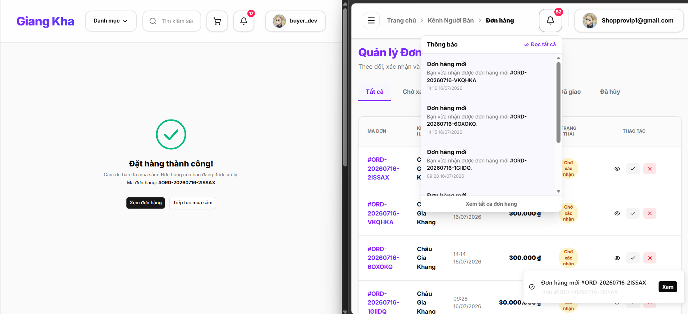
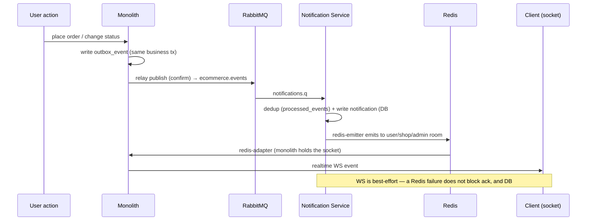
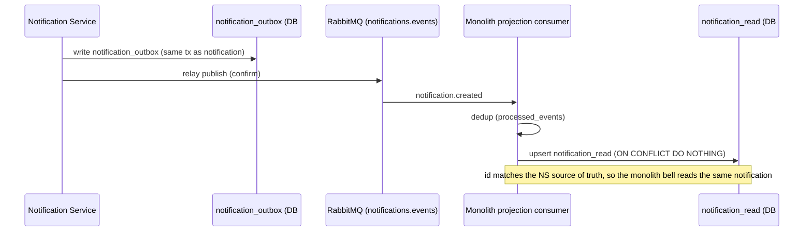

# Fullstack Multi-Vendor E-Commerce

A production-deployed multi-vendor marketplace (customer · seller · admin) built with **NestJS**,
**Next.js**, and **PostgreSQL** — featuring an **event-driven notification system split into its own
microservice** (transactional outbox, message broker, CQRS read model, cross-process WebSocket).

**🔗 [Live Demo](https://fullstack-multi-vendor-ecommerce.vercel.app)** ·
**[API Docs (Swagger)](https://fullstack-multi-vendor-ecommerce.onrender.com/api/docs)** ·
**[Source](https://github.com/chaugiakhang193/fullstack-multi-vendor-ecommerce)**

> ⏳ The API runs on a free-tier host — the **first request may take ~50s** to cold-start, then it's fast.

<!-- SCREENSHOT: storefront homepage — save as docs/screenshots/home.png -->


---

## ✨ Highlights

- **Distributed architecture** — notifications run as a **separate microservice** with its own database
  (database-per-service), communicating with the monolith over **RabbitMQ** + **Redis**.
- **Reliable messaging** — **transactional outbox** + **publisher confirms** + **idempotent consumers**
  with a dedup ledger and **DLQ retry** guarantee notifications are never lost or duplicated.
- **CQRS read model** — the microservice owns the source of truth; the monolith keeps an
  eventually-consistent read projection so the notification bell stays fast.
- **Cross-process realtime** — Socket.IO with a **Redis adapter/emitter** lets the microservice push
  WebSocket events to clients connected to the monolith.
- **Zero-downtime migration** — the notification path was carved out of the monolith using the
  **strangler-fig pattern** with a feature-flag cutover, verified in production.
- **Scale & scope** — **15 feature modules**, **113 REST endpoints**, **11 domain event types**,
  **2 services / 2 databases**.
- **Production-grade** — CI/CD (GitHub Actions → GHCR → Render), Docker multi-stage, structured
  logging (pino), Sentry, CodeQL, Dependabot.

---

## 🖼️ Screenshots

| Product detail | Realtime notification (cross-user) | Seller portal |
|---|---|---|
|  |  |  |

> The realtime shot shows a customer placing an order (left) and the seller receiving the matching
> order notification live (right) — same order id on both sides.

---

## 🧩 Features

**Customer** — browse & search products, multi-shop cart, checkout with shipping & coupons, order
tracking, returns, product reviews, realtime notifications, Google login.

**Seller** — shop setup, product & variant management, order fulfilment, payouts, a stats dashboard,
and realtime new-order alerts.

**Admin** — user management, shop approval, product moderation (take-down / restore), payout approval.

---

## 🏛️ Architecture: distributed notification system

Notifications (new order, status change, review, payout, return…) are handled by a **dedicated
microservice**, carved out of the monolith with the **strangler-fig** pattern. An event's journey
guarantees notifications are **never lost or duplicated**, even when a service or the broker is flaky.

### Mechanisms (mapped to code)

| Mechanism | Where |
|-----------|-------|
| **Transactional outbox (both directions)** | `outbox_event` (monolith→NS) · `notification_outbox` (NS→monolith) — written in the same business transaction |
| **Polling publisher + publisher confirms** | `outbox.relay.ts` · `notification-outbox.relay.ts` — poll unpublished rows, mark `published_at` only after broker confirm |
| **Topic exchange + routing keys** | `ecommerce.events` (order.\* / review.\* / payout.\* / return.\* / shop.\*) |
| **DLX + TTL retry + parking-lot DLQ** | `notifications.dlx` → `notifications.retry` (TTL 30s, max 5) → `notifications.dlq` (manual inspect) |
| **Idempotent consumer** | `processed_events` (one per service) — dedup by `eventId`; unique-violation = already processed |
| **At-least-once → effectively-exactly-once** | outbox gives at-least-once; dedup + `ON CONFLICT DO NOTHING` makes it effectively exactly-once |
| **CQRS read model** | NS holds the **source of truth** (`notification`, DB#2); monolith keeps a **read projection** (`notification_read`, DB#1) for the bell |
| **Database-per-service** | DB#1 (monolith) and DB#2 (NS) are fully separate — they only talk via broker + Redis |
| **Cross-process WebSocket** | socket.io **redis-adapter** (monolith holds the client sockets) + **redis-emitter** (NS emits into the adapter) |
| **Scale-to-zero + event-driven wake** | NS sleeps when idle (free tier); the monolith relay "pokes" `/health` after publishing to wake it |
| **Strangler cutover** | feature-flag `NOTIFICATION_MODE` (inprocess→distributed), zero-downtime — see [Migration](#-migration-monolith--microservice-strangler-fig) |

### Architecture diagram


**Live RabbitMQ broker** — the exchanges/queues, DLX/retry/DLQ topology, and message rates in production:


### Sequence 🅐 — realtime to the client (via Redis)



### Sequence 🅑 — projection back to the monolith (via RabbitMQ)



---

## 🛠️ Tech stack

| Layer | Stack |
|---|---|
| **Backend (monolith)** | NestJS 11 · TypeORM · PostgreSQL · Socket.IO · Passport (JWT access/refresh + Google OAuth2) |
| **Notification Service** | NestJS 11 · RabbitMQ (amqplib) · Redis · PostgreSQL (database-per-service) |
| **Frontend** | Next.js · React · TanStack Query · Zustand · Tailwind / shadcn-style UI |
| **Messaging & realtime** | RabbitMQ (topic exchange, DLX/retry/DLQ) · Redis (socket.io adapter/emitter) |
| **DevOps** | Docker (multi-stage) · Docker Compose · GitHub Actions → GHCR → Render · pino · Sentry · CodeQL · Dependabot |
| **Infra (prod)** | Render · Supabase (2 databases) · CloudAMQP · Upstash Redis · Vercel |

---

## 🚀 Run locally (Docker Compose)

Spin up the **full distributed stack** locally. Prepare env first (app secrets are not in the repo):

```bash
# 1) Backend secrets (required — at least JWT_* to log in / create demo notifications):
cp backend/.env.example backend/.env      # then fill JWT_ACCESS_SECRET / JWT_REFRESH_SECRET...
# 2) (optional) override compose DB defaults:
cp .env.docker.example .env               # compose reads the root .env

# 3) Bring everything up:
docker compose up --build
```

> Postgres / RabbitMQ / Redis are wired internally by compose; only app secrets need `backend/.env`.

Once up:

| Component | URL / port |
|-----------|-----------|
| Backend API | http://localhost:8080/api/v1 |
| Swagger API docs | http://localhost:8080/api/docs |
| Notification Service health | http://localhost:3001/health |
| RabbitMQ Management UI | http://localhost:15672 (guest / guest) |
| Postgres DB#1 (monolith) | localhost:5432 |
| Postgres DB#2 (notification) | localhost:5433 |

Run the frontend separately: `cd frontend && npm run dev` (set
`NEXT_PUBLIC_API_URL=http://localhost:8080/api/v1`).

Both `backend` and `notification` **self-migrate** on startup (`migration:run:prod` before
`node dist/main`), so an empty database is provisioned automatically.

---

## 🔀 Migration: monolith → microservice (strangler fig)

The notification system originally lived **inprocess** inside the monolith (an `OutboxWorker` read
`outbox_event`, created notifications, and emitted WebSockets directly). It was carved into a
microservice **without downtime**, driven by the `NOTIFICATION_MODE` feature flag:

1. **inprocess** — the monolith worker creates notifications; the NS only logs (shadow, verified in parallel).
2. **distributed** — the NS consumer becomes the source of truth; the monolith worker stops creating and
   keeps only the read projection.
3. **cut-off** — once distributed was stable in production, the old inprocess code was removed entirely.

> The whole journey is in the commit history. The **dual-mode** checkpoint (both inprocess and
> distributed paths present) is tagged at
> [`notif-strangler-dualmode`](https://github.com/chaugiakhang193/fullstack-multi-vendor-ecommerce/tree/notif-strangler-dualmode) —
> check out that tag to see the code just before cut-off.
