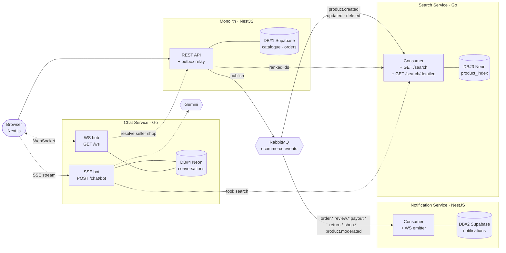
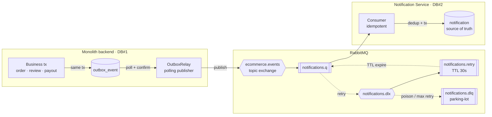
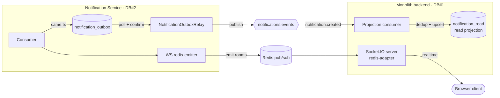
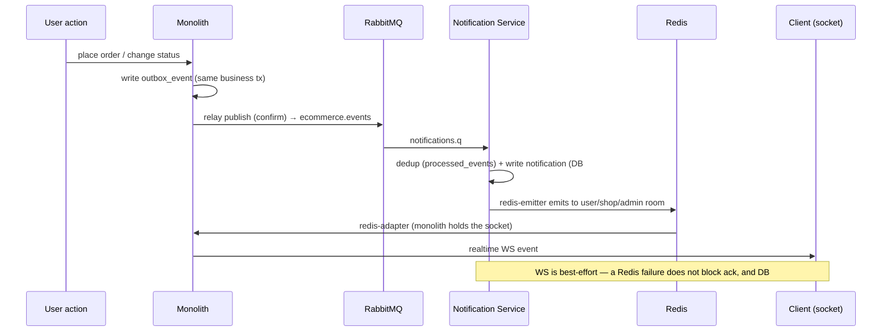
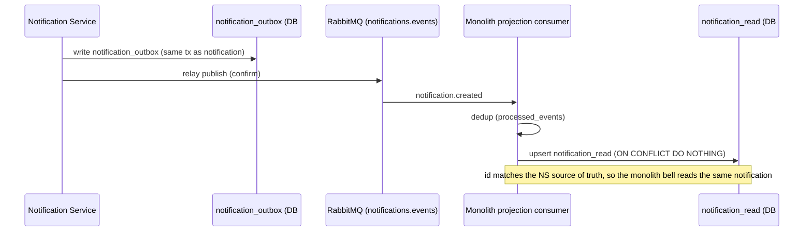
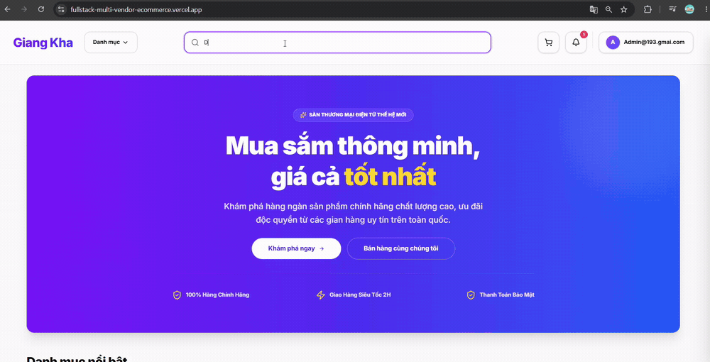
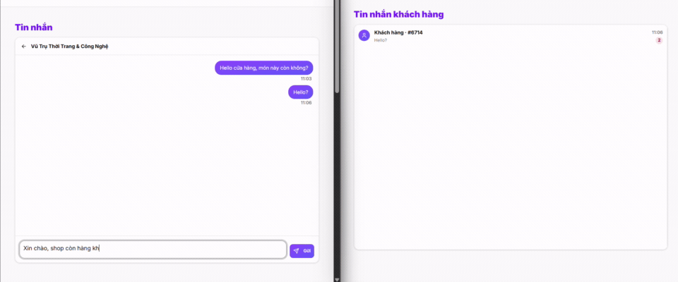

# Fullstack Multi-Vendor E-Commerce

A production-deployed multi-vendor marketplace (customer · seller · admin) built with **NestJS**,
**Next.js**, **Go**, and **PostgreSQL** — featuring an **event-driven notification system split into
its own microservice** (transactional outbox, message broker, CQRS read model, cross-process
WebSocket) and a **Go search service** that keeps a full-text index off the same event stream.

**🔗 [Live Demo](https://fullstack-multi-vendor-ecommerce.vercel.app)** ·
**[API Docs (Swagger)](https://fullstack-multi-vendor-ecommerce.onrender.com/api/docs)** ·
**[Source](https://github.com/chaugiakhang193/fullstack-multi-vendor-ecommerce)**

> ⏳ The API runs on a free-tier host — the **first request may take ~50s** to cold-start, then it's fast.

<!-- SCREENSHOT: storefront homepage — save as docs/screenshots/home.png -->


---

## ✨ Highlights

- **Distributed architecture** — notifications run as a **separate microservice** with its own database
  (database-per-service), communicating with the monolith over **RabbitMQ** + **Redis**.
- **Reliable messaging** — **transactional outbox** + **publisher confirms** + **idempotent consumers**
  with a dedup ledger and **DLQ retry** guarantee notifications are never lost or duplicated.
- **CQRS read model** — the microservice owns the source of truth; the monolith keeps an
  eventually-consistent read projection so the notification bell stays fast.
- **Cross-process realtime** — Socket.IO with a **Redis adapter/emitter** lets the microservice push
  WebSocket events to clients connected to the monolith.
- **Zero-downtime migration** — the notification path was carved out of the monolith using the
  **strangler-fig pattern** with a feature-flag cutover, verified in production.
- **Polyglot search service** — a **Go** microservice owns a Postgres **full-text index** (`tsvector` +
  GIN + `unaccent`, with a trigram fuzzy fallback), kept current by consuming the same event stream.
  Two-stage retrieval cut search p95 at 100 VUs from **6.07 s to 186 ms** on a 50k catalogue.
- **End-to-end distributed tracing** — a single **OpenTelemetry** trace follows one request through the
  monolith, the **outbox table**, **RabbitMQ**, and into the consuming service — **across a language
  boundary into Go** — plus Prometheus/Grafana **RED dashboards** and a k6 load baseline.
- **Grounded shopping chatbot** — a second **Go** service streams answers over **SSE**, calling the search
  service as a **tool** so replies cite real catalogue products, behind a three-tier quota that caps
  provider spend. A category shortcut answers a whole class of questions without spending model quota.
- **Realtime buyer ↔ shop chat** — the same Go service also runs a raw **WebSocket** channel: one goroutine
  writes per connection, a room-based Hub fans a message out to every open tab, and a dropped connection
  resumes by re-reading history rather than trusting the socket to have buffered anything.
- **Scale & scope** — **17 feature modules**, **113 REST endpoints**, **14 domain event types**,
  **4 services / 4 databases**.
- **Production-grade** — CI/CD (GitHub Actions → GHCR → Render), Docker multi-stage, structured
  logging (pino), Sentry, CodeQL, Dependabot.

---

## 🖼️ Screenshots

**Realtime notification across two users** — a customer places an order (left) and the seller receives
the matching order live (right, same order id), with no page refresh:


| Product detail | Seller portal |
|---|---|
|  |  |

---

## 🧩 Features

**Customer** — browse & search products, ask a shopping assistant that cites real catalogue items,
message a shop directly and get a realtime reply, multi-shop cart, checkout with shipping & coupons,
order tracking, returns, product reviews, realtime notifications, Google login.

**Seller** — shop setup, product & variant management, a realtime inbox to answer buyer messages,
order fulfilment, payouts, a stats dashboard, and realtime new-order alerts.

**Admin** — user management, shop approval, product moderation (take-down / restore), payout approval.

---

## 🏛️ Architecture: four services, four databases

Three capabilities have been carved out of the monolith, each owning its own database. None of them
reads the monolith's tables. Two are fed asynchronously by the **same** RabbitMQ topic exchange; the
third — the chat service — is not an event consumer at all. The browser uses SSE for the bot and a raw
WebSocket for direct chat. Solid arrows below are asynchronous events; dashed arrows are synchronous calls.



Redis carries the WebSocket push from the notification service back to the socket the monolith holds;
it is left out above to keep the shape readable and drawn in full in the
[notification flow diagram](#the-notification-flow-in-detail) below.

| Service | Language | Database | Fed by | Owns |
|---|---|---|---|---|
| Monolith | NestJS | DB#1 (Supabase) | HTTP | catalogue, orders, payouts, the read projection |
| Notification | NestJS | DB#2 (Supabase) | `order.*` `review.*` `payout.*` `return.*` `shop.*` `product.moderated` | notifications (source of truth) |
| Search | **Go** | DB#3 (Neon) | `product.created` `product.updated` `product.deleted` | the full-text index |
| Chat | **Go** | DB#4 (Neon) | HTTP (SSE) + WebSocket | bot conversations, quota counters, buyer↔shop threads |

### The notification path

Notifications (new order, status change, review, payout, return…) are handled by a **dedicated
microservice**, carved out of the monolith with the **strangler-fig** pattern. An event's journey
guarantees notifications are **never lost or duplicated**, even when a service or the broker is flaky.

> 📖 **Deep dives:** [`docs/notification-architecture.md`](docs/notification-architecture.md) — the loop in
> both directions, the retry topology, and what the monolith keeps ·
> [`notification-service/README.md`](notification-service/README.md) — service role, tech stack, env vars,
> run steps, and HTTP endpoints.

### Mechanisms (mapped to code)

| Mechanism | Where |
|-----------|-------|
| **Transactional outbox (both directions)** | `outbox_event` (monolith→NS) · `notification_outbox` (NS→monolith) — written in the same business transaction |
| **Polling publisher + publisher confirms** | `outbox.relay.ts` · `notification-outbox.relay.ts` — poll unpublished rows, mark `published_at` only after broker confirm |
| **Topic exchange + routing keys** | `ecommerce.events` (order.\* / review.\* / payout.\* / return.\* / shop.\*) |
| **DLX + TTL retry + parking-lot DLQ** | `notifications.dlx` → `notifications.retry` (TTL 30s, max 5) → `notifications.dlq` (manual inspect) |
| **Idempotent consumer** | `processed_events` (one per service) — dedup by `eventId`; unique-violation = already processed |
| **At-least-once → effectively-exactly-once** | outbox gives at-least-once; dedup + `ON CONFLICT DO NOTHING` makes it effectively exactly-once |
| **CQRS read model** | NS holds the **source of truth** (`notification`, DB#2); monolith keeps a **read projection** (`notification_read`, DB#1) for the bell |
| **Database-per-service** | DB#1 (monolith) and DB#2 (NS) are fully separate — they only talk via broker + Redis |
| **Cross-process WebSocket** | socket.io **redis-adapter** (monolith holds the client sockets) + **redis-emitter** (NS emits into the adapter) |
| **Scale-to-zero + event-driven wake** | NS sleeps when idle (free tier); the monolith relay "pokes" `/health` after publishing to wake it |
| **Strangler cutover** | feature-flag `NOTIFICATION_MODE` (inprocess→distributed), zero-downtime — see [Migration](#-migration-monolith--microservice-strangler-fig) |

### The notification flow in detail

The path is a loop — monolith to broker to service and back again — so it is drawn as two halves.
The sequence diagrams further down show the same two halves in time order; these show the topology,
including the retry machinery that never appears in a happy-path sequence.

**Outbound, and what happens when delivery fails.** The business transaction and the outbox row commit
together, so an event cannot be lost by a crash between them. Everything after that is the broker's
problem:



**Live RabbitMQ broker** — the exchanges/queues, DLX/retry/DLQ topology, and message rates in production:


**The two return paths.** Once the notification is written, it has to reach two places: the browser,
which wants it now, and the monolith's read projection, which wants it eventually. They travel by
different carriers on purpose — Redis is best-effort so a WebSocket failure cannot block the ack,
while the projection goes through a second outbox so it inherits the same delivery guarantee as the
outbound leg:



### Sequence 🅐 — realtime to the client (via Redis)



### Sequence 🅑 — projection back to the monolith (via RabbitMQ)



---

## ⚡ Search Engine

> 📖 **Deep dives:** [`docs/search-architecture.md`](docs/search-architecture.md) (design) ·
> [`docs/search-explain.md`](docs/search-explain.md) (query plans + load numbers)

Typing `dien thoai` — Vietnamese without diacritics, which is how people actually type — returned
**nothing**, while `điện thoại` returned 11 products. That is the bug that started this: not a slow
search, a **wrong** one.



### The baseline, measured rather than assumed

Search ran `ILIKE '%q%'` inside the monolith. Before replacing it, the existing behaviour was measured:

- **Latency** — p95 of **30 / 73 / 84 ms** at 10 / 50 / 100 virtual users, **0 errors** over 9,369 requests.
- **Query plan** — `EXPLAIN (ANALYZE, BUFFERS)` reports `Seq Scan on product`: a leading wildcard makes
  every B-tree index unusable, so the whole table is read and then filtered.
- **Functional gap** — the accent problem above, which no amount of tuning fixes.

> **What those numbers do and do not prove.** The catalogue was 82 products — 104 kB, sitting entirely
> in `shared_buffers` (`Buffers: shared hit=8`, no disk reads). At that size the sequential scan costs
> ~1.3 ms, so the latency above is framework and queueing overhead, **not** scan cost. The load-bearing
> argument was structural, not the milliseconds: a `Seq Scan` is **O(rows)** and an index is not. The
> functional gap, by contrast, was already real.

### What replaced it

A dedicated **Go** service owns a Postgres full-text index — `tsvector` + a **GIN** index, with
`unaccent` applied on both sides so an accent-free query matches accented text. Because `unaccent` is
only `STABLE`, Postgres refuses it in a generated column, so the vector is filled by a **trigger**
instead.

Same query, same data, 20k rows:

| | `ILIKE '%dien thoai%'` | `tsvector @@ websearch_to_tsquery` |
|---|---|---|
| Plan | `Seq Scan`, 20,025 rows filtered | `Bitmap Index Scan` on GIN, `Heap Blocks: exact=1` |
| Execution | **24.7 ms** | **6.7 ms** |
| Rows returned | **0** — wrong answer | **25** — correct |

And end-to-end under k6 on a **50,000**-product catalogue, monolith → search service → hydrate:

| Load | old `ILIKE` p95 | two-stage p95 | speedup |
|---|---|---|---|
| 10 VU | 407 ms | **60 ms** | ~6.8× |
| 50 VU | 1.55 s | **99 ms** | ~15.7× |
| 100 VU | 6.07 s | **186 ms** | ~32.6× |

The O(rows) prediction is visible directly: the old path's p95 at 100 VU climbs **84 ms → 373 ms →
6,070 ms** as the table grows 82 → 20k → 50k, while the indexed path stays roughly flat.

### Why ranked ids, not a denormalised index

Two shapes were on the table for the storefront path. **Pattern A** inlines `shop_name`, `avg_rating`,
and stock so a search is a single read; **Pattern B** returns **ranked ids** that the monolith hydrates
from DB#1. The main `/search` endpoint takes **B**: the index is fed only by `product.*` events, so
denormalising review- or order-owned fields would either go stale — nothing emits `product.*` when a
rating or stock level changes — or force the search service to consume streams it has no business
owning. A separate `/search/detailed` contract for the chatbot reads the `name`, `slug`, and `price`
already carried by product events; it does not turn the storefront path into a denormalised read model.

### Mechanisms (mapped to code)

| Mechanism | Where |
|---|---|
| **Two-stage retrieval (Pattern B)** | the main `/search` contract returns ranked ids; the monolith hydrates and paginates from DB#1. The bot-only `/search/detailed` contract separately returns up to five indexed `name` / `slug` / `price` records |
| **Full-text + fuzzy fallback** | `tsvector` GIN for whole-lexeme matches; when full-text returns 0, a `pg_trgm` word-similarity pass (`<%`, threshold `0.3` set per-transaction) catches typos and prefixes like `die` or `dienn` |
| **Index as a CQRS read model** | the index is built only from `product.created` / `updated` / `deleted` events off `ecommerce.events` — no shared tables, no cross-service reads |
| **Out-of-order safety** | brokers do not guarantee order, so an upsert applies only `WHERE updated_at < EXCLUDED.updated_at`, and a delete writes a **tombstone** row that blocks a stale update from resurrecting a deleted product |
| **Idempotent consumer** | `processed_events` in the same transaction as the write — a redelivery hits a unique violation and is acked as a duplicate |
| **Retry + DLQ** | failed writes go to a TTL retry queue (10 s, max 3) and then to a parking-lot DLQ; unparseable payloads skip retries and go straight to the DLQ |
| **Graceful degradation** | the monolith calls the service behind a `SEARCH_SERVICE_ENABLED` flag with a **700 ms** timeout, falling back to the old `ILIKE` query — a cold or slow search service degrades results, never breaks the page |

### Known limitations

**Event ordering uses two different timestamp sources.** An upsert orders on the product's
`updatedAt`; a delete orders on the envelope's `occurredAt`, because the delete payload carries only
an id. They come from the same clock in practice, but it is two contracts where there should be one —
to be unified in the `product.deleted` payload rather than papered over in the consumer.

**Retention has to outlive every deliverable event.** The main queue and DLQ each have a 30-day TTL,
so an hourly capped sweep can collect tombstones and processed-event rows only after the resulting
61-day retention window. `SEARCH_RETENTION_GC_ENABLED` gates deletion, while the row-count and database-
size gauges remain active even when deletion is disabled.

---

## 💬 Shopping Chatbot

> 📖 **Deep dive:** [`docs/chat-architecture.md`](docs/chat-architecture.md) — the request path, the
> quota layers, and what the Gemini 3 line requires of a caller.

A shopping assistant is easy to demo and easy to get wrong in two specific ways: it invents products
that are not for sale, and it bills an unbounded amount of somebody's API quota. Both are design
problems, not prompt problems.

### Answers are grounded in the catalogue, not in the model

The bot is given exactly one tool: the **search service** from the section above. When a question needs
product facts, the model calls it, and the reply is written from what came back — real names and real
prices from the indexed catalogue.

Product links are then built **from our own stored slug and id**, never from a URL the model composed:

```
FRONTEND_URL + "/products/" + slug + "-i." + productId
```

The storefront resolves on the id after `-i.`, so the link survives a slug that has lost its diacritics.
Letting the model write URLs would invite a plausible-looking link to a product that does not exist —
the one failure a shopper cannot detect before clicking.

### Quota is the design constraint, not an afterthought

A free-tier provider key is a shared, exhaustible resource, so the ceiling had to be structural. Six
gates sit in front of the model, ordered cheapest-first, so a rejected request is turned away before it
costs anything it did not have to:

| Layer | Held in | Spares |
|---|---|---|
| Kill switch · auth | config / stateless | a provider call while the bot is off |
| **Burst** — token bucket, 10 capacity, +1 / 6 s | RAM, per subject | a runaway loop, before it reaches the DB |
| **Reply cache** — 500 entries, 10 min TTL | RAM | the model call **and** the quota charge |
| **In-flight latch** — one request per subject | RAM | twenty open tabs each spending a turn |
| **Counters** — guest 5/day · user 10/hr, 30/day · **global 300/day** | Neon DB#4 | the provider's daily quota |

The counter order is a security decision rather than a tidy sort: **individual before global**, so
someone already out of their own allowance cannot keep drawing down the shared 300; and **hour before
day**, so a user who hits the hourly wall has not also lost one of their daily turns. The counters are
**fail-closed** — a database error refuses the request, because a service that cannot count cannot know
how much quota is already gone.

### The cheapest answer costs no model quota

A whole class of questions never reaches `chat-service`. When a shopper's message names a catalogue
category — including the accent-free and colloquial spellings people actually type — the **frontend**
matches it locally, then renders products fetched through the monolith's public catalogue API:

| Path | Cost | Latency |
|---|---|---|
| Category shortcut | **zero model cost** — no chat-service call or bot quota; catalogue data may require one monolith request | immediate match, then catalogue latency |
| Cached reply | DB persistence only; no model call or quota | ~100 ms |
| Full bot answer | 1 quota turn + 1–2 model calls (+ a search) | ~7–9 s |
| Out of quota | offers the same category shortcuts in-panel | local once categories are loaded |

Running out of quota **degrades rather than breaks**: the panel offers category shortcuts that still
lead to real catalogue results, so the shopper can keep browsing instead of hitting a dead end.

### Mechanisms (mapped to code)

| Mechanism | Where |
|---|---|
| **SSE, not WebSocket** | a question is request-and-response, so a socket lifecycle buys nothing; `meta` → `tool` → `text` → `done` over plain HTTP |
| **Two-turn tool loop** | turn one decides *whether* to search; its prose is held back while that decision is made, then used directly when no tool is requested. A tool call adds a second, streamed turn with the result attached — one question cannot burn several searches |
| **Provider-agnostic core** | quota, cache, retry, breaker and persistence never learn which model is behind them; one package converts types and maps provider errors |
| **Breaker outside retrier** | `Breaker(Retrier(Gemini))` — both attempts of one request count as a single failure, and an open breaker skips the retry wait too |
| **Identity, split two ways** | *who to bill* and *whose conversation* are separate: guests are metered by IP (clearing storage buys no new turns) while their history is keyed by an `X-Guest-Key` UUID; signed-in users are metered and stored by account, via an HS256 token verified with the monolith's secret |
| **Durable conversation** | history lives in DB#4 and is read back on first open — free of quota, with a server-side limit of 30 so no client can ask for the whole table |
| **Kill switch** | `CHAT_BOT_ENABLED=false` answers `503` with a reason and the widget hides itself; `GET /chat/config` reports it without touching the database |

### Known limitations

**Four of ten category shortcuts are dead ends in production.** The chips are built from live leaf
categories, but measured against the production catalogue, `Xiaomi Poco`, `Áo Khoác`, `Samsung` and
`Iphone` hold **0 products** each, while the other six hold 10–15. The matching code is correct; the
seed data is thin. Filtering chips by product count needs a count the categories endpoint does not
currently return.

**Cold starts are held off by a cron, not by the free tier.** An idle free instance sleeps after 15
minutes, and a wake measured before the cron existed cost **12.5 s**, of which TCP connect was 0.107 s —
essentially all of it the platform restarting the container. A scheduled `GET /health` now keeps
chat-service awake, so that number is what returns the moment the cron stops rather than a cost paid
today. The wake a live question still pays is the **search service's**, left asleep on purpose to save
instance-hours; `toolTimeout` (20 s) is sized for it, and the client allows 75 s for response headers.

**Some protective state is per-instance.** Burst buckets, the in-flight latch, reply cache and breaker
live in RAM. Scaling out can multiply the effective burst/in-flight ceilings and reduce cache hits, but
the guest, hourly, daily and global quota counters stay shared and atomic in Neon DB#4.

---

## 🗨️ Direct Chat: buyer ↔ shop

> 📖 **Deep dive:** [`docs/chat-architecture.md`](docs/chat-architecture.md) — the WebSocket
> concurrency model, the shape of all five frame types, and the client-side state machine.

A shopping bot answers one question and is done. A conversation between a shopper and a shop is not
that shape — either side can write at any moment, on a connection that has to survive a closed tab, a
locked phone, or the same free-tier host cold-starting mid-conversation. Same `chat-service`, same
Postgres database, a different transport and a different set of failure modes: a raw **WebSocket**
channel sits next to the SSE one above, one connection per open tab.

Two windows, one shop: the buyer sends, the seller's inbox updates its badge and preview with no
reload, and the reply travels back the same way. Which side a bubble lands on is decided by
`senderRole` rather than by comparing ids — which is why the same message sits on the right for the
person who wrote it and on the left for the person reading it.



### One writer per connection, routed through a Hub, never directly

Every accepted socket runs three goroutines around a single invariant — **exactly one goroutine ever
writes to a given connection** — because the underlying library allows only one writer at a time,
and fan-out means an arbitrary sender's goroutine has to deliver into an arbitrary receiver's socket.
A buffered `outbox` channel per connection turns that invariant from a rule everyone has to remember
into one a slow client cannot violate: if the queue fills (16 frames — sized for a channel that gets
a few messages a minute, not a stream), the connection is **closed**, not silently dropped-and-kept —
two tabs quietly holding two different histories is worse than a reconnect.

Delivery is address-based, never a direct reference between connections. A `Hub` keeps two kinds of
room, `user:<id>` and `shop:<id>`, and a sent message fans out to both — skipping the sender's own
connection, which gets a separate echo carrying the `clientMsgId` it sent up. That single
round-tripped field is the entire optimistic-UI mechanism: the tab that sent a message matches the
echo to the bubble it already drew; every other tab in the room renders the frame from scratch.

### 4401 means "go refresh your token"; every other code means "just retry"

A closed WebSocket is ambiguous by default — a dropped network and a rejected token both just look
like "the connection ended." The server closes with a specific code, **4401**, only for identity
failures, and the client backs off differently for each:

| Close reason | Client response |
|---|---|
| `4401` — token missing, malformed, or rejected | refresh the access token, then reconnect **once** |
| anything else | exponential backoff — 1s → 2s → 4s → 8s → 16s, **capped at 30s**, leaving margin over the measured ~12.5s free-tier wake |

Getting that distinction to the browser at all took a deliberate workaround: the WebSocket library
closes **silently** — no close frame at all — the instant a `context` deadline expires, so the
5-second auth handshake times out on a hand-rolled timer instead, keeping the connection alive just
long enough to actually send the 4401 the client is waiting to read.

### Mechanisms (mapped to code)

| Mechanism | Where |
|---|---|
| **One writer per connection** | a buffered `outbox` channel + a dedicated write goroutine — every other goroutine calls `Send()`, which never blocks its caller |
| **Room-based fan-out, no direct references** | `Hub.Broadcast(user:<id> \| shop:<id>)` — a connection never holds a pointer to another connection |
| **Shop identity resolved once per connection, not per message** | asked of the monolith exactly once at auth and cached — DB#4 has no `shop` table, and asking on every fan-out would put a network hop between two people mid-conversation |
| **Optimistic UI via one round-tripped field** | the client mints `clientMsgId` on send; it comes back on either the sender's own echo or a rejection, never both, never neither |
| **One error, two causes, on purpose** | "conversation not found" covers both "doesn't exist" and "exists but isn't yours" — splitting them into 404/403 would let a caller map real conversation ids by the shape of the rejection |
| **Reconnect resumes by re-reading history, not by trusting the socket** | a WebSocket has no buffer of its own, so a reconnect calls the same HTTP read path a fresh page load would — nothing sent while disconnected is lost |

### Known limitations

**A shop's identity is cached at connect time, not re-checked per message.** If a shop ever changed
hands, the previous owner would keep answering as that shop until their next reconnect. Nothing
transfers a shop today, so this is latent rather than live.

**The buyer's inbox resolves shop names one request at a time.** `chat-service` has no shop table, so
showing a name means asking the monolith — and there is no batch-by-id endpoint yet, so an inbox with
N distinct shops costs N requests. Bounded in practice (an inbox page tops out at 30 rows), and the
first thing to fix once a batch endpoint exists.

**A seller sees an anonymized buyer, not a name.** The monolith has no public-profile-by-id endpoint,
so a seller's inbox row reads `Khách hàng · #a91c` — four characters of the buyer's id — rather than
a real name. Deliberate: adding that lookup this close to a freeze would open a new read surface onto
user data for a feature (a friendlier inbox row) that does not need one.

---

## 🔭 Observability

> 📖 **Deep dive:** [`docs/observability.md`](docs/observability.md) — the two pipelines, how trace
> context is carried across the outbox and the broker, and the known limitations.

The hard part of splitting a monolith is that a request stops being one thing you can follow. A
notification now crosses a database table, a broker, and a process boundary — so *"what happened to
**this** order's notification?"* becomes unanswerable from logs alone.

**One trace answers it.** A single request lands **the monolith and the service it feeds under one
trace id** — from the HTTP handler, through the outbox row and RabbitMQ, to the notification service's
`INSERT` and its WebSocket publish (16–20 spans depending on the flow):


| Mechanism | Where |
|---|---|
| **Auto-instrumentation** | `backend/src/tracing.ts` · `notification-service/src/tracing.ts` — HTTP, TypeORM/`pg`, `amqplib`; Express/router layer spans disabled to keep waterfalls readable. The Go services instrument at the HTTP boundary instead: `otelhttp` wraps each business route in `search-service` and `chat-service` (`internal/httpapi/server.go`), while `/health`, `/metrics` and the hours-long `/ws` connection are deliberately left outside it |
| **Trace context across the async gap** | `outbox_event.trace_parent` — the W3C `traceparent` is captured by an `@BeforeInsert` hook and restored by the relay before publishing (see ADR-7) |
| **Context over the broker** | injected into RabbitMQ message headers; the consumer extracts it and opens a `SpanKind.CONSUMER` span, so both services land in the same trace |
| **Across a language boundary** | `search-service/internal/telemetry` — the Go consumer extracts the same W3C header (case-insensitively, since `amqp.Table` is a plain map) and `otelpgx` continues the trace into its queries |
| **A trace with nothing to carry it** | A bot question is one synchronous call stack: the request's `context.Context` is passed explicitly into the Gemini client and the search tool, and `otelhttp.NewTransport` on both (`internal/bot/gemini/client.go` · `internal/bot/tool_search.go`) injects the `traceparent`, so `GET /search/detailed` continues into the search service's own server span — one question, a **single trace across two services**. Nothing is persisted and nothing is re-injected by hand: this is the ordinary case the outbox and broker rows above exist to compensate for |
| **RED metrics** | The monolith derives RED from `metrics.interceptor.ts` → `/api/v1/metrics`; each Go service exposes a request counter plus duration histogram from its HTTP boundary. The notification worker instead exposes consumer metrics, and the monolith adds an **outbox-lag gauge** (age of the oldest unpublished event) |
| **Consumer metrics** | `notification_events_processed_total` · `search_events_processed_total` — events counted by `event_type` and `result`, so "running" and "succeeding" are different questions |
| **Bot and socket metrics** | `chat_bot_quota_rejected_total` by `reason` · `chat_bot_reply_cache_total` by `result` · `chat_bot_tokens_total` by `kind` · `chat_ws_closed_total` by close `code`. The kill switch and the open-socket count are `GaugeFunc`s read **at scrape time**, not `Set()` on an event — a switch flipped by hand in the dashboard and a connection that can die four different ways both stay true without anyone remembering to update a counter |
| **Dashboard as code** | `observability/grafana/**` provisioned at container start — both dashboards live in git and survive `docker compose down -v`; the provider watches the folder, so another one is added by dropping in a JSON file |
| **Load baseline** | [`observability/k6/baseline-search.js`](observability/k6/baseline-search.js) — three sequential stages at 10 / 50 / 100 VUs, measured before the search work began |

**RED dashboard, monolith** — request rate, error rate and p95 latency per route, plus outbox lag:


**RED dashboard, the two Go services** — the same three panels for the chat and the search service:


Rate on the second one is read from the duration histogram's `_count` rather than from the request
counter, because the two metrics carry disjoint labels: the counter is keyed by `status` and
`outcome`, the histogram by `endpoint`. Grouping the counter by `endpoint` matches nothing and
returns an empty panel with no error to explain it.

> **Why the observability stack is local-only.** Jaeger, Prometheus and Grafana run from
> `docker-compose.observability.yml` on a developer machine, not in production. The hosting budget for
> this project is the free tier, which is spent on the things a visitor actually touches (API, databases,
> broker). Tracing is also **opt-in** behind `OTEL_ENABLED`, so the production write path pays nothing
> for instrumentation it isn't exporting.

---

## 🧭 Architecture Decision Records

Short records of the *expensive* decisions — **why this over the obvious alternative**, and the
trade-off accepted. (The full rationale for each lives in the commit history; these are the summaries.)

### ADR-1 — Transactional outbox instead of two-phase commit

- **Decision** — write the event to an `outbox_event` row **in the same DB transaction** as the business
  change, then a polling relay publishes it to the broker with publisher confirms.
- **Rejected** — a distributed transaction (2PC/XA) spanning PostgreSQL and RabbitMQ.
- **Why** — RabbitMQ has no practical XA support, and 2PC blocks on a coordinator (worse availability and
  throughput, heavy to operate). The outbox keeps the write **local and atomic**, then turns delivery into
  *at-least-once* which an idempotent consumer (`processed_events`) collapses into **effectively
  exactly-once**.
- **Trade-off** — extra moving parts (a relay + a dedup ledger) and eventual, not instant, delivery
  (bounded by the poll interval).

### ADR-2 — Strangler-fig + feature flag to split the microservice

- **Decision** — carve the notification path out of the monolith incrementally behind a
  `NOTIFICATION_MODE` flag: `inprocess` → `distributed` (shadow-verified in parallel) → cut-off.
- **Rejected** — a big-bang extract/rewrite in a single release.
- **Why** — **zero downtime**, the new service is verified against the old one *in production* before it
  owns the truth, and rollback is a single flag flip — the right risk profile for a solo project.
  See [Migration](#-migration-monolith--microservice-strangler-fig).
- **Trade-off** — dual code paths and extra complexity *during* the migration window (removed at cut-off).

### ADR-3 — Backend-owned auth (Passport) instead of NextAuth

- **Decision** — issue and own JWT access/refresh tokens and Google OAuth2 in **NestJS via Passport**;
  the frontend just carries tokens.
- **Rejected** — NextAuth, with session/auth state living on the Next.js side.
- **Why** — the API is consumed by **more than the web app** (Swagger, future mobile), so auth must live
  at the **API boundary**, not inside one client. One source of truth for sessions and refresh rotation,
  and a uniform contract for every client.
- **Trade-off** — I implement refresh rotation and guards myself instead of getting them off the shelf.

### ADR-4 — API-first codegen with a CI drift check

- **Decision** — the backend OpenAPI spec is the source of truth; the typed frontend client is
  **generated** from it (`gen-api`), and **CI fails if the committed schema drifts** from the backend.
- **Rejected** — hand-written frontend request/response types kept in sync manually.
- **Why** — eliminates frontend/backend type drift: a backend DTO change surfaces as a **compile error**
  on the frontend, and the CI check stops a stale schema from ever landing (learned the hard way).
- **Trade-off** — a codegen step in the workflow; you must run `gen-api` when DTOs change.

### ADR-5 — Database-per-service + CQRS read projection

- **Decision** — the notification service owns **its own database** (source of truth); the monolith keeps
  an eventually-consistent **read projection** (`notification_read`) for the bell.
- **Rejected** — a single database shared by the monolith and the notification service.
- **Why** — real service autonomy: independent schema and deploy, with **no coupling at the data layer**.
  The projection keeps the bell query fast and local instead of a synchronous cross-service call.
- **Trade-off** — eventual consistency and duplicated data, plus a projection consumer to maintain.

### ADR-6 — Pessimistic locking + idempotent checkout for correctness over throughput

- **Decision** — decrement stock under a **pessimistic row lock** (`SELECT … FOR UPDATE`) and make
  checkout **idempotent** via an idempotency key.
- **Rejected** — optimistic locking (retry-on-conflict) or no lock, letting clients retry freely.
- **Why** — overselling and double-charging are **real-money** failures; a pessimistic lock is the right
  call when contention on a row is high and the cost of a wrong answer is severe, and the idempotency key
  makes a page refresh or network retry safe instead of a second order.
- **Trade-off** — lower throughput on a hot row, so the lock is held for the shortest span possible
  (lock the bare row *first*, load relations *after* — TypeORM won't emit `FOR UPDATE` with a join).

### ADR-7 — Trace context persisted in the outbox row, not just in memory

- **Decision** — instrument both services with **OpenTelemetry** (vendor-neutral), and carry the W3C
  `traceparent` across the async boundary by **storing it in an `outbox_event.trace_parent` column**,
  restoring it in the relay, and injecting it into the RabbitMQ message headers.
- **Rejected** — (a) a vendor agent (Datadog/New Relic) bought with lock-in; (b) letting the trace end at
  the outbox write, leaving the consumer to start a fresh, unrelated trace.
- **Why** — the relay publishes on a **separate `@Interval` tick**, so by then the originating request's
  in-memory context is long gone. Without persisting it, you get two disconnected traces and can never
  answer *"what happened to this order's notification"* — the exact question that going distributed made
  hard. The outbox row is **already the thing that crosses the gap**, so it is the only carrier that
  survives it; a DB column is the cheapest possible one.
- **Trade-off** — a 64-char column on a hot write path, and a hard rule that instrumentation must never
  break business logic: the `@BeforeInsert` hook **swallows every error** and leaves `trace_parent` null
  rather than failing an order. Tracing is opt-in via `OTEL_ENABLED`, so this is a no-op when disabled.

### ADR-8 — A kill switch the service can throw at itself

- **Decision** — gate the bot branch behind `CHAT_BOT_ENABLED`, read through a `Switch` on **every request**
  rather than copied into a boolean at boot, and let the service **trip that switch itself**, for a bounded
  window, when the global daily quota is exhausted or the provider fails.
- **Rejected** — (a) a redeploy as the only way to turn the bot off; (b) the flag as a database column read
  per request; (c) leaving the bot on and letting every caller rediscover the wall on their own.
- **Why** — the bot is the one feature spending a **metered third-party quota**, so "off" has to be reachable
  faster than a deploy *and* reachable by the code that noticed. `Enabled()` runs on every `/chat/config` and
  `/chat/bot`, which is why the flag lives in RAM and not in a row: a widget that mounts on every storefront
  page must not bill a query just to decide whether to draw a button. The automatic flag sits **beside** the
  manual one instead of replacing it, because not every reason to silence a bot is a quota — "it is answering
  nonsense" is one no counter will ever detect.
- **Trade-off** — the flag is per-instance memory, so beyond one instance an auto-trip silences only the
  instance that hit the wall; and the manual half is fixed at boot, since a process cannot rewrite its own
  environment and changing it on Render *is* a redeploy. Two rules keep the automatic half honest: a trip only
  ever **extends** its window, so a 60-second provider hiccup cannot cut short a "sleep until midnight"
  already set by the global ceiling, and a non-positive duration is **ignored** rather than read as "off
  forever", because acting on missing data is the worst option on the table.

### ADR-9 — The model SDK confined to one adapter package

- **Decision** — let `internal/bot` own the vocabulary (`Client`, `Turn`, `ToolCall`, `ToolResult`) and
  confine the SDK to a single adapter, `internal/bot/gemini`, which converts types both ways and maps
  provider errors onto the service's own. Retry, circuit breaker, quota and the prompt builder never learn
  which model sits behind them.
- **Rejected** — handing the SDK back the `Content` objects it produced, which is what Google's
  function-calling guide assumes and what makes thought signatures handled for you.
- **Why** — three properties follow that are otherwise hard to get. Caller identity cannot leak into a prompt,
  because the layer that builds prompts has never seen a `Subject`. Changing how callers are metered stops
  at `internal/quota`. And the model layer stays honestly testable: every test points at an
  `httptest.Server`, with the real provider reached only by `live_test.go` behind a build tag.
- **Trade-off** — the conversation is rebuilt from our own types every turn, so whatever the SDK attached to
  its own objects is gone by the next request. For Gemini 3 that includes the `thoughtSignature` on a
  `functionCall`, which the API demands back verbatim or answers `400 INVALID_ARGUMENT`, so it is carried by
  hand as an opaque `ToolCall.Signature []byte` the bot layer never inspects. **Two tests exist solely to hold
  that round trip**, because an `httptest.Server` accepts the request whether the signature is there or not —
  only the real provider refuses. Signatures also survive only within a turn pair, since history is stored as
  plain text and rebuilt from the database.

### ADR-10 — Messages point at a seat in a conversation, not at a person

- **Decision** — `message.sender_participant_id` references a `participant` row — one person's seat in one
  conversation — under a surrogate `id`, instead of carrying `user_id` on the message.
- **Rejected** — the natural key `(conversation_id, user_id)`, which in a system with a single kind of
  identity is the better choice: `message` already carries `conversation_id`, so a composite foreign key
  would let the **database** enforce that a sender belongs to the conversation they are writing into.
- **Why** — one `message` table carries the bot thread and the shopper-to-shop threads, and **two of its four
  kinds of sender have no `user_id` at all**: a visitor who never signed in has only a guest key, and the bot
  has neither. A natural key would force a nullable column, a `CHECK` explaining which identity is in play,
  and that branch repeated in every query that reads a thread. The seat is also the right grain for what
  hangs off it — `role` differs per conversation (the same account is a `user` in the threads it opened and a
  `seller` in the ones its shop receives) and `last_read_at` is per conversation by definition; neither
  belongs on an account. And `user_id` is issued by the monolith, so making another service's identifier part
  of this one's primary key would tie the storage layout to their identity scheme.
- **Trade-off** — the invariant the composite key would have enforced is now held by **code**:
  `ResolveDirectParticipant` hands both ids to `AppendMessage` from one authorised lookup, and nothing in the
  schema stops a future caller from skipping that. The insulation pays off at the edge, though — a
  participant id, never a user id, is what travels out to the browser on every message frame.

---

## 🛠️ Tech stack

| Layer | Stack |
|---|---|
| **Backend (monolith)** | NestJS 11 · TypeORM · PostgreSQL · Socket.IO · Passport (JWT access/refresh + Google OAuth2) |
| **Notification Service** | NestJS 11 · RabbitMQ (amqplib) · Redis · PostgreSQL (database-per-service) |
| **Search Service** | **Go 1.26** · pgx · sqlc · RabbitMQ (amqp091-go) · PostgreSQL full-text (`tsvector` + GIN + `unaccent` + `pg_trgm`) |
| **Chat Service** | **Go 1.26** · pgx · sqlc · SSE streaming · raw WebSocket · Gemini (function calling) · circuit breaker + retry + reply cache |
| **Frontend** | Next.js · React · TanStack Query · Zustand · Tailwind / shadcn-style UI |
| **Messaging & realtime** | RabbitMQ (topic exchange, DLX/retry/DLQ) · Redis (socket.io adapter/emitter) |
| **Observability** | OpenTelemetry (traces, W3C context propagation) · Jaeger · Prometheus (`prom-client` + `client_golang`) · Grafana (dashboard as code) · k6 (load baseline) |
| **DevOps** | Docker (multi-stage) · Docker Compose · GitHub Actions → GHCR → Render · pino · Sentry · CodeQL · Dependabot |
| **Infra (prod)** | Render · Supabase (DB#1, DB#2) + Neon (DB#3, DB#4) · CloudAMQP · Upstash Redis · Vercel |

---

## 🚀 Run locally (Docker Compose)

Spin up the **full distributed stack** locally. Prepare env first (app secrets are not in the repo):

```bash
# 1) Backend secrets (required — at least JWT_* to log in / create demo notifications):
cp backend/.env.example backend/.env      # then fill JWT_ACCESS_SECRET / JWT_REFRESH_SECRET...
# 2) (optional) override compose DB defaults:
cp .env.docker.example .env               # compose reads the root .env

# 3) Bring everything up:
docker compose up --build
```

> Postgres / RabbitMQ / Redis are wired internally by compose; only app secrets need `backend/.env`.

Once up:

| Component | URL / port |
|-----------|-----------|
| Backend API | http://localhost:8080/api/v1 |
| Swagger API docs | http://localhost:8080/api/docs |
| Notification Service health | http://localhost:3001/health |
| RabbitMQ Management UI | http://localhost:15672 (guest / guest) |
| Search Service health | http://localhost:8090/health |
| Chat Service health | http://localhost:8091/health |
| Postgres DB#1 (monolith) | localhost:5432 |
| Postgres DB#2 (notification) | localhost:5433 |
| Postgres DB#3 (search) | localhost:5434 |
| Postgres DB#4 (chat) | localhost:5435 |

Run the frontend separately: `cd frontend && npm run dev` (set
`NEXT_PUBLIC_API_URL=http://localhost:8080/api/v1` and
`NEXT_PUBLIC_CHAT_SERVICE_URL=http://localhost:8091`).

> **Both Go services are in the compose file** — all ten containers come up together. Two notes on
> degraded modes, both deliberate: the monolith only calls search when `SEARCH_SERVICE_ENABLED=true`
> and otherwise falls back to the in-monolith `ILIKE` query; and the chat service starts fine without
> `GEMINI_API_KEY`, leaving `/chat/bot` registered but disabled with a `503`. Neither missing piece
> breaks the stack.
> See [`docs/deploy-search-service.md`](docs/deploy-search-service.md) and
> [`docs/deploy-chat-service.md`](docs/deploy-chat-service.md).

### Optional: the observability stack

Traces and metrics come up as a **separate** compose file, so the app stack stays lean by default:

```bash
docker compose -f docker-compose.observability.yml up -d
```

Then set `OTEL_ENABLED=true` in `backend/.env`, `notification-service/.env`, `search-service/.env`
**and** `chat-service/.env`, then restart them — instrumentation is opt-in, so nothing is exported
until you ask for it.

| Component | URL / port |
|-----------|-----------|
| Jaeger UI (traces) | http://localhost:16686 |
| Prometheus | http://localhost:9090 |
| Grafana (RED dashboards, auto-provisioned) | http://localhost:3002 |
| Backend metrics endpoint | http://localhost:8080/api/v1/metrics |
| Notification metrics endpoint | http://localhost:3001/metrics |
| Search metrics endpoint | http://localhost:8090/metrics |
| Chat metrics endpoint | http://localhost:8091/metrics |

> Grafana is on **3002**, not its usual 3000/3001 — those are taken by the Next.js frontend and the
> notification service respectively.

All four services **self-migrate** on startup — the two NestJS services run `migration:run:prod`
before `node dist/main`, and the two Go services run their embedded migrations before opening the
pool — so an empty database is provisioned automatically.

---

## 🔀 Migration: monolith → microservice (strangler fig)

The notification system originally lived **inprocess** inside the monolith (an `OutboxWorker` read
`outbox_event`, created notifications, and emitted WebSockets directly). It was carved into a
microservice **without downtime**, driven by the `NOTIFICATION_MODE` feature flag:

1. **inprocess** — the monolith worker creates notifications; the NS only logs (shadow, verified in parallel).
2. **distributed** — the NS consumer becomes the source of truth; the monolith worker stops creating and
   keeps only the read projection.
3. **cut-off** — once distributed was stable in production, the old inprocess code was removed entirely.

> The whole journey is in the commit history. The **dual-mode** checkpoint (both inprocess and
> distributed paths present) is tagged at
> [`notif-strangler-dualmode`](https://github.com/chaugiakhang193/fullstack-multi-vendor-ecommerce/tree/notif-strangler-dualmode) —
> check out that tag to see the code just before cut-off.
