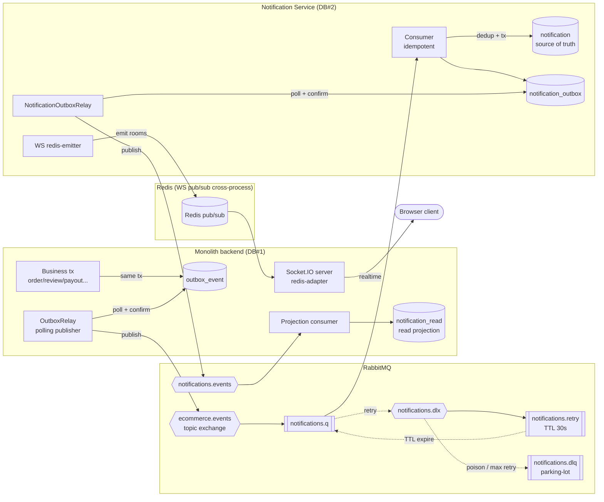
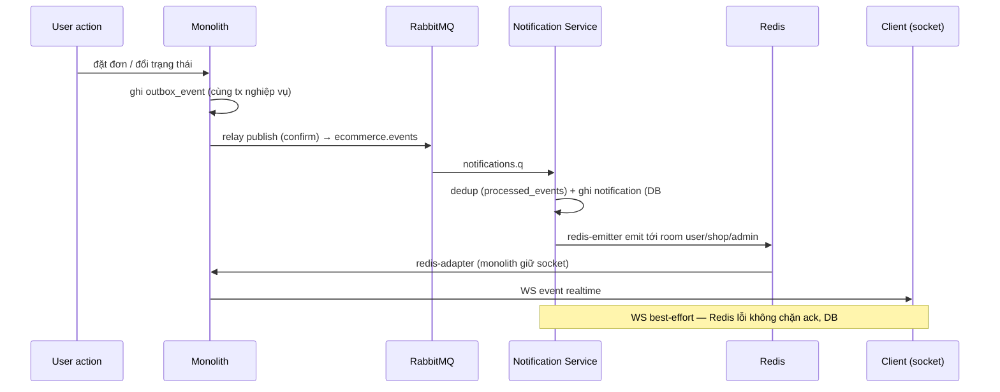
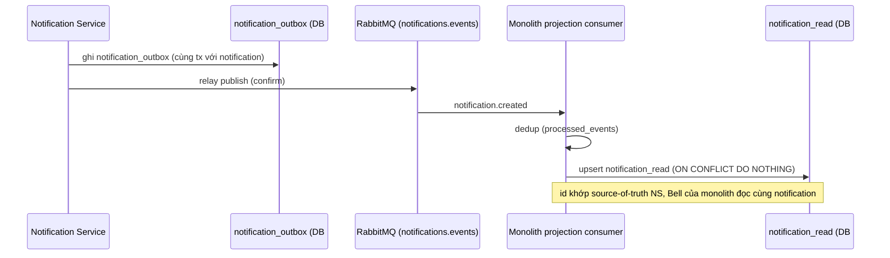

# Fullstack Multi-Vendor E-commerce

Nền tảng thương mại điện tử multi-vendor (khách hàng · người bán · admin) xây bằng **NestJS** +
**Next.js** + **PostgreSQL**, với một **hệ thống thông báo hướng sự kiện tách thành microservice**
(transactional outbox, message broker, CQRS read model, WebSocket cross-process).

- **Backend:** NestJS 11 · TypeORM · PostgreSQL · Socket.IO · JWT + Google OAuth
- **Notification Service:** NestJS 11 · RabbitMQ (amqplib) · Redis · Postgres riêng (database-per-service)
- **Frontend:** Next.js · React Query · Zustand
- **Hạ tầng:** Docker Compose (local) · Render + Supabase + CloudAMQP + Upstash (prod)

---

## Điểm nhấn kiến trúc: hệ thống thông báo phân tán

Thông báo (đơn mới, đổi trạng thái, review, payout, trả hàng…) được xử lý bởi một **microservice
riêng**, tách khỏi monolith bằng mô hình **strangler fig**. Đường đi của một sự kiện đảm bảo
**không mất, không trùng** notification kể cả khi service/broker chập chờn.

### Cơ chế (keyword thật, ánh xạ tới code)

| Cơ chế | Nơi hiện thực |
|--------|---------------|
| **Transactional outbox (×2 chiều)** | `outbox_event` (monolith→NS) · `notification_outbox` (NS→monolith) — ghi cùng transaction nghiệp vụ |
| **Polling publisher + publisher confirms** | `outbox.relay.ts` (monolith) · `notification-outbox.relay.ts` (NS) — poll row chưa publish, chờ broker confirm mới mark `published_at` |
| **Topic exchange + routing keys** | `ecommerce.events` (order.\* / review.\* / payout.\* / return.\* / shop.\*) |
| **DLX + TTL retry + parking-lot DLQ** | `notifications.dlx` → `notifications.retry` (TTL 30s, tối đa 5 lần) → `notifications.dlq` (inspect thủ công) |
| **Idempotent consumer** | 2 bảng `processed_events` (mỗi service 1) — dedup theo `eventId`, unique-violation coi như đã xử lý |
| **At-least-once → effectively-exactly-once** | outbox đảm bảo at-least-once; dedup + `ON CONFLICT DO NOTHING` đưa về hiệu quả exactly-once |
| **CQRS read model** | NS giữ **source of truth** (`notification`, DB#2); monolith giữ **read projection** (`notification_read`, DB#1) cho Notification Bell |
| **Database-per-service** | DB#1 (monolith) và DB#2 (NS) tách hẳn — chỉ giao tiếp qua broker + Redis |
| **WS cross-process** | socket.io **redis-adapter** (monolith giữ kết nối client) + **redis-emitter** (NS bắn event vào adapter) |
| **Scale-to-zero + event-driven wake** | NS free-tier idle→sleep; monolith relay "poke" `/health` NS sau khi publish để đánh thức |
| **Strangler cutover** | Feature-flag `NOTIFICATION_MODE` chuyển inprocess→distributed, cutover không downtime (xem [Migration](#migration-monolith--microservice-strangler-fig)) |

### Sơ đồ kiến trúc



### Sequence 🅐 — realtime tới client (qua Redis)



### Sequence 🅑 — projection về monolith (qua RabbitMQ)



---

## Chạy local (Docker Compose)

Dựng **trọn kiến trúc distributed** local. Chuẩn bị env trước (secret app không nằm trong repo):

```bash
# 1) Secret backend (BẮT BUỘC — cần ít nhất JWT_* để đăng nhập/tạo đơn demo notif):
cp backend/.env.example backend/.env      # rồi điền JWT_ACCESS_SECRET / JWT_REFRESH_SECRET...
# 2) (tùy chọn) đổi mặc định DB cho compose:
cp .env.docker.example .env               # compose tự đọc file .env ở root

# 3) Dựng toàn bộ:
docker compose up --build
```

> DB/RabbitMQ/Redis được compose trỏ nội bộ tự động; chỉ secret app cần `backend/.env`.

Sau khi lên:

| Thành phần | URL / cổng |
|-----------|-----------|
| Backend API | http://localhost:8080/api/v1 |
| Notification Service health | http://localhost:3001/health |
| RabbitMQ Management UI | http://localhost:15672 (guest / guest) |
| Postgres DB#1 (monolith) | localhost:5432 |
| Postgres DB#2 (notification) | localhost:5433 |

Frontend chạy riêng: `cd frontend && npm run dev` (đặt `NEXT_PUBLIC_API_URL=http://localhost:8080/api/v1`).

Cả `backend` và `notification` **self-migrate** khi khởi động (chạy `migration:run:prod` trước
`node dist/main`), nên DB rỗng được dựng schema tự động.

---

## Migration: monolith → microservice (strangler fig)

Hệ thống thông báo ban đầu nằm **inprocess** trong monolith (một `OutboxWorker` đọc `outbox_event`
rồi tạo notification + bắn WebSocket trực tiếp). Nó được tách dần thành microservice mà **không
downtime**, điều khiển bằng feature-flag `NOTIFICATION_MODE`:

1. **inprocess** — worker monolith tạo notif; NS chỉ log (shadow, verify song song).
2. **distributed** — NS consumer trở thành nơi tạo notif (source of truth); worker monolith ngừng
   tạo, monolith chỉ giữ read projection.
3. **cut-off** — sau khi distributed ổn định prod, code inprocess cũ được gỡ bỏ hẳn.

> Toàn bộ hành trình nằm trong lịch sử commit. Trạng thái **dual-mode** (còn cả 2 đường
> inprocess/distributed) được đánh dấu ở git tag
> [`notif-strangler-dualmode`](https://github.com/chaugiakhang193/fullstack-multi-vendor-ecommerce/tree/notif-strangler-dualmode) —
> checkout tag này để xem code trước khi cut-off.
