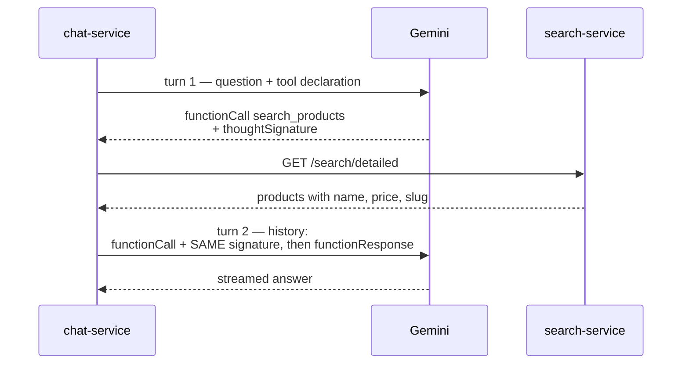

# Chat service: the bot's provider layer

The chat service answers product questions by streaming a Gemini reply over SSE, with one tool the model
may call to search the catalogue. Everything above the provider — retry, circuit breaker, quota, cache,
persistence — is written without knowing which model is behind it.

This note covers the boundary itself: what the Gemini 3 line requires of a caller, and why the code carries
a field it never reads.

## The boundary

`internal/bot` owns the vocabulary: `bot.Client`, `bot.Turn`, `bot.ToolCall`, `bot.ToolResult`.
`internal/bot/gemini` is the only package that imports the SDK, and its whole job is converting types in
both directions and mapping provider errors onto `bot.ErrTimeout` / `bot.ErrBlocked` / the rest. The
retrier and the breaker sit above it and stay provider-agnostic.

That boundary has a price, and it is the reason for most of this note. A conversation is rebuilt from our
own types on every turn, so anything the SDK attached to the objects it returned is gone by the time the
next request goes out. For Gemini 3 that includes something the API insists on getting back.

## The 2.5 line is closed to new keys

The service was written against `gemini-2.5-flash-lite`. An API key created in August 2026 cannot reach it:

| Request | Result |
|---|---|
| `gemini-2.5-flash-lite` | `404 NOT_FOUND` — "no longer available to new users" |
| `gemini-2.5-flash` | `404 NOT_FOUND` |
| `gemini-3.5-flash-lite` | works |

The 404 body names `gemini-3.5-flash-lite` as the replacement, and that is the default the service ships
with. There is no retreat to an older model on a fresh key, which matters when reading advice about
Gemini 3: the common workaround for its stricter tool protocol is "use 2.5 instead", and that door is shut.

Two constants hold the default, `gemini.DefaultModel` and `config.defaultGeminiModel`, and `GEMINI_MODEL`
overrides both so a model can be swapped without a deploy.

## Thinking is a level, not a budget

The model must be told not to think, explicitly. Thinking tokens count towards the output cap, so leaving
the setting empty lets the model spend an unpredictable share of the 512-token ceiling on reasoning nobody
reads, and the visible answer is cut off mid-sentence. That failure is silent — the logs show a short reply
and no error at all.

Gemini 3 changed the dial from a token count to a level:

| `generationConfig.thinkingConfig` | Result |
|---|---|
| `thinkingBudget: 0` | `400 INVALID_ARGUMENT` |
| `thinkingLevel: "MINIMAL"` | works |
| `thinkingLevel: "LOW"` / `"HIGH"` | works |
| `thinkingLevel: "OFF"` / `"NONE"` | `400 INVALID_ARGUMENT` |

`MINIMAL` is the floor; thinking cannot be switched off entirely any more. It does preserve the property
the old `thinkingBudget: 0` was there for — a live call returned 22 output tokens for a 22-token answer,
so reasoning is not being billed into the reply.

## Function calls are signed, and the signature has to come back

Gemini 3 signs the `functionCall` part it emits, and refuses the follow-up turn unless that signature
returns untouched:

```
400 INVALID_ARGUMENT — Function call is missing a thought_signature in functionCall parts.
```



The signature travels as `bot.ToolCall.Signature`, an opaque `[]byte`. The bot layer never inspects it; it
only carries it from the response of turn one into the history of turn two, which keeps the provider-neutral
vocabulary intact while satisfying a requirement that is entirely Gemini's.

Google's function-calling guide says the SDKs handle thought signatures automatically. That is accurate for
callers that hand the SDK back the `Content` objects it produced. This service deliberately does not — it
converts everything to its own types — so the signature has to be plumbed by hand. The automatic handling
and the provider-agnostic layer are the same trade-off seen from two sides.

Two tests hold the round trip, one for reading the signature off the response and one for putting it back
on the wire. They exist because nothing else can fail: every other test in the package points the client at
an `httptest.Server`, which accepts a request whether or not the signature is there. Only the real provider
rejects it, and the real provider is never called from the test suite — except by `live_test.go`, guarded
behind the `gemini_live` build tag, which is the only check that the configured model name still exists.

## Known limits

- **One tool call per question.** The model may ask for several; the service runs the first and ignores the
  rest, so a single question cannot burn several search calls. It also sidesteps an open API bug where
  Gemini 3 Flash signs only the first one or two calls of a parallel batch, leaving the caller unable to
  return signatures for the others.
- **Signatures survive only within a turn pair.** Conversation history is stored as plain text and rebuilt
  from the database, so any signature attached to a non-tool part is dropped between requests. The tool loop
  is unaffected because it keeps its turns in memory, but this is the first thing to check if a future model
  starts requiring signatures more broadly.
- **A missing API key disables the bot, it does not stop the service.** `GEMINI_API_KEY` empty means the bot
  branch is never registered, so a deploy that forgets the key still serves everything else.
- **Free-tier traffic may be used to improve Google's products.** The service sends the question, the system
  prompt, and the tool results — public catalogue data and whatever the user typed. No order or account data
  crosses that boundary.
