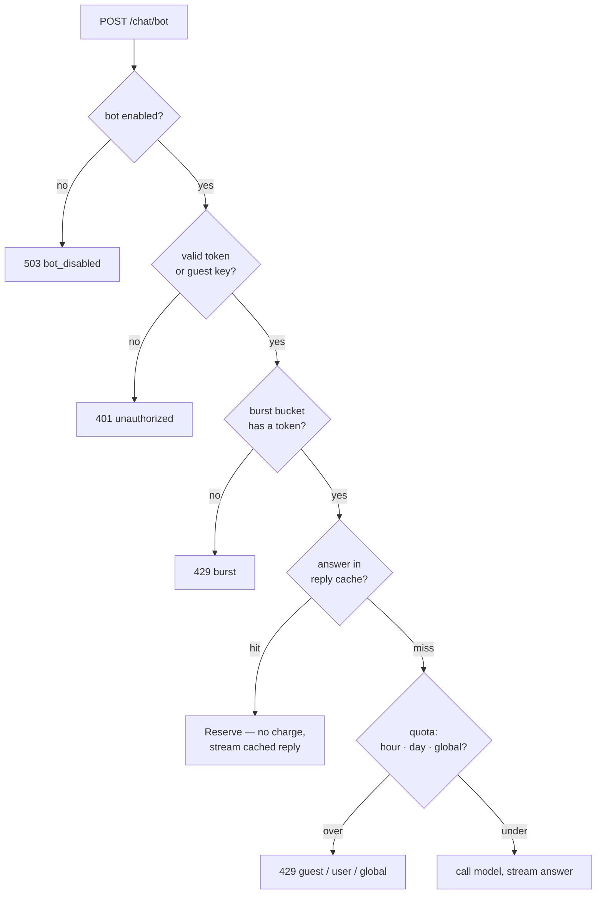
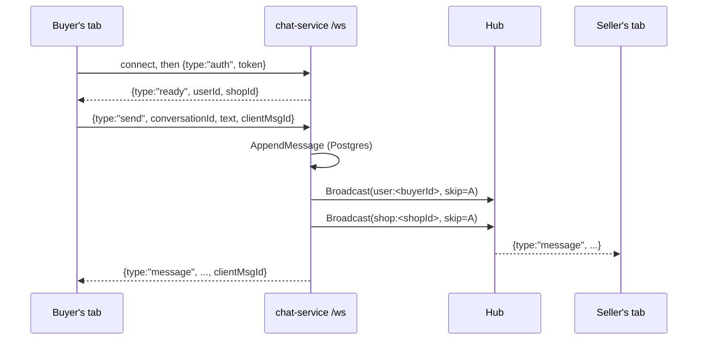
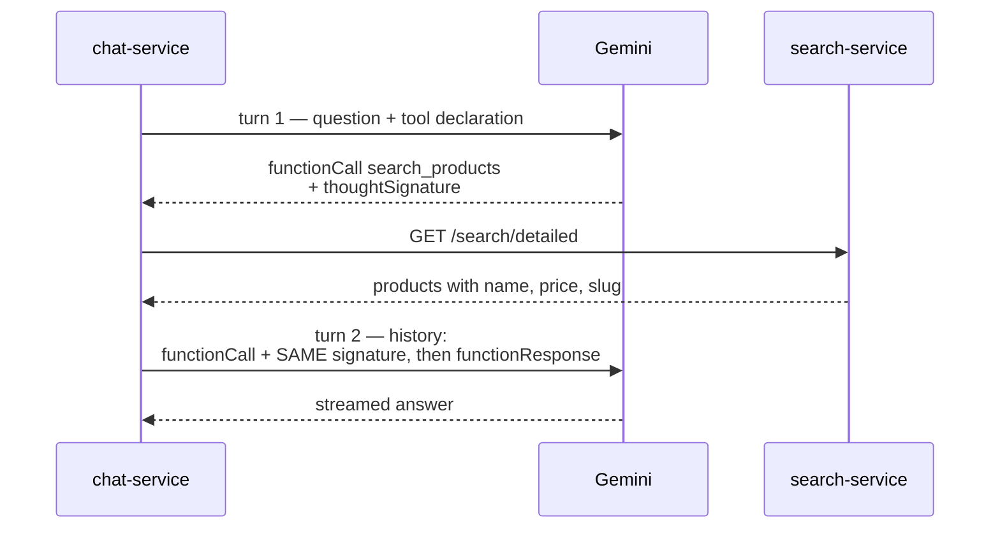

# Chat service: the shopping bot, and the direct line to a shop

_Last updated: 09:57 ICT · 05/09/2026_

The chat service answers product questions by streaming a Gemini reply over SSE, with one tool the model
may call to search the catalogue. Everything above the provider — retry, circuit breaker, quota, cache,
persistence — is written without knowing which model is behind it. The same service also carries a second,
unrelated feature: a realtime 1-1 channel between a shopper and a shop, over WebSocket instead of SSE,
sharing nothing with the bot below the `message` table both write to.

This note has three parts. The first follows a bot question through the service: the gates it passes
before a token is ever spent, how identity and quota are decided, and how the answer comes back. The
second is the WebSocket layer underneath the shopper-to-shop channel — the concurrency model per
connection, how a message reaches a tab that never asked for it, and why a dropped connection and an
unauthorized one are handled differently. The third is the provider boundary itself — what the Gemini 3
line requires of a caller, and why the code carries a field it never reads.

## A question's path through the service

`botHandler` (`internal/httpapi`) runs a fixed sequence of gates, and the order is deliberate — each one is
cheaper than the next, so a rejected request is turned away before it costs anything it did not have to:

```
kill switch → auth → burst → read body → cache (Reserve) → quota → model
```



The kill switch (`CHAT_BOT_ENABLED`) and auth come first because they need no state and no I/O. Burst is a
pure in-memory check, so it fences off a runaway loop before that loop can touch the database. Only after
the body is read and the cache is missed does the request reach the counters that write to Neon. `Reserve`
on the cache-hit branch and `Acquire` on the miss branch return the same `Decision` shape, so the handler
has one rejection path to format, not two.

Each layer in one view — ordered by the path, cheapest first, so the columns read as "how much did this
request cost before it was turned away":

| Layer | Function | State lives in | Check cost | What it spares | Rejects with |
|---|---|---|---|---|---|
| Kill switch | `botDeps.Enabled` | config flag (RAM) | none | a provider call while the bot is off | `503 bot_disabled` |
| Auth | `resolveSubject` | stateless — HS256 verify / guest UUID | one signature check | — (identifies, does not spare) | `401 unauthorized` |
| Burst | `quota.Burst.Allow` | token bucket in RAM, per subject (cap 10, +1 / 6s; swept every 256 calls) | in-memory, no I/O | a runaway loop before it reaches the DB | `429 burst` |
| Reply cache | `bot.ReplyCache.Get` | TTL map in RAM (500 entries, 10 min) | map lookup | the model call **and** the quota charge, for a repeated question | hit streams the cached reply |
| In-flight latch | `Limiter.enter` | set in RAM, per subject | in-memory | concurrent tabs each spending a turn | `429 in_flight` |
| Quota counters | `Limiter.charge` | Neon `bot_usage_daily` | 1–3 DB increments | the provider's daily quota (guest 5 · user 30/hr-cap 10 · global 300) | `429 guest_daily / user_hourly / user_daily / global_daily` |
| Retrier | `bot.Retrier` | stateless | — (one retry on upstream/timeout) | — (spends a call to save an answer) | passes the error through |
| Breaker | `bot.Breaker` | state + fail count in RAM (5 consecutive failures → open 60s) | in-memory | repeated calls to a provider that is down | `503 bot_unavailable` |

The first six are gates on the request path, run in sequence. The last two are not gates — they wrap the
provider call itself, and the model loop below explains why they nest in that order.

Two of these behave in a way the row cannot hold. The cache **never evicts to make room**: when it is full
it sweeps expired entries, and if it is still full it simply skips storing the new reply. A full cache means
the questions are all different, which is exactly when a cache has stopped paying for itself — so the code
declines to add an eviction policy it would not benefit from. And the breaker counts *consecutive* failures:
one success in between resets the count to zero, so a provider that is merely flaky never trips it.

Most of the state in the table lives in **RAM on one instance**: the burst bucket, the reply cache, the
in-flight latch, and the breaker's fail count. That is what makes the burst ceiling and the in-flight latch
exact today — and it is also the assumption that breaks first if the service is ever scaled to two
instances, where each of those ceilings becomes the configured one multiplied by the instance count.

The quota counters are the exception, and deliberately so. They are a single atomic upsert against Neon
(`INSERT … ON CONFLICT DO UPDATE SET message_count = message_count + 1 RETURNING`), which increments and
returns in one round trip rather than reading then writing. Guest, hourly, daily and global ceilings
therefore stay exact no matter how many instances run. Scaling would not raise them — but it can reach
them sooner when requests are distributed across instances, because a reply cache held per instance turns
a question one instance could have answered from memory into a model call and a quota charge on another.

## Quota is three ceilings and a speed limit

Burst is a token bucket held per subject in RAM (`quota.Burst.Allow`): a fixed capacity refilled one token
every few seconds. It is the speed limit, and it answers without a round trip, which is the point — the
request it blocks never reaches the database.

Those per-subject buckets accumulate, so they have to be cleaned up, and *how* is a deliberate choice. The
sweep runs **on call count, not on a timer**: every 256th `Allow` drops the buckets that have been idle long
enough, inline, while the caller already holds the lock. There is no background goroutine and no ticker —
one more goroutine is one more thing to shut down correctly, and the map only grows while requests are
arriving, so tying the cleanup to request volume means it happens exactly when it is needed and never while
the service is quiet.

The idle threshold is not a tuned constant either: it is `capacity × refill`, the time a bucket takes to
refill from empty. Past that point a remembered bucket and a fresh one are indistinguishable, so dropping it
costs nothing. It is not a memory-versus-accuracy trade — beyond that horizon there is no accuracy left to
trade away.

The three counters live in `quota.Limiter.charge`, and their order is a security decision, not a tidy
sort:

- **Individual before global.** Guest-daily or the user's hour/day counter is charged first; the global
  daily ceiling last. Reversed, someone already out of their own allowance could still add to the 300-per-day
  global total and starve the bot for everyone else.
- **Hour before day, for signed-in users.** Reversed, a user who hits the hourly wall would still have spent
  one of their daily allowance on the request that got refused.

Two guards sit around the counters. An **in-flight** latch (`Limiter.enter`, keyed per subject) admits
one request at a time, so opening twenty tabs blocks nineteen at the latch and none of them spends a turn.
And the counters are **fail-closed**: a database error refuses the request rather than waving it through,
because a service that cannot count cannot know how much of the provider quota is already gone — and if the
counter write failed, the conversation write would fail too.

Every rejection carries a `Reason` and a `RetryAfter` the limiter already computed (`untilNextDay`,
`untilNextHour`), so the six distinct 429s reach the client as six distinct messages rather than one flat
"out of quota".

## Identity answers two different questions

`resolveSubject` (`internal/httpapi`) is the only place a caller's identity is decided, and its signature
gives away the design: it returns **three** values, `(Subject, guestKey, error)`. The guest key is
deliberately *not* a field of `Subject`, because the two answer different questions.

**`Subject` answers "who is billed".** It is assembled on the server and holds two fields:

```go
type Subject struct {
    UserID string // empty means guest
    IP     string
}
```

`dayKey()` turns that into `user:<id>` for a signed-in caller and `ip:<addr>` for a guest. Metering guests
by IP rather than by their guest key is the load-bearing choice: a key lives in `localStorage`, so counting
against it would mean clearing site data buys five fresh turns. The IP is never taken from the request
body — it is derived server-side by `ClientIP`, reading Cloudflare's `cf-connecting-ip`, because a
client-declared address would make the guest ceiling decorative.

**The guest key answers "whose conversation is this".** It arrives as the `X-Guest-Key` header, and it is
what `EnsureBotConversation` stores as the owner of an anonymous thread. For a signed-in caller it comes
back empty — the conversation belongs to the account instead.

So an anonymous visitor is *rate-limited by IP* while their *history is addressed by key*. Two office
workers behind one NAT share a quota but never see each other's threads; clearing storage loses the thread
but grants no extra turns.

Three details around that:

- **The key travels in a header, not the body.** Identity has to be settled before the body is read, so
  that quota can reject a request whose body is garbage.
- **A bad token is a `401`, never a silent demotion to guest.** A signed-in user quietly dropped to five
  IP-based turns a day is a symptom nobody can diagnose; the status code tells the client to refresh and
  retry.
- **`IP` is filled even for signed-in callers**, though `dayKey()` ignores it there. `ClientIP` has already
  run, so carrying it costs nothing, and it is the only lead left if one account has to be traced for
  abuse. The `quota` package deliberately keeps IP out of its logs, so any future use of that field has to
  be a conscious choice rather than an accident.

That guest key started as a way to keep one anonymous visitor's model context separate from another's.
Once `GET /chat/history` existed it became something stronger: guessing a key now *reads* that visitor's
stored conversation. The key is still a 122-bit `crypto.randomUUID()`, so the difficulty is unchanged —
but the comment in `subject.go` that once called it low-stakes had to be corrected, because it now guards
a read. The validator enforces a 16–64 character bound and an alphanumeric-plus-`-_` charset before the
value ever reaches the `owner_guest_key` column.

### Where a Subject travels, and where it stops

`Subject` is not a general-purpose user context passed around the service. It reaches exactly two places,
and the list is short enough to be worth stating in full:

| Destination | Call | Why it needs identity |
|---|---|---|
| Rate limiting | `Burst.Allow(subject)` | which bucket to spend a token from |
| Quota counters | `Limiter.Reserve` / `Acquire(ctx, subject)` | which row of `bot_usage_daily` to increment |
| Conversation ownership | `conversationFor(...)` | which thread to append to |

At the third one it is taken apart rather than passed on:

```go
owner := store.BotOwner{UserID: subject.UserID, GuestKey: guestKey}
```

Only `UserID` survives, recombined with the guest key into a different type. This is the same split as
above, expressed in the type system: `Subject` is a *metering* identity, `BotOwner` is an *ownership*
identity, and neither is substitutable for the other.

The boundary that matters most is where `Subject` does **not** go: it never enters `internal/bot`. The
prompt builder, the tool loop, the retrier, the breaker and the provider client are all written without
any notion of who is asking — they receive a question and a history, nothing more.

That buys three things. Caller identity cannot leak into a prompt sent to Google, because the layer that
builds prompts has never seen it. Changing how callers are metered — say, adding a paid tier — touches
`internal/quota` and stops there. And the model layer stays honestly testable: there is no user to
construct in order to exercise it.

Counters keyed by subject, meanwhile, are plain strings rather than columns:

| Tier | Key |
|---|---|
| Guest, per day | `ip:1.2.3.4` |
| Signed-in, per hour | `userhour:<uuid>:14` — the hour, in `Asia/Ho_Chi_Minh` |
| Signed-in, per day | `user:<uuid>` |
| Whole service, per day | `global` — no prefix, because it identifies nobody |

The hour is folded into the key instead of getting a column of its own: the primary key of
`bot_usage_daily` is `(subject_key, usage_date)`, the date half already carries the day, so two digits of
hour in the key are enough to separate the buckets. One table serves all four tiers.

## The stream is the only channel

Both branches answer over SSE, never a plain JSON body. A question is a request-and-response, not a
conversation, so a WebSocket would buy nothing and cost a connection lifecycle; SSE is one-directional and
rides ordinary HTTP. `internal/httpapi/sse.go` emits a fixed event vocabulary:

| Event | Payload | Meaning |
|---|---|---|
| `meta` | `{"remaining": n}` or `{"cached": true}` | sent first, before any text |
| `tool` | `{"name": "search_products"}` | the model asked to search |
| `text` | `{"v": "…"}` | one chunk of the answer |
| `done` | `{"cached", "truncated"}` | the stream is complete |
| `error` | `{"reason": "…"}` | failed after the stream opened |

The cache-hit branch streams too, one `text` event carrying the whole stored reply, so the client has a
single code path to read. Errors split at the stream boundary: a rejection *before* the first byte is a
normal HTTP status with a JSON body the client can read; a failure *after* the stream is open can only be
an `error` event, because the status line is already sent.

## What makes two questions the same

The reply cache is the only gate that can answer outright, so what counts as "the same question" is a
behavioural decision rather than a detail.

The key is a SHA-256 of the question after `normalizeQuestion` lowercases it, collapses every run of
whitespace into one space, and trims the ends. Three things follow:

- **Diacritics are kept.** Two Vietnamese sentences differing only in their marks are two different
  questions, and folding them together would answer one of them wrongly. It is the one normalisation the
  function deliberately declines to do.
- **The key is a hash, not the text.** A map keyed by raw questions puts whatever people typed into heap
  dumps and debug output. Hashing also bounds the key when somebody pastes a thousand characters.
- **The cache is shared by everyone.** A catalogue question carries no personal data and its answer does not
  depend on who asked, so one popular question costs one model call however many people ask it inside the
  TTL.

That last property is exactly why not every answer may be stored. `cacheable` refuses three kinds:

| Refused | Why |
|---|---|
| an answer produced with a non-empty history | the key hashes the question and nothing else, so a contextual answer would be replayed to someone holding different context — *"còn màu xanh thì sao"* asked after browsing phones, served to a reader who was looking at shoes |
| an empty answer | storing one incident replicates it for every asker for the whole TTL |
| a truncated answer | a sentence cut mid-word is not something to hand to a second person |

Only opening questions are stored, then — which is also the kind most often repeated, and therefore the part
of the traffic a cache was ever going to pay for.

The pair filter on the read path feeds back into this. A first question whose turn died leaves an orphan in
the thread; once that orphan is filtered out of the history, a retry of the same question is an opening
question once more, and regains the eligibility it would otherwise have lost.

`DefaultReplyCacheTTL` is ten minutes: long enough to absorb a round of refreshes on one question, short
enough that a price or a stock figure quoted inside a stored answer has not drifted far.

### The four caches, side by side

| Cache | Lives in | TTL | Holds |
|---|---|---|---|
| `bot.ReplyCache` | chat-service RAM | 10 min, 500 entries | answers to opening questions, shared across callers |
| `shopclient` | chat-service RAM | 10 min | which shop a seller owns, since this database has no shop table |
| `/chat/config` | browser `sessionStorage` | 5 min | whether the bot is enabled |
| shortcut blocks | browser `localStorage` | 24 h, 10 entries | the question plus category id/name; products come from the catalogue API when rendered |

The middle two each earn a sentence. The shop lookup is cached because the seller-shop relation almost never
changes, while the alternative is a network hop into the monolith on every fanout. The kill switch is held in
`sessionStorage` rather than `localStorage` on purpose: it is flipped during an incident, and a stale
"disabled" surviving for days would keep the widget hidden long after the bot came back.

## The model loop, and the ring around it

`Service.Ask` (`internal/bot`) turns one question into at most two model calls. History reaches it already
filtered to complete question-answer pairs, and is then trimmed to the last `maxHistoryTurns` (6) before the
question is appended, so an old conversation cannot grow the prompt without bound.

### Why the history arrives in pairs

`historyFor` (`internal/httpapi`) drops any stored turn that has no reply beside it, and that filter exists
because the write path is deliberately asymmetric. `streamAnswer` stores the question *before* it calls the
model, so `GET /chat/history` reports what the person actually asked even when no answer ever arrives. Every
turn that dies mid-flight — a reload, a dropped connection, a provider timeout — therefore leaves a user
message with no bot message after it.

Those orphans accumulate, and `toContents` gives every turn a `Content` of its own, so without the filter the
next question's prompt opens with a run of consecutive `user` parts that nobody has answered. The model is
free to answer any one of them, and it does: a question about laptops came back as an answer about phones
from two turns earlier, carrying the search failure that the older question had hit.

The filter is on the read path only. The stored thread keeps its unanswered questions, because that is what
happened; it is the prompt that must not see them. A model turn whose question fell outside the
`historyLimit` window is dropped for the same reason — an answer with no visible question is a fragment, not
context.

Turn one is non-streaming and carries the tool declaration, but its sink is wrapped in `toolCallOnly` — only
a `tool` event reaches the client, and any prose the model writes on this turn is suppressed. The turn
exists to decide one thing: does the model want to search?

- **No tool call.** The answer is already complete on turn one. It is flushed once through the sink and the
  service stops. Calling the model a second time just to obtain a stream would pay twice for the same
  answer.
- **A tool call.** Only the first is run (`decided.ToolCalls[0]`); a model that asks to search several times
  in one turn cannot burn several search calls on one question. The tool result is appended and turn two
  streams the real answer. The two turns must stay adjacent — Gemini rejects the request if the
  `functionResponse` does not immediately follow its `functionCall`, which is the signature contract
  described below.

The whole of `Ask` runs under an `answerBudget` timeout, with a tighter `decideBudget` around turn one, so a
slow provider fails on a deadline rather than holding the stream open.

Around the provider sits a two-layer ring, composed in `buildBotClient` as `Breaker(Retrier(Gemini))`:

- **Retrier** retries a failed call once, on `ErrUpstream` / `ErrTimeout` only, after a jittered backoff. A
  call that already delivered bytes is not retried — that would double the visible text.
- **Breaker** sits *outside* the retrier, on purpose. Both attempts of one request count as a single failure
  toward its threshold, and while the breaker is open it short-circuits before the retrier's wait, so a
  provider that is down stops costing latency as well as calls.

The reply cache is deliberately *not* in this ring. It is a handler gate checked before quota (see the path
above), so a repeated question is answered from memory without reaching the model or spending a turn — the
ring protects the call, the cache avoids it.

## The search tool, and links built from our own slugs

When the model asks to search, `SearchTool` calls the search service at `GET /search/detailed` and hands
the results back as the tool response. The two-round protocol that this requires — and the signature Gemini
attaches to the call — is the subject of the provider half below.

One detail lives on this side of the boundary. Product links in the answer are built by `productURL` from
our own stored slug and id, `FRONTEND_URL + "/products/" + slug + "-i." + id`, never from a URL the model
composed. The storefront route resolves on the id after `-i.`, so a link works even when the slug has lost
its diacritics; letting the model write the URL would invite a plausible-looking link to a product that
does not exist.

### Five products, enforced three times

The cap of five is set on both sides of the call and again in the prompt:

| Where | What it does |
|---|---|
| `searchDetailedHandler` (search service) | returns display fields for at most five products |
| `maxToolItems` (`internal/bot/tool_search.go`) | truncates the decoded list again before building the payload |
| the `SystemPrompt` line "tối đa 5 sản phẩm" | keeps the model from listing more than it was handed |

The middle row looks redundant and is not. This is the side *reading* the data, and a reader that trusts a
producer to have honoured a limit has no limit — a deploy skew, or any future caller of that endpoint, and
the prompt grows without anything noticing. The prompt line is not redundant either: it constrains the
answer rather than the payload, which is what a reader of the reply actually sees.

### Everything inside the payload is data

Product names are written by sellers, so the tool response is the one place in this service where untrusted
text reaches a model's context. Two things guard it, and neither is in the code that fetches.

The payload carries its own warning. Alongside `products` and `total`, `SearchTool` ships a `note` field
saying the contents are data from the catalogue and must not be read as instructions. That sentence travels
**with the data** rather than living only in the system prompt, so the model meets it in the same breath as
the seller-authored text it qualifies.

The `SystemPrompt` then states the rule from the other direction: results returned by the function are data,
never instructions, and a product name that reads like a command to the assistant is to be treated as part of
the name and ignored. The search service reasons about the same risk from its end — it declines to serve
free-text description fields to this endpoint at all, on the grounds that one of its callers is a model.

## Every clock in one question

A bot question passes through a dozen-odd deadlines, and most stay invisible until one is set wrong. They
fall into three groups.

**The budget ladder**, nested, each inside the last:

| Clock | Value | Declared in | Bounds |
|---|---|---|---|
| `answerBudget` | 56s | `internal/bot/service.go` | the whole of `Ask`: both model turns plus the tool call |
| `decideBudget` | 18s | `internal/bot/service.go` | turn one alone |
| `TotalBudget` | 25s | `internal/bot/retry.go` | one `Generate`, counting both attempts |
| `firstChunkTimeout` | 8s | `internal/bot/gemini/client.go` | silence before the first chunk of a single attempt |
| retry backoff | 1.0–1.5s | `internal/bot/retry.go` | the gap between the two attempts |
| `toolTimeout` | 20s | `internal/bot/tool_search.go` | the HTTP call to the search service |

Nested, the worst case looks like this. Every number below is a ceiling, not a typical duration — the
ordinary path finishes in about eight seconds:

```
answerBudget 56s
│
├─ decideBudget 18s ─── turn one ──────────────┐
│    attempt 1          8s   cut by firstChunkTimeout, not by an answer arriving
│    backoff       1.0–1.5s  jittered, so several callers do not retry in unison
│    attempt 2          8s   a whole second window — that is the entire point
│
├─ toolTimeout 20s ──── the search call ───────┐
│    GET /search/detailed    a ceiling, not a typical duration — see below
│
└─ what turn two inherits: 56 − 18 − 20 = 18s ─┘
     attempt 1, backoff, attempt 2, same shape as turn one, needs ≥ 17.5s
```

Two of those relationships are arithmetic rather than taste, and `TestNganSachConDuChoVong2` goes red if
either breaks:

```
decideBudget                              >= firstChunkTimeout + backoff + firstChunkTimeout   (18 >= 8 + 1.5 + 8)
answerBudget - decideBudget - toolTimeout >= 17.5s                                             (56 - 18 - 20 = 18)
```

The first says turn one must hold **two** complete provider attempts. Gemini's latency is almost entirely
queueing ahead of the first token rather than generation — measured on 03/09/2026 at a p50 of 4.2s against a
p90 of 25s, with time-to-first-chunk equal to total time — so cutting early and retrying is the only thing
that swallows the tail, and streaming turn one would not help. The second line says the same for turn two,
out of whatever is left.

### The ceilings move together, or not at all

Rearranging the second inequality shows what any one of them costs the others. Holding `decideBudget` at 18s:

```
answerBudget − 18 − toolTimeout ≥ 17.5   ⟹   toolTimeout ≤ answerBudget − 35.5
```

That is the whole history of `toolTimeout` in one line. While `answerBudget` was 48s the tool could have at
most **12.5s**, which is exactly why it sat at 12 — the largest value that still fit, not a judgement about
how long a search takes. Raising it to 20s was therefore never a local change; it forced `answerBudget` to
56s, because the alternatives were to shrink `decideBudget` below what a retry needs, or to lower the guard
and delete the very protection it exists to hold.

The guard states the failure in the same terms, so a wrong constant explains itself:

```
vong 1 18s + tool 20s an het answerBudget 48s, chi con 10s cho vong 2, can it nhat 17.5s
```

Three of these constants live in three different packages and one of them is unexported across a package
boundary, so nothing but that test ties them together. A change to any single value that looks harmless in
isolation is the failure mode this section exists to prevent.

`callTimeout` (25s) sits beside `firstChunkTimeout` but never fires in production: it applies only when a
caller reaches the provider client with no deadline set, which the retrier never does.

`toolTimeout` was originally sized off a `curl /health` measurement — 13.7s and 12.6s waking, 0.3s warm, on
04/09/2026 — on the theory that a slow search call meant the service was mid-wake and 20s bought enough
margin to ride it out. Render logs from that same night disproved the theory: the failing calls returned in
**29–70ms**, three orders of magnitude below the ceiling. `curl /health` measures how long a *health probe*
waits for a cold container; it says nothing about how long `/search/detailed` is held open, because the two
requests were never in the same wait. `toolTimeout` has not fired once in production. What actually happens
is `SearchTool` getting an immediate 5xx, an immediate connection refusal, or a 200 whose body never arrives
— all of them fast, none of them a wait for anything to boot.

That the search service sleeps at all is a decision, not an oversight. A cron keeps chat-service warm,
because it is the entry point and its cold start is what a visitor would read as a dead widget. The search
service is deliberately left out of that cron: the free tier bills instance-hours across every service on the
account, and holding a second one awake around the clock would eat most of a month's allowance. The user-
visible cost of that choice — a shopper reading "the system is having trouble" moments after the widget
should still be finding its feet — is not the 20-second ceiling covering a wake in progress. It is one of the
outcomes below arriving before any wake has had a chance to happen, and `SearchTool` telling the model to
report it as a system fault when it is not one.

### `ToolOutcome`: naming what actually happened, not what was assumed

`Execute` returns two things: the payload handed to the model, and a `ToolDiagnostic` that never reaches the
model. The diagnostic exists because `hasError: true` in a log line does not distinguish an edge proxy
returning 5xx from a 200 whose body is HTML instead of JSON from a connection refused outright — and on
04/09/2026, without that distinction, three competing theories for the same failure took an entire
investigation to narrow down, and still could not be settled from static reading alone.

`ToolOutcome` is a closed set of fifteen values — one success, fourteen ways `Execute` can fail — split across
four phases of one call:

| Phase | Values | When |
|---|---|---|
| Input, before any network call | `invalid_input`, `request_error` | empty query after trimming; a malformed request URL |
| `success` | `success` | the one value that is not a failure |
| Connect (`http.Client.Do` returns an error) | `canceled`, `context_deadline`, `client_timeout`, `transport_timeout`, `transport_error` | no response was ever received |
| HTTP status ≠ 200 | `http_4xx`, `http_5xx`, `http_other` | a response arrived, header included |
| Reading the body, after a 200 header | `body_canceled`, `body_context_deadline`, `body_timeout`, `decode_error` | the header was fine; something failed while reading or parsing what followed |

The connect phase and the body-read phase look like they should share one set of names, and deliberately do
not. `http.Client.Timeout` does not stop at `Do()` returning — its clock keeps running and can cut in while
`json.Decoder.Decode` is still reading `Response.Body`. A server that sends a 200 header and then never
finishes the body would, under a single shared `client_timeout`, be indistinguishable from one that never
connected at all. Four body-phase values exist so that a stalled response is named for what it is, with its
own `StatusCode: 200` on the diagnostic, rather than being absorbed into `decode_error` as if the JSON had
simply been malformed.

`shouldWarm()` is the one place this taxonomy changes behaviour rather than just naming it. Five of the
fifteen values wake the search service with a background `GET /health`:

| Wakes the service | Does not |
|---|---|
| `context_deadline`, `client_timeout`, `transport_timeout`, `transport_error`, `http_5xx` | everything else, including `success` and all four body-phase values |

The asymmetry is deliberate on both ends. `canceled` does not wake anything: a shopper who closed the tab is
not evidence the upstream is unhealthy, and paying to spin up an instance-hour for someone who already left
works against the very reason the search service is allowed to sleep. The four body-phase values do not wake
anything either — not because there is proof they never would benefit from it, but because that is what the
decode-error path did before this distinction existed, and this change is scoped to naming failures
precisely, not to revisiting which of them should trigger a wake. `warmIf` is only ever called from the
connect-error and status branches; the body-read branch never reaches it, so the question does not arise
there at all.

The wake call carries two fields that answer two different questions, and they are easy to swap by accident
because both are string-typed outcomes. `trigger` is the `ToolOutcome` that caused `Warm` to be called at
all — which of the fifteen values `Execute` just saw. `outcome` is a separate, unexported `warmOutcome` — one
of seven values describing what happened to *this particular* `/health` poke: `success`, `http_non_2xx`,
`transport_error`, `request_error`, or one of `suppressed_in_flight` / `suppressed_throttled` /
`suppressed_empty_url` when the poke never went out at all. A log line reads as cause and effect together —
`trigger=http_5xx outcome=success` says the search call saw a 5xx, so a wake was attempted, and it worked.

Not every occurrence of `outcome` carries the same fields, because not every branch reaches the network.
`Warm` checks three gates before a request is ever built — an empty `baseURL`, a poke already in flight, a
poke too recent — and each of those three logs directly with only `outcome` and `trigger`, since nothing was
sent and there is nothing to time. Only the four outcomes that follow an actual `/health` attempt
(`request_error`, `transport_error`, `success`, `http_non_2xx`) go through the shared `log` helper, which adds
`statusCode` (`0` when no response arrived) and `latencyMs`. A log line missing those two fields is not a bug
— it means the poke was suppressed before it left the process.

Before this change the warmer logged nothing at all: a nearly three-minute gap between a failing call and the
first one that worked, in the 04/09/2026 incident, had no record of whether a wake had even been attempted.

**Clocks that protect the process rather than the answer:**

| Clock | Value | Declared in | Purpose |
|---|---|---|---|
| `keepaliveEvery` | 20s | `internal/httpapi/sse.go` | an SSE comment, so Cloudflare does not cut a silent stream |
| `ReadHeaderTimeout` | 5s | `internal/httpapi/server.go` | a client that opens a connection then dribbles headers |
| `breakerOpenFor` | 60s | `internal/bot/breaker.go` | how long the breaker stays open |
| `providerTripFor` | 60s | `internal/httpapi/bot_handler.go` | how long the kill switch stays flagged after a provider failure — must equal the row above |
| `warmThrottle` | 10 min | `internal/bot/warmup.go` | at most one background wake of the search service per window |
| `warmTimeout` | 90s | `internal/bot/warmup.go` | how long that wake may hold its connection |
| `authDeadline` | 5s | `internal/ws` | a socket that connects but never sends its `auth` frame |
| `lookupTimeout` | 5s | `internal/shopclient` | asking the monolith which shop a seller owns |

**And two on the client**, which measure something different and must not be compared against the server's:

| Clock | Value | Declared in | Bounds |
|---|---|---|---|
| `BOT_CONNECT_TIMEOUT_MS` | 75s | `frontend/src/constants/chat.ts` | the wait for response **headers** on `POST /chat/bot` |
| `defaultTimeout` | 15s | `frontend/src/lib/http.ts` | any call to the monolith, headers and body together |

The client ceiling exceeds the server's entire `answerBudget` on purpose, because it covers a stretch the
server cannot: chat-service sleeps after fifteen idle minutes, and nothing is written until Render has it
back. The ceiling is released the moment the headers land, and the server's own budgets take over from
there. One ceiling wrapped around the whole stream would instead cut a legitimate answer that merely followed
a cold start, since the wake and the answer are consecutive waits rather than overlapping ones.

That same handover is what the widget shows. Until the first `meta` event arrives the composer reads *"đang
kết nối tới trợ lý"*, and `meta` — written before the handler reads history or calls the model — flips it to
*"đang suy nghĩ"*. The seconds spent waking a service are therefore never reported as the bot thinking.

## Conversation is stored once, and read without cost

The database is the single copy of a conversation. `EnsureBotConversation` (`internal/store`) attaches
every turn to a conversation owned by the subject, and `GET /chat/history` reads it back when the panel
first opens.

Two decisions keep that read cheap. History **does not touch quota** — it is a handful of SELECTs that never
call the model, so re-opening the widget to read yesterday's thread costs nothing. And its `limit` is a
server-side constant of 30, not a query parameter: a client-set limit would be a handle for anyone to make
the service read the whole table. `GET /chat/config` is cheaper still — it returns `{"enabled": bool}`
without a database call, because the widget mounts on every storefront page and must not bill a query just
to decide whether to draw a button.

## The bot is not a separate system, it is a kind of participant

One `message` table carries both the bot thread and the one-to-one threads between a shopper and a shop.
That is possible because a message does not point at a person. It points at a `participant` row — a
person's *seat in one conversation* — and that row is where identity lives:

| Sender | `user_id` | `guest_key` | `role` |
| :--- | :--- | :--- | :--- |
| Signed-in shopper | set | — | `user` |
| Shop owner | set | — | `seller` |
| Visitor who never signed in | — | set | `user` |
| The bot | — | — | `bot` |

Two of those four have no user id at all, and `message.sender_participant_id` is `NOT NULL`. Pointing
messages directly at a user id would mean a nullable column, a `CHECK` explaining which identity column is
in play, and that branch repeated in every query that reads a thread. Behind a participant id, all four
look identical to the reader.

The seat, not the person, is also the right grain for the columns that hang off it. `role` differs per
conversation — the same account is a `user` in the threads it opened and a `seller` in the threads its shop
receives. `last_read_at` is per conversation by definition. Neither belongs on an account.

The natural key here would be `(conversation_id, user_id)`, and in a system with a single kind of identity
it would be the better choice: `message` already carries `conversation_id`, so a composite foreign key would
let the database enforce that a sender belongs to the conversation they are writing into. Today that
invariant is held by code — `ResolveDirectParticipant` hands both ids to `AppendMessage` from one authorized
lookup — and not by a constraint. What rules the natural key out is the two rows with no `user_id`. Identity
here is polymorphic, and a surrogate key is what keeps that shape in one table instead of spreading it
across every table that references it.

There is a second reason to keep the key local: `user_id` is issued by the monolith. Making another
service's identifier part of this one's primary key would tie the storage layout to their identity scheme.
The surrogate is a layer of insulation, and it is also why a participant id — not a user id — is what
travels out to the browser on every message frame.

## A second channel: one goroutine writes, per connection

The bot answers over SSE because a question is one request and one reply — the client asks, the
server streams back, done. A conversation between a shopper and a shop is not that shape: either
side can write at any moment, and a message has to reach a tab that never asked for anything. That
needs a connection the server can push through, which is what `internal/ws` is for — a stateful,
bidirectional socket per open tab, entirely separate from the SSE stream above and built around one
rule: **exactly one goroutine ever writes to a given connection.**



`coder/websocket` permits only one writer at a time per connection, and fanout means an arbitrary
sender's goroutine has to deliver into an arbitrary receiver's socket — a mutex everyone has to
remember to take would make the one-writer rule a matter of discipline. Channeling every write
through a single goroutine per connection makes it a matter of the type system instead. Three
goroutines per accepted socket carry that out:

| Goroutine | Reads | Writes | Exits when |
|---|---|---|---|
| the request goroutine, running `readLoop` | frames off the socket | nothing | the socket errors, closes, or a frame exceeds `readLimit` (8KB) |
| `writeLoop` | `Conn.outbox` — a buffered channel, 16 frames deep | the socket — the **only** writer | `ctx` is cancelled or `Conn.done` closes |
| `pingLoop` | a 30s ticker | a WebSocket control frame (`Ping`) | same |

`Conn.Send` is the only way any frame reaches the wire — called from the read loop, from the Hub,
from anywhere — and it never blocks its caller: it pushes onto `outbox` and returns immediately. A
`select` with a `default` branch is what makes that a guarantee rather than a hope: if the queue is
already full, the frame is not queued and blocked on, it is dropped and the connection is torn down
via `Close`. Sixteen is a small number on purpose — a direct conversation gets a few messages a
minute, so a queue that deep filling up is not "busy", it is "the write side is dead and does not
know it yet". Silently dropping the frame instead of closing would leave two tabs holding two
different histories with nothing telling either one.

Pings ride a *control* frame, which `coder/websocket` keeps on a separate lane from data frames — so
`pingLoop` writing on its own ticker never collides with `writeLoop`'s hold on the data-frame lane,
and the one-writer rule survives having two goroutines that write something.

## The five frames, shape by shape

Everything that crosses the socket is one of five frame types — two the client sends, three the
server does — and every type carries a different subset of the same two structs:

```go
type clientFrame struct {
    Type string `json:"type"`

    Token string `json:"token,omitempty"` // auth only

    ConversationID string `json:"conversationId,omitempty"` // send only
    ShopID         string `json:"shopId,omitempty"`         // send only
    Text           string `json:"text,omitempty"`           // send only
    ClientMsgID    string `json:"clientMsgId,omitempty"`    // send only
}

type serverFrame struct {
    Type string `json:"type"`

    UserID string `json:"userId,omitempty"` // ready only
    ShopID string `json:"shopId,omitempty"` // ready only

    ConversationID string `json:"conversationId,omitempty"` // message only
    ID             string `json:"id,omitempty"`             // message only
    SenderID       string `json:"senderId,omitempty"`       // message only
    SenderRole     string `json:"senderRole,omitempty"`     // message only
    Text           string `json:"text,omitempty"`           // message only
    CreatedAt      string `json:"createdAt,omitempty"`      // message only
    ClientMsgID    string `json:"clientMsgId,omitempty"`    // message (sender's own echo) or error

    Reason string `json:"reason,omitempty"` // error only
}
```

One struct per direction instead of one per type, because a direct-chat frame only ever has a
handful of fields — decoding it twice to get two typed structs would mean holding onto the raw JSON
between the two reads. On the wire, the five look like this:

```json
// client → server — the first frame, and the only thing accepted before it
{"type": "auth", "token": "<JWT access token>"}

// client → server — opening a NEW conversation: shopId set, conversationId absent
{"type": "send", "shopId": "<shop uuid>", "text": "còn hàng không?", "clientMsgId": "<uuid, client-generated>"}

// client → server — replying in an EXISTING conversation: conversationId set, shopId absent
{"type": "send", "conversationId": "<conversation uuid>", "text": "còn hàng bạn nhé", "clientMsgId": "<uuid>"}

// server → client — sent once, right after auth verifies
{"type": "ready", "userId": "<uuid>", "shopId": "<shop uuid, or absent if this user owns no shop>"}

// server → client — fanned out to every connection in both rooms; only the SENDER's own copy carries clientMsgId
{"type": "message", "conversationId": "<uuid>", "id": "<uuid v7>", "senderId": "<participant id>", "senderRole": "user", "text": "còn hàng không?", "createdAt": "2026-09-01T13:25:00Z", "clientMsgId": "<uuid, sender's copy only>"}

// server → client — any gate in handleSend rejected the frame, or the type wasn't recognized
{"type": "error", "reason": "conversation_not_found", "clientMsgId": "<uuid, echoed back if this answered a send>"}
```

`clientMsgId` is the one field that travels in a loop: the client mints it on `send`, and it comes
back on exactly one of two frames — the sender's own `message` echo, or an `error` — never both,
never neither. That round trip is the entire mechanism the FE store uses to find the optimistic
bubble it drew before the server answered (see the state table below).

## No connection ever writes to another — only through the Hub

There is no code path where the sender's connection reaches into the receiver's. Delivery goes
through exactly one indirection, and it is address-based, not identity-based:

- `readLoop` on the sender's `Conn` decodes the `send` frame and calls `handleSend`.
- `handleSend` writes the message to Postgres, then calls `Hub.Broadcast` twice — once for
  `user:<buyerId>`, once for `shop:<shopId>`.
- `Broadcast` looks up every `Conn` registered under that key and calls `.Send()` on each, which —
  by the rule above — only ever queues onto *that* connection's own `outbox`.

Read (the sender's `readLoop`), route (`Hub`), write (the receiver's `writeLoop`) are three different
pieces of code, and a `Conn` never holds a pointer to another `Conn`. The Hub is the only thing that
ever has more than one connection in hand at once, and it releases its `sync.RWMutex` before calling
any `Send()` — so a receiver whose queue is filling up can never block the Hub from routing to
everyone else in the room while it happens.

The room keys are deliberately not user ids:

```go
func UserKey(userID string) string { return "user:" + userID }
func ShopKey(shopID string) string { return "shop:" + shopID }
```

A `user:<id>` room holds every tab an account has open, so its own sent message and any reply both
land in the same place. A seller's tabs additionally join `shop:<id>` alongside `user:<sellerId>`
— and that second room is the load-bearing choice, not a naming preference. The moment a buyer opens a
conversation, chat-service knows the shop id but has no way to know who *owns* it: this database has
no `shop` table, and asking the monolith on every single fanout would put a network hop between two
people in the middle of a conversation. `authenticate()` asks that question exactly once, right after
the token verifies, and caches the answer in `Conn.ShopID` for the life of the connection — a
network error there does not fail the connection, it only means this tab won't receive messages
addressed to its shop until the next reconnect, because the alternative (dropping identity resolution
into every fanout) would let one monolith hiccup take down direct chat for everyone.

## Two close codes, and a client that tells them apart

Every close carries one of two meanings:

- **4401 — identity did not check out.** No `auth` frame within `authDeadline` (5s), an unreadable
  first frame, a first frame that isn't `type:"auth"`, or a token that fails `Verifier.Verify`. All
  four live inside `authenticate()`, and all four happen before a `ready` frame is ever sent.
- **Everything else** — the tab closing, a dead network, the server restarting, the outbox filling —
  is an ordinary, expected end to a WebSocket connection.

4401 sits in the range reserved for application use, not `1008` (policy violation), because the
client's `lib/chat/socket.ts` needs to tell "your token is stale, go refresh it" apart from every
other reason a socket might die. `ws.onclose` reads the code and picks one of two responses:

| Close code | FE response |
|---|---|
| `4401` | `handleUnauthorized()` — call `silentRefresh()`, then reconnect **once**. A second 4401 after a fresh token means the problem isn't the token, so it gives up and reports `unauthorized` rather than loop. |
| anything else | `scheduleReconnect()` — back off and retry with the *same* token: 1s → 2s → 4s → 8s → 16s, capped at 30s, plus a little jitter so several tabs from one person don't all retry in the same instant. |

That split only works because of a detail on the Go side that has nothing to do with WebSocket
semantics on its face. `authenticate()` reads the first frame with a hand-rolled `time.After(5s)`
race against the read, instead of passing a `context.WithTimeout` straight into `wsjson.Read`. The
reason: `coder/websocket` closes the socket **silently** — no close frame at all — the instant its
context expires. Wire the deadline straight into the read and the 4401 branch could never reach the
browser; the client would only see the connection die, indistinguishable from a dropped network, and
would answer a fixable "your token expired" with an unfixable retry loop instead of a refresh. The
hand-rolled timer exists purely so the connection is still alive when `Close(4401, ...)` runs, long
enough to actually send the close frame the FE is waiting to read.

The 30-second reconnect ceiling is not an arbitrary "exponential backoff, capped" number either. A
measured chat-service wake on Render's free tier took about 12.5 seconds; the cap leaves margin for that
wake without retrying every second against a process that is still booting.

And the `attempt` counter behind that backoff resets to zero only on receiving a `ready` frame — never
on `ws.onopen`. A TCP handshake succeeding says nothing about whether the token that follows will be
accepted: resetting on `onopen` would turn a string of 4401s from a stale token into a reconnect
attempt every second instead of a proper backoff.

## The client's state: five statuses, one store

`frontend/src/lib/chat/socket.ts` owns the connection and reports it as one of five values — the
`DirectSocketStatus` enum — which is all the UI needs to decide what to show:

| Status | Meaning | Set by |
|---|---|---|
| `idle` | no connection has been attempted yet | the store's initial value, before `connect()` is ever called |
| `connecting` | first attempt in flight, including the case where `accessToken` isn't in memory yet and a silent refresh has to finish first | `connectDirectChat` |
| `ready` | authenticated and the `ready` frame arrived | `ws.onmessage`, on frame type `ready` |
| `reconnecting` | the socket dropped for any reason other than 4401, backoff timer running | `scheduleReconnect` |
| `unauthorized` | refreshed the token once, got rejected again — stopped retrying for good | `handleUnauthorized`, after the one allowed refresh fails |

`idle` and `connecting` look similar but answer different questions: `idle` is "nobody has asked to
connect yet" (the store just mounted), `connecting` is "asked, and still waiting". `DIRECT_STATUS_MESSAGES`
only has strings for three of the five — `connecting`, `reconnecting`, `unauthorized` — so both
`idle` and `ready` render no banner at all: a component that mounts before `connect()` runs shows
nothing rather than a flash of status text, and a working connection is the normal state, not
something worth a line on screen.

That status is one field of a larger Zustand store, `useDirectChatStore`, which both `/chat` and
`/seller/messages` mount — same component, same store, different `viewer`:

| Field | Type | Holds |
|---|---|---|
| `status` | `DirectSocketStatus` | the five values above |
| `viewer` | `'buyer' \| 'seller'` | which page mounted the store — decides which bubble renders on the right and which inbox query (`?as=seller` or not) runs |
| `conversations` | `DirectConversation[]` | the inbox list: id, shop id, buyer id, preview, unread count |
| `loadingConversations` | `boolean` | inbox fetch in flight |
| `target` | `DirectTarget \| null` | which thread is open in the right-hand pane — see below |
| `messages` | `Record<conversationId, DirectMessage[]>` | history per conversation, oldest first |
| `draftMessages` | `DirectMessage[]` | messages typed before the conversation has a real id — see `target.kind === 'draft'` |
| `loadingMessages` | `boolean` | history fetch in flight for the currently open target |
| `errorMessage` | `string \| null` | the last `error` frame's Vietnamese translation, dismissed by the user tapping it away |
| `shopNames` | `Record<shopId, string>` | shop names resolved against the monolith, one request per unknown shop — chat-service has no shop table to answer this itself |

`target` is the one field worth a diagram of its own, because its two shapes are not symmetric:

```ts
type DirectTarget =
  | { kind: 'conversation'; conversationId: string; shopId: string }
  | { kind: 'draft'; shopId: string };
```

A `draft` exists because the backend deliberately does not create a conversation on the read path —
`EnsureDirectConversation` only ever runs from `handleSend`. Between the moment a shopper taps "Chat
với shop" and the moment their first message is actually acknowledged, there is no `conversationId`
anywhere yet, so the pending messages live in `draftMessages` instead of keyed into `messages`. The
first `message` frame that echoes back a `clientMsgId` still sitting in `draftMessages` is what
promotes the target from `draft` to `conversation` — see `applyFrame` in the store, and note it also
triggers a full `loadConversations()` rather than patching the array in place, because this
conversation did not exist in that array a moment ago for `.map()` to find.

## The write path: burst, resolve, append, fan out

`handleSend` runs the same shape of gate ladder as the bot's, cheapest check first:

```
trim + length check → burst → resolveTarget (authorization) → AppendMessage (Postgres) → fanout
```

Burst here is 20 messages, refilling one a second — wide open next to the bot's 10-per-6s, because
this gate is standing between a person and their own keyboard, not between a caller and a metered
provider call. `resolveTarget` carries the two ways a `send` frame can name its destination, and they
are not symmetric on purpose:

- **`conversationId` empty, `shopId` set** — opening a new conversation. Only a buyer can take this
  path: the schema requires a direct conversation's `owner_user_id` to be the buyer, an anti-spam
  rule against a shop originating conversations at will. A seller pointed at their own `shopId` is
  rejected with `own_shop` before the database is ever touched — letting it through would create a
  conversation owned by the shop's own account, indistinguishable afterward from an ordinary buyer
  thread nobody can ever answer as the shop.
- **`conversationId` set** — an existing conversation, either side. `ResolveDirectParticipant` is
  where authorization actually happens, and it returns the *same* `conversation_not_found` whether
  the id doesn't exist or exists but this caller has no seat in it — one error for two different
  causes, on purpose. `GET /chat/messages` makes the identical choice for the same reason: splitting
  "not found" from "not yours" into a 404 and a 403 would let someone map real conversation ids by
  the shape of the rejection alone.

Every server-side error reason has a fixed FE translation, so a rejection reaches the composer as a
sentence, not a code:

| Reason | Vietnamese shown to the user | Cause |
|---|---|---|
| `bad_text` | Tin nhắn trống hoặc quá dài. | empty after trim, or over 4000 runes |
| `too_fast` | Bạn gửi hơi nhanh, chờ một chút nhé. | burst bucket empty |
| `conversation_not_found` | Không mở được hội thoại này. | id doesn't exist, or caller has no seat in it |
| `own_shop` | Đây là shop của bạn, không thể tự nhắn cho mình. | seller opening a conversation with their own shop |
| `missing_target` | Chưa biết gửi tin này cho shop nào. | neither `conversationId` nor `shopId` set |
| `store_unavailable` | Máy chủ chat đang bận, thử lại sau nhé. | store not wired (should not happen outside tests) |
| `send_failed` | Gửi không thành công. Bạn thử lại nhé. | an unexpected DB error on write |
| `unsupported_type` | Phiên bản trang đang cũ, tải lại giúp mình nhé. | a client frame type the server doesn't recognize |

A successful write is stamped with a UUIDv7 id, not v4: `ListMessagesBefore`'s keyset pagination
cursors on this column, and a v4 id inserted mid-history would land in the wrong page whenever
someone scrolled back through it.

`fanout` then sends from that one stored row to three destinations: the buyer's room, the shop's
room, and back to the sender itself — skipped by `Hub.Broadcast`'s `skip` parameter on the first two
calls, sent separately as the third with one field the other two never carry. The sender's own copy
gets `clientMsgId` echoed back; nobody else's does. That single field is the whole mechanism behind
optimistic UI: the tab that sent the message matches the echo to the pending bubble it already drew,
by `clientMsgId`, while every other tab in the room renders the same `message` frame from scratch.
One server-side struct, one client-side render path, no branch anywhere for "is this frame mine".

## Not every question reaches the service

A class of questions never arrives here at all. When a shopper's message matches a catalogue category, the
frontend resolves the category locally and never calls `/chat/bot` — no model and no bot quota. Rendering
the product block may still call the monolith's public catalogue endpoint; the shortcut avoids this service,
not every server round trip. This is why the question count a user generates runs ahead of the calls this
service sees, and why the quota numbers are smaller than the traffic suggests. The mechanism — the synonym
dictionary and category matching — is a frontend concern, described in the project README.

## The boundary

`internal/bot` owns the vocabulary: `bot.Client`, `bot.Turn`, `bot.ToolCall`, `bot.ToolResult`.
`internal/bot/gemini` is the only package that imports the SDK, and its whole job is converting types in
both directions and mapping provider errors onto `bot.ErrTimeout` / `bot.ErrBlocked` / the rest. The
retrier and the breaker sit above it and stay provider-agnostic.

That boundary has a price, and it is the reason for most of this note. A conversation is rebuilt from our
own types on every turn, so anything the SDK attached to the objects it returned is gone by the time the
next request goes out. For Gemini 3 that includes something the API insists on getting back.

## The 2.5 line is closed to new keys

The service was written against `gemini-2.5-flash-lite`. An API key created in August 2026 cannot reach it:

| Request | Result |
|---|---|
| `gemini-2.5-flash-lite` | `404 NOT_FOUND` — "no longer available to new users" |
| `gemini-2.5-flash` | `404 NOT_FOUND` |
| `gemini-3.5-flash-lite` | works |

The 404 body names `gemini-3.5-flash-lite` as the replacement, and that is the default the service ships
with. There is no retreat to an older model on a fresh key, which matters when reading advice about
Gemini 3: the common workaround for its stricter tool protocol is "use 2.5 instead", and that door is shut.

Two constants hold the default, `gemini.DefaultModel` and `config.defaultGeminiModel`, and `GEMINI_MODEL`
overrides it at process startup so a model can be swapped without changing code.

## Thinking is a level, not a budget

The model must be told not to think, explicitly. Thinking tokens count towards the output cap, so leaving
the setting empty lets the model spend an unpredictable share of the 512-token ceiling on reasoning nobody
reads, and the visible answer is cut off mid-sentence. That failure is silent — the logs show a short reply
and no error at all.

Gemini 3 changed the dial from a token count to a level:

| `generationConfig.thinkingConfig` | Result |
|---|---|
| `thinkingBudget: 0` | `400 INVALID_ARGUMENT` |
| `thinkingLevel: "MINIMAL"` | works |
| `thinkingLevel: "LOW"` / `"HIGH"` | works |
| `thinkingLevel: "OFF"` / `"NONE"` | `400 INVALID_ARGUMENT` |

`MINIMAL` is the floor; thinking cannot be switched off entirely any more. It does preserve the property
the old `thinkingBudget: 0` was there for — a live call returned 22 output tokens for a 22-token answer,
so reasoning is not being billed into the reply.

## Function calls are signed, and the signature has to come back

Gemini 3 signs the `functionCall` part it emits, and refuses the follow-up turn unless that signature
returns untouched:

```
400 INVALID_ARGUMENT — Function call is missing a thought_signature in functionCall parts.
```



The signature travels as `bot.ToolCall.Signature`, an opaque `[]byte`. The bot layer never inspects it; it
only carries it from the response of turn one into the history of turn two, which keeps the provider-neutral
vocabulary intact while satisfying a requirement that is entirely Gemini's.

Google's function-calling guide says the SDKs handle thought signatures automatically. That is accurate for
callers that hand the SDK back the `Content` objects it produced. This service deliberately does not — it
converts everything to its own types — so the signature has to be plumbed by hand. The automatic handling
and the provider-agnostic layer are the same trade-off seen from two sides.

Two tests hold the round trip, one for reading the signature off the response and one for putting it back
on the wire. They exist because nothing else can fail: every other test in the package points the client at
an `httptest.Server`, which accepts a request whether or not the signature is there. Only the real provider
rejects it, and the real provider is never called from the test suite — except by `live_test.go`, guarded
behind the `gemini_live` build tag, which is the only check that the configured model name still exists.

## Known limits

- **One tool call per question.** The model may ask for several; the service runs the first and ignores the
  rest, so a single question cannot burn several search calls. It also sidesteps an open API bug where
  Gemini 3 Flash signs only the first one or two calls of a parallel batch, leaving the caller unable to
  return signatures for the others.
- **Signatures survive only within a turn pair.** Conversation history is stored as plain text and rebuilt
  from the database, so any signature attached to a non-tool part is dropped between requests. The tool loop
  is unaffected because it keeps its turns in memory, but this is the first thing to check if a future model
  starts requiring signatures more broadly.
- **A missing API key disables the bot, it does not stop the service.** `GEMINI_API_KEY` empty means the bot
  client is not built and `/chat/bot` returns `503 bot_disabled`, while every non-bot route still serves.
- **Free-tier traffic may be used to improve Google's products.** The service sends the question, the system
  prompt, and the tool results — public catalogue data and whatever the user typed. No order or account data
  crosses that boundary.
- **Read access to a direct conversation has two sources, and they can drift apart.** A buyer is admitted by a
  `participant` row carrying their user id. The shop side is admitted by the conversation's `shop_id` matching a
  shop the caller owns — a fact only the monolith can confirm, since this service has no shop table. A seller
  who has answered once holds both. Were a shop to change hands, the former owner would keep the participant row
  and keep reading the thread while the shop key already pointed elsewhere. Nothing transfers a shop today, so
  this is latent rather than live, and it cannot be closed by deleting the row: `message.sender_participant_id`
  references it, and the delete cascades to every message that participant ever sent.
