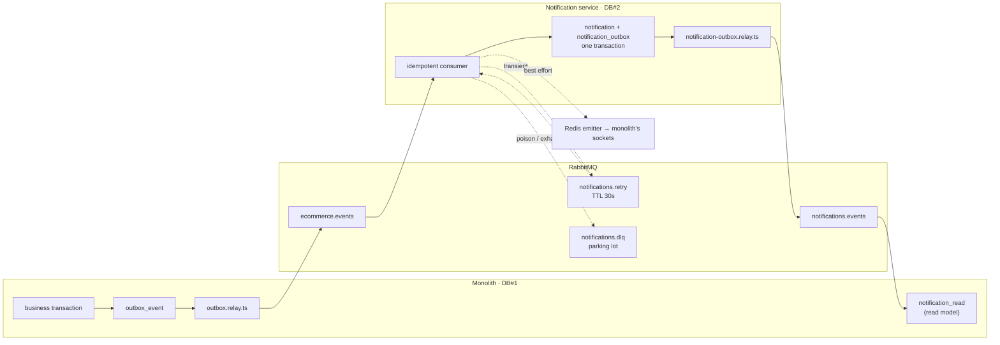

# Notification service: a strangler-fig carve-out, and the loop that keeps two databases in step

The notification service is the first piece of this project that stopped being a module and became a
process. It consumes domain events from the monolith, owns the notifications table outright, pushes
realtime updates to sockets it does not hold, and publishes its own events back so the monolith can
keep a read model of data it no longer owns.

That round trip — monolith → broker → service → broker → monolith — is the part worth reading. Each
mechanism below exists because a specific way of losing a message was ruled out; where one is only
narrowed rather than closed, it is named as such.

## Overview

| | |
|---|---|
| **Runtime** | NestJS worker, no public API — HTTP serves only `/health`, `/health/broker`, `/metrics` |
| **Owns** | `notification` (DB#2) — the source of truth for every notification row |
| **Does not own** | users, shops, orders. Handlers read **only** what the producer put in the payload |
| **Consumes** | `ecommerce.events` → `notifications.q` (`order.*`, `review.*`, `payout.*`, `return.*`, `shop.*`, `product.moderated`) |
| **Publishes** | `notifications.events` → the monolith's `notification_read.q` |
| **Side effects** | Socket.IO emit through a Redis emitter · two transactional emails |

## Two outboxes, one loop

Both directions use the same shape, and for the same reason: a database write and a broker publish
cannot share a transaction, so the publish is deferred to a row that *can* be written transactionally.

| | Monolith → service | Service → monolith |
|---|---|---|
| Table | `outbox_event` | `notification_outbox` |
| Relay | [`outbox.relay.ts`](../backend/src/modules/engagements/outbox.relay.ts) | [`notification-outbox.relay.ts`](../notification-service/src/modules/broker/notification-outbox.relay.ts) |
| Poll · batch | 8 s · 10 rows | 5 s · 20 rows |
| Claim | `FOR UPDATE SKIP LOCKED`, oldest first, filtered to handled event types | `FOR UPDATE SKIP LOCKED`, oldest first |
| Marks `published_at` | only after a publisher confirm | only after a publisher confirm |
| Gate | `NOTIFICATION_RELAY_ENABLED` (default off) | none — the service is the only writer |

`SKIP LOCKED` keeps two relays that query *at the same moment* off each other's rows. It is not an
exclusive claim: the lock lives only for the duration of the `SELECT` transaction, and publishing and
marking happen after that transaction ends. A second instance starting inside that window still sees
`published_at IS NULL` and can pick up the same batch. What makes a second instance safe is the same
thing that makes a crash safe — marking `published_at` only *after* the confirm keeps the pipeline
at-least-once, and the consumer's dedup ledger absorbs whatever arrives twice.

The service-side outbox is deliberately leaner than the monolith's: no `status` column, because there
was never a second worker draining the same table in parallel. The monolith's outbox carried one
during the strangler window, and the column stayed.

## A message's path through the consumer

The order of these five steps is the whole design; each one is where a different failure would have
cost a message.

1. **Parse the envelope.** A body that is not a valid envelope cannot be deduped and will never parse
   on a retry either, so it goes straight to the DLQ.
2. **Check `processed_events` — inside the `try`.** If this read sat outside, a momentary DB blip
   would fall through to the outer catch and ack the message away. Inside, it becomes a transient
   error and gets retried.
3. **One transaction: insert the event id, then dispatch.** The dedup ledger row and every
   notification the handler writes commit together, so "processed" and "persisted" cannot disagree.
4. **Flush WebSocket emits after the commit, before the ack.** Handlers return `WsEmit[]` rather than
   calling a gateway, so nothing is emitted for a transaction that later rolls back. A Redis failure
   here is logged and swallowed: the database is the source of truth, and re-delivering a message
   because a toast failed would create a duplicate notification to fix a cosmetic miss.
5. **Ack.**

Handlers return their emits per invocation instead of buffering on the service, because `prefetch` is
10 — ten messages are in flight on one singleton, and a shared buffer would fan out one message's
notifications during another message's ack.

## Five endings, and only one of them retries

`notification_events_processed_total{event_type, result}` carries the outcome. The five values are
mutually exclusive **per delivery attempt**, not per event: one event that fails transiently four
times and then runs out of budget increments `retry` four times and `exhausted` once.

| `result` | Cause | What happens to the message |
|---|---|---|
| `success` | handler committed | ack |
| `duplicate` | id already in `processed_events`, or a unique violation (`23505`) from a concurrent redelivery | ack |
| `poison` | invalid envelope, unhandled `event_type`, or a payload missing a required field (`PoisonPayloadError`) | published to the DLQ, then ack |
| `retry` | transient — DB down, network | published to the retry queue, then ack |
| `exhausted` | transient, but `x-death` already counts 5 passes | published to the DLQ, then ack |

`23505` is treated as `duplicate` rather than as an error because it *is* the dedup working: two
deliveries raced, one inserted first, and the loser has nothing left to do. TypeORM surfaces the
Postgres code as `driverError.code` on some versions and `code` on others, so both are checked.

## Retry is app-driven, and the main queue stays arg-free

`notifications.q` is declared with **no arguments at all**. The retry path is not a dead-letter
argument on the main queue — the consumer *publishes* the message to a separate direct exchange
(`notifications.dlx`) with routing key `retry` or `dlq`:

- `notifications.retry` holds the message for `x-message-ttl` = 30 s, then dead-letters it back to
  `notifications.q` by name.
- `notifications.dlq` is a parking lot: durable, bound, and deliberately **without a consumer**.

The number of passes comes from RabbitMQ's own `x-death` header, summed across entries, capped at 5.

One asymmetry is worth stating plainly, because it is the weakest link in the chain: these four
publishes go out on the **consumer's own channel**, without `mandatory` and without publisher
confirms, and the original delivery is acked immediately afterwards. If the channel or the connection
dies in that window, the incoming message is already acknowledged while its retry or DLQ copy may
never have reached the broker. The return path (`publishWithConfirm`) does wait for a confirm; this
path does not. Closing the gap means confirming the publish and calling `nack(requeue = true)` when it
fails.

Keeping the main queue arg-free is a decision about the *next* change, not this one. Queue arguments
are immutable: re-declaring an existing queue with different arguments fails with
`406 PRECONDITION_FAILED`, and the only ways out are renaming the queue or deleting it in production.
The search service has already paid that bill — its queue carries a `.v2` suffix for exactly this
reason. Here, every retry decision lives in application code, where changing it is a deploy.

## Bind only what the service can handle

The binding list is explicit — `product.moderated`, never `product.*`. The wildcard would also match
`product.created`, `product.updated` and `product.deleted`, which belong to the search service. This
consumer has no handler for them, so `dispatch()` would throw `PoisonPayloadError` and every seller
edit would drop one message into the DLQ. A DLQ full of routine traffic stops being an alarm.

Binding changes have a deploy order, because `bindQueue` is additive and idempotent: removing a
pattern from the array does **not** unbind it on the broker. Deploy the service first, so the new
pattern exists alongside the old one, then unbind the old pattern by hand. The reverse order opens a
window where an event matches no binding at all and the broker drops it with no trace.

## The return path breaks differently from the outbound one

`publishWithConfirm` returns three states, and collapsing them into a boolean would be a bug:

| Result | Meaning | Relay's response |
|---|---|---|
| `ok` | confirmed and routed | mark `published_at` |
| `failed` | nack, or no channel — transient | leave `published_at` NULL, retry next poll |
| `unroutable` | a `mandatory` publish matched no binding — permanent | mark `published_at`, log an error |

`unroutable` is the interesting one. RabbitMQ sends `basic.return` **before** `basic.ack`, so a
message that was thrown away still arrives as a successful confirm; the publisher records returned
`messageId`s and re-checks them one tick later (`setImmediate`) before deciding which state it is in.
And because retrying is pointless, the row is marked published anyway: the relay claims 20 rows
ordered by age, so 20 permanently unroutable rows would occupy every batch forever and stop the return
path completely.

This direction is the more fragile one, because of how the *other* side binds: the monolith's
projection queue binds the exact string `notification.created`, not a wildcard. A new event type
published here is unroutable on arrival until the monolith adds a binding for it.

## Realtime without owning a socket

The service never holds a client connection. It writes into the same Socket.IO Redis adapter the
monolith's gateway reads from, through
[`notification-emitter.service.ts`](../notification-service/src/modules/broker/notification-emitter.service.ts):

- **Room names come from generated contracts** (`userRoom`, `shopRoom`, `ADMINS_ROOM`), shared with the
  monolith. A room name assembled by hand on one side is a message delivered to nobody, with no error
  anywhere to explain it.
- **The Redis client is not awaited at boot.** `connect()` retries internally, so awaiting it would
  block Nest's bootstrap while Redis is unreachable; the emitter is created immediately and queues
  publishes until the connection lands.
- **A missing `REDIS_URL` is a warning, not a failure** — emits become a no-op and messages still
  process.
- The emitter pins **node-redis v4** while the rest of the service uses v6, because
  `@socket.io/redis-emitter` supports v4.

## Email leaves the critical path on purpose

Only two emails are outbox-driven — payout status and product take-down — and both are started
fire-and-forget (`void` plus a `.catch`) from inside the handler, which means from inside the
transaction: the request is already in flight before the commit that decides whether the notification
exists. The mail service swallows its own errors as well, and the transport is the Brevo HTTP API on
443 rather than SMTP, which Render blocks outbound.

Nothing waits for it, so send latency never delays a realtime toast and a failed send never
re-delivers a message that would create a second notification. The price is paid in the other
direction: a transaction that rolls back after the call has gone out leaves an email describing a
notification that does not exist, and a redelivery sends it again. Everything else (verification,
password reset, shop rejection) stayed in the monolith, where it belongs to a request rather than to
an event.

## Waking a service that sleeps

On the free tier the service scales to zero after 15 minutes idle and takes ~32 s to come back, so
delivery would be late exactly when a buyer is watching.
[`ns-warmup.service.ts`](../backend/src/modules/ns-warmup/ns-warmup.service.ts) pokes `/health` from
two places: along the purchase funnel (add to cart → cart → checkout preview), and as a backstop from
the relay whenever a publish actually reached a queue — which covers admin moderation, payouts and
returns, none of which touch a cart.

The poke is more careful than it looks, because a single one is not reliable:

- **Throttled to one per 10 minutes** globally — under the 15-minute idle window, with room to spare.
- **A 120 s timeout**, because aborting early can cancel Render's spin-up and leave the service asleep
  with nothing to show for the attempt.
- **Three retries at 15 s / 30 s / 45 s**, since Render's edge can answer `502`/`503` instantly while
  the container is still starting.
- **Only a 2xx counts as success.** `fetch` resolves on `5xx` too, and treating that as a win would
  arm the 10-minute throttle while the service is still down.

`/health` answers `200` unconditionally, even with the broker disconnected, because Render uses it as
both the health check and the wake path. Dependency state is reported separately by `/health/broker`.

## What the monolith keeps: a read model, not a copy

After each notification commits, the service publishes `notification.created`; the monolith's
[projection consumer](../backend/src/modules/engagements/notification-projection.consumer.ts) dedupes
by event id and upserts a row into `notification_read`, so the bell renders without a synchronous call
into the service.

Two details make it a projection rather than a mirror:

- **The insert uses `orIgnore()`.** A replayed event must not overwrite a row whose `is_read` the user
  has since flipped. The dedup ledger already prevents most replays; this is the row-level safety net
  under it.
- **Read state lives only here.** Marking a notification read updates `notification_read` in DB#1; the
  owning row in DB#2 keeps `is_read = false` forever. Creation is owned by the service, read state by
  the monolith, and nothing reconciles the two.

The projection deliberately has no DLQ. A message that fails is retried once on redelivery and then
dropped: a poison loop on the monolith's own queue would cost more than a missing bell row, and the
row is recoverable in principle because DB#2 still holds the truth. In practice that recovery is
manual — there is no rebuild command or endpoint for `notification_read` today.

## Guard rails around the schema

`notification-service/.env` points at the production database, because that is what the runtime needs.
The consequence is that a mistyped `npm run migration:run` on a laptop would alter production schema,
and `migration:revert` would drop production tables.
[`assert-local-db.ts`](../notification-service/src/common/helpers/assert-local-db.ts) refuses to run
migrations unless `NODE_ENV=production` (a real deploy, where the image runs `migration:run:prod`),
`DB_HOST` is local, or the operator sets `ALLOW_REMOTE_MIGRATION=YES_I_AM_SURE` — which nobody types
by accident.

## Observability

Four metrics are specific to this service; the pipelines behind them are described in
[`observability.md`](observability.md).

| Metric | Answers |
|---|---|
| `notification_events_processed_total{event_type, result}` | is it running, and is it succeeding — different questions |
| `notification_event_processing_duration_seconds` | observed only on success, so failures cannot flatter the histogram |
| `notification_dlq_messages` | polled every 10 s on a **throwaway channel**: `checkQueue` against a missing queue closes the channel it runs on, and that must never be the consumer's channel |
| `notification_outbox_oldest_unpublished_age_seconds` | the return path's lag — the number that climbs when the relay is stuck |

Trace context crosses both gaps: the `traceparent` captured in `outbox_event.trace_parent` is restored
by the relay before publishing, injected into the message headers, and extracted here into a
`SpanKind.CONSUMER` span. A message without that header starts a fresh trace instead of failing.

## Known limits

- **Read state does not flow back.** DB#2 never learns that a notification was read.
- **The DLQ has no consumer.** Replaying a parked message is a manual operation.
- **Retry and DLQ publishes are not confirmed.** They share the consumer's channel and the original
  message is acked right after, so a channel death in that window loses the copy.
- **Unroutable return events are dropped after logging.** The relay logs the failure loudly, but the
  projection misses those rows until a binding is added on the monolith side.
- **The projection drops a row after one failed redelivery** instead of parking it, and rebuilding
  `notification_read` from DB#2 has no tooling — it is a hand-written query today.
- **Email can outlive its own transaction.** It is launched before the commit, so a rollback or a
  redelivery can produce a message no notification backs.
- **Tracing is opt-in** (`OTEL_ENABLED`) and off in production, so the spans above exist only when the
  local observability stack is running.
