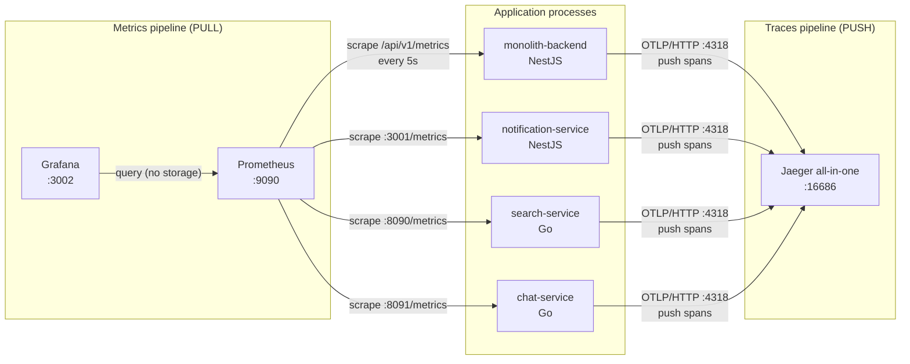
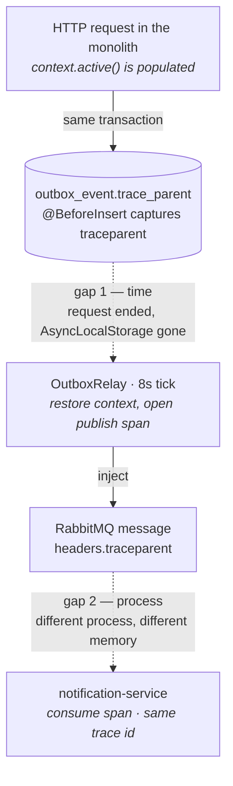
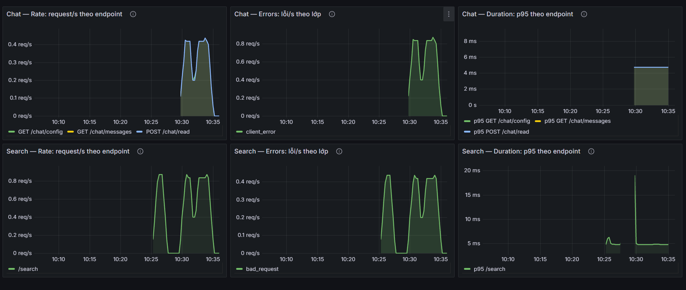

# Observability

> This is the deep dive behind the **🔭 Observability** section of the
> [README](../README.md#-observability) and [ADR-7](../README.md#adr-7--trace-context-persisted-in-the-outbox-row-not-just-in-memory).
> The README says *what* exists; this document explains *how* it is wired and — just as
> importantly — *where it stops working and why*.

Splitting the notification path out of the monolith bought real service autonomy, but it also
broke the one thing a monolith gives you for free: a request you can follow end to end. A single
notification now crosses a **database table**, a **message broker**, and a **process boundary**.
Logs on either side can each say "I did my part" while the notification silently never arrives.
The whole point of the observability work is to make *"what happened to **this** order's
notification?"* answerable again.

Two more services have since joined — a **Go** search service that maintains its own index off the
same event stream, and a **Go** chat service that serves the chatbot and 1-to-1 chat over HTTP/WS —
which turned out to be a useful test of whether the answer generalises. It does: the carrier is a
W3C standard, not a framework feature, so the same trace crosses a language boundary without
anything new being invented.

---

## 1. Two independent pipelines

Traces and metrics are often lumped together as "monitoring", but they are two separate systems
with opposite data-flow directions. Keeping them straight is what makes the setup easy to reason
about.



**Traces are pushed.** Each service exports spans over **OTLP/HTTP** to Jaeger (`:4318`). The
application decides when to emit; Jaeger only receives. Nothing polls the app for traces.

**Metrics are pulled.** **Prometheus** reaches *into* each service and scrapes its metrics endpoint
every 5 seconds. No app ever pushes a metric anywhere — each just exposes the current values and
waits to be asked.

**Grafana stores nothing.** It is a query-and-render layer pointed at Prometheus. Every panel is a
PromQL query executed live against Prometheus' TSDB. If Prometheus loses its data, Grafana has
nothing to show — a distinction that matters for the retention limit below.

### The asymmetry worth stating plainly

| | Traces | Metrics |
|---|---|---|
| Direction | push (app → Jaeger) | pull (Prometheus → app) |
| `monolith-backend` (NestJS) | ✅ | ✅ RED + outbox-lag gauge |
| `notification-service` (NestJS) | ✅ | ✅ consumer metrics |
| `search-service` (Go) | ✅ | ✅ RED **and** consumer metrics |
| `chat-service` (Go) | ✅ | ✅ RED + bot-specific counters |

All four services are traced and all four are scraped. The asymmetry is not *whether* a service is
measured any more — it is **what is worth measuring**, and that follows from what the service is.

The monolith is an HTTP server, so RED (rate / errors / duration) is the natural frame. The
notification service is a pure **consumer**: it has no meaningful request traffic, so HTTP-shaped RED
metrics there would be close to noise. What deserves measuring instead is events processed by
outcome, DLQ depth, and per-event processing time.

The search service is the one that is **both** — it serves `GET /search` over HTTP *and*
consumes `product.*` events to maintain its index — so it is the only service publishing both metric
families side by side. That is why it gets its own subsection below rather than a row in the
monolith's table.

The chat service is HTTP-only like the monolith — it has no RabbitMQ consumer, since chat 1-to-1 and
the chatbot are both served directly over HTTP/WS — so plain RED covers its request traffic. What it
adds on top is a set of counters specific to *why* a request failed or cost something: quota
rejections by tier, Gemini reply-cache hit/miss, and tokens spent split prompt vs. output. A 429 on
`/chat/bot` is not the same failure as a 5xx, and RED alone cannot tell them apart.

---

## 2. Carrying trace context across two gaps

This is the interesting part, and the subject of [ADR-7](../README.md#adr-7--trace-context-persisted-in-the-outbox-row-not-just-in-memory).

Auto-instrumentation propagates trace context for free **as long as the work stays inside one
call stack** — an incoming HTTP span becomes the parent of the `pg` query span underneath it
without any manual wiring. The outbox pattern breaks that assumption twice.



### Gap #1 — a gap in *time* (request → relay)

The request writes an `outbox_event` row and returns. Up to 8 seconds later, on a separate
`@Interval` tick, the relay wakes up and publishes that row. By then the originating request's
in-memory context — the OpenTelemetry `AsyncLocalStorage` that held the active span — is **long
gone**. There is nothing in memory left to be a parent.

The carrier that survives this gap is the **outbox row itself**, because the row is *already* the
thing that crosses from request-time to relay-time. So the W3C `traceparent` is written into a
[`outbox_event.trace_parent`](../backend/src/common/entities/outbox-event.entity.ts)
column by a `@BeforeInsert` hook, **while the code is still inside the request** and the context is
still live:

```ts
@BeforeInsert()
captureTraceParent(): void {
  try {
    const carrier: Record<string, string> = {};
    propagation.inject(context.active(), carrier);
    this.trace_parent = carrier.traceparent ?? null;
  } catch {
    this.trace_parent = null;
  }
}
```

An entity hook rather than a change in each service was chosen on purpose: roughly ten call sites
across orders, payouts, returns and engagements write to the outbox — some of them on the
money path — and every one of them uses `manager.save()`, so a single `@BeforeInsert` listener
covers them all **without touching a line of business logic**. The hook also swallows every error
and leaves `trace_parent` null: observability must never be able to fail an order.

Later, the relay
([`outbox.relay.ts`](../backend/src/modules/engagements/outbox.relay.ts)) reads the column back,
`extract`s it into a parent context, and opens the publish span underneath it — so the publish span
becomes a child of the request that happened seconds earlier.

### Gap #2 — a gap in *process* (relay → notification service)

The relay and the notification service are **different OS processes with different memory**. No
in-process mechanism can bridge them; the context has to travel *with the message*.

The carrier here is the **RabbitMQ message**, because — same principle as gap #1 — the message is
the thing that already crosses the process boundary. The relay `inject`s the publish span's context
into the message headers, and the consumer
([`notification-service` broker](../notification-service/src/modules/broker/rabbitmq.service.ts))
`extract`s it at the top of `handleMessage` and opens a `SpanKind.CONSUMER` span under it:

```ts
const headers = (msg.properties.headers ?? {}) as Record<string, string>;
const parentCtx = propagation.extract(otelContext.active(), headers);
// ... startSpan(`consume ${routingKey}`, { kind: SpanKind.CONSUMER })
```

### The same gap, crossed again in a different language

The search service consumes `product.*` off the **same exchange** and crosses gap #2 the same way,
which is the point of picking a vendor-neutral standard: the carrier is a W3C `traceparent` header, so
the fact that the producer is TypeScript and this consumer is **Go** never comes up.

```go
msgCtx := telemetry.ExtractAMQPContext(ctx, msg.Headers)
msgCtx, span := tracer.Start(msgCtx, "consume "+msg.RoutingKey,
    trace.WithSpanKind(trace.SpanKindConsumer), ...)
```

Two details had to be got right on the Go side, and both were only visible once messages started
failing rather than succeeding:

**AMQP header lookup has to be case-insensitive.** `amqp.Table` is a plain map, so a header written
as `TraceParent` by any producer would not be found by a propagator asking for `traceparent`, and the
trace would silently split in two. The carrier lowercases on lookup rather than trusting the
producer's casing.

**A retried message no longer knows its own routing key.** Messages that fail are parked on a retry
queue and dead-lettered back via the *default* exchange, which rewrites the routing key to the queue
name. Naming the span from `msg.RoutingKey` therefore produced `consume search_index.q` for every
retry — all of them collapsing into one indistinguishable bucket in Jaeger. The span is named from
the **envelope's event type** instead, which is carried in the message body and so survives the round
trip unchanged.

### The one rule that ties it together

> **Each gap needs its own carrier, and the carrier is always the thing that already crosses that
> particular boundary.** The outbox row crosses time; the message crosses processes. You cannot
> reuse one for the other — a message header would be gone by the time the relay runs, and a
> database column is invisible to a consumer in another process.

The result is that one HTTP request lands **the monolith and the consumer it feeds under a single
trace id** — for a notification, from the HTTP handler through the outbox `INSERT`, the publish, the
broker, the consume, and the notification `INSERT`, **16–20 spans depending on the flow**. A product
write traces the same way into the search service's index update.


### Why the span count is a range, and one honest edge case

The count is **16–20**, not a fixed number, because Express/router-layer middleware spans are
switched off (`instrumentation-express` **and** `instrumentation-router`, symmetrically, in both
services' `tracing.ts`) to keep the waterfall readable — so the exact span count depends on how
many `pg` queries a given flow issues, not on framework noise.

There is also a graceful edge case worth calling out, because it looks like a bug and isn't. If an
event is produced by code that **did not initialise the tracing SDK** (for example a throwaway test
script that doesn't `import './tracing'`), then `context.active()` is empty, `propagation.inject`
writes nothing, and `trace_parent` is stored as **NULL**. The relay handles NULL by simply starting
a fresh, standalone trace instead of attaching to a parent. Nothing breaks — this is exactly the
"observability must never fail business logic" contract, visible from the outside.

---

## 3. Metrics: RED where there are requests, outcome counters where there are events

### The monolith — RED from one histogram, plus an outbox-lag gauge

The monolith exposes Prometheus metrics from
[`metrics.interceptor.ts`](../backend/src/modules/metrics/metrics.interceptor.ts) →
[`/api/v1/metrics`](../backend/src/modules/metrics/metrics.controller.ts). The core is a single
histogram plus one gauge.

**RED, from one histogram.** `http_request_duration_seconds` (a
[`prom-client` Histogram](../backend/src/modules/metrics/metrics.service.ts), labelled
`method` / `route` / `status`) is enough to derive all three RED signals in Grafana:

| Signal | PromQL (sketch) |
|---|---|
| **R**ate | `sum(rate(http_request_duration_seconds_count[1m])) by (route)` |
| **E**rrors | `sum(rate(http_request_duration_seconds_count{status=~"5.."}[1m]))` |
| **D**uration (p95) | `histogram_quantile(0.95, sum(rate(http_request_duration_seconds_bucket[1m])) by (le, route))` |

The `route` label is the route **pattern** (`/products/:id`), never the raw URL, so an id in the
path can't explode metric cardinality.

**Outbox-lag gauge.** `outbox_oldest_unpublished_age_seconds` reports the age of the oldest
unpublished outbox row, refreshed every 10s. It is the single most useful health signal for the
outbox: if the relay stalls or the broker is unreachable, this climbs steadily, whereas the RED
panels would look perfectly healthy (the HTTP writes still succeed).


**Dashboard as code.** The datasource and both RED dashboards are provisioned from
[`observability/grafana/**`](../observability/grafana) at container start, so they live in
git and survive even `docker compose down -v`. Nothing is clicked together by hand in the Grafana
UI — a hand-built dashboard would evaporate the first time the volume is wiped and would be
invisible to anyone reading the repo. The provider watches the whole folder, so another dashboard
is added by dropping a JSON file into it rather than by editing any configuration.

**A second dashboard, for the two Go services.**
[`go-services-red.json`](../observability/grafana/dashboards/go-services-red.json) carries the same
three RED panels for the chat and the search service. It is a separate file rather than three more
panels on the one above, because that dashboard is titled for the monolith and folding two more
services into it would leave the title lying.



Rate on that dashboard comes from the histogram's `_count`, not from the request counter, and the
reason is worth naming because it is a silent trap. The two metrics carry **disjoint label sets**:
`chat_requests_total` is labelled `status` and `outcome`, while `chat_request_duration_seconds` is
labelled `endpoint`. Grouping the counter by `endpoint` therefore matches nothing and returns an
empty result — no error, no warning, just a panel that reads exactly like an endpoint nobody is
calling. The search service has the same shape.

The same split has a consequence worth stating plainly: on neither Go service can the error rate be
broken down per endpoint. The error panels are service-wide, and finding out *which* endpoint is
failing means reading the logs.

### The consumers — counting outcomes, not requests

A consumer has no request rate to measure. What it has is a **stream of events, each of which ends in
exactly one of a small set of outcomes**, so the useful counter is one keyed by that outcome. Both
consumers use the same shape deliberately, so a single PromQL pattern reads either service:

| Service | Metric | Labels |
|---|---|---|
| notification | `notification_events_processed_total` | `event_type`, `result` |
| notification | `notification_event_processing_duration_seconds` | `event_type` |
| notification | `notification_dlq_messages` · `notification_outbox_oldest_unpublished_age_seconds` | — (gauges) |
| search | `search_events_processed_total` | `event_type`, `result` |
| search | `search_index_products_total` | — (gauge) |

The `result` label is where the design lives, because it is what turns "the consumer is running" into
"the consumer is *succeeding*". For the search service the possible values are `success`,
`duplicate` (dedup ledger caught a redelivery), `tombstone_blocked` (a stale update was refused
because the product is deleted), `retry`, `dlq`, `poison` (unparseable payload), `skipped`, and
`nack_requeue` (the message was handed back to the broker because publishing to retry/DLQ failed).

That last one is worth its own sentence. Without it, a broker outage is **invisible**: the event is
neither a success nor a retry nor a poison message, so it simply stops being counted and the graph
quietly flattens. A counter that goes silent looks exactly like a system with no traffic.

Two labels are deliberately *not* free-form. `event_type` on the search service falls back to the
constant `"unknown"` when the envelope carries an event type the consumer does not handle, because
that field arrives from the message body — using it directly would let a malformed publisher mint a
new Prometheus time series per event and grow scrape memory without bound.

### The search service — both metric shapes at once

The search service is the only one serving HTTP *and* consuming events, so it publishes the consumer
metrics above **and** a RED pair for `GET /search`:

| Metric | Labels |
|---|---|
| `search_requests_total` | `status`, `outcome` |
| `search_request_duration_seconds` | `endpoint` |

`outcome` separates results that share an HTTP status but not a meaning — `served` vs `empty` are both
`200`, and telling them apart is how you notice the index silently going stale. The `status` label
also carries a **synthetic `499`**, borrowed from nginx's convention for *client closed request*: when
the monolith's `AbortController` fires on its search timeout, the in-flight query returns
`context.Canceled`. That is the client giving up, not the service failing, so folding it into `500`
would inflate the error rate with something no operator can act on.

> The `/metrics` and `/health` endpoints are deliberately **not** wrapped in `otelhttp`; only
> `/search` is. Prometheus scrapes every 5 seconds, and health probes run continuously, so
> instrumenting them would bury the real traffic under a steady stream of self-observation spans.

### The chat service — RED plus a kill-switch gauge

The chat service ([`internal/telemetry/metrics.go`](../chat-service/internal/telemetry/metrics.go))
exposes the same RED pair as the monolith:

| Metric | Labels |
|---|---|
| `chat_requests_total` | `status`, `outcome` |
| `chat_request_duration_seconds` | `endpoint` |

Both are written by a single `measured` middleware in
[`internal/httpapi/server.go`](../chat-service/internal/httpapi/server.go), not by each handler, so
a route is instrumented the moment it is registered rather than when someone remembers to add the
call. The `endpoint` label comes from the same `spanNameFromPattern` helper that names the span, so
a slow bucket in Grafana carries a string that pastes straight into a Jaeger search.

The middleware captures the response through `httpsnoop.CaptureMetrics` rather than a hand-written
`ResponseWriter`. A writer wrapped by embedding exposes only the `http.ResponseWriter` methods and
silently drops `Flusher` and `Hijacker` — the two interfaces the `/chat/bot` SSE stream and the
websocket handshake depend on.

One label reads differently here than in the search service. Search derives `outcome` from the
business result, so it can say `empty` or `client_canceled`; the chat middleware only ever sees a
status code, so its `outcome` is the status class — `served`, `client_error`, `error`. The detailed
reason for a chat 4xx lives in the `reason` field of the response body, not in a label.

> `/health`, `/metrics` and the `OPTIONS` preflights sit **outside** the middleware, on the same
> boundary the spans use. Keep-warm pings, Prometheus scrapes and preflight 204s would otherwise
> make up most of the count, and an error rate measured against that mixture answers nothing.

Layered on top are counters that explain *why* the bot flow specifically failed or cost money,
rather than just that a request happened:

| Metric | Labels | What it answers |
|---|---|---|
| `chat_bot_quota_rejected_total` | `reason` | Is the quota biting a real abuser or a normal user? |
| `chat_bot_reply_cache_total` | `result` (hit/miss) | How often is a Gemini call avoided entirely? |
| `chat_bot_tokens_total` | `kind` (prompt/output) | What does the daily question budget actually cost? |
| `chat_bot_enabled` | — (gauge) | Is the kill switch on right now? |

The realtime side is measured by a pair, not by a single number:

| Metric | Labels | What it answers |
|---|---|---|
| `chat_ws_connections` | — (gauge) | How many websocket connections are open right now? |
| `chat_ws_closed_total` | `code` | Why did connections go away — a rejected token (4401), a client too slow to read (1008), a failed write (1011)? |

Neither half is useful alone. The gauge dropping from forty to five is a fact without a cause; the
counter says which of the four ways a connection can die accounted for it. And the counter is
deliberately a counter rather than a span: the question asked about a websocket is a **rate over
time** — "is 4401 climbing?" — which is the shape of a metric, not of a trace. A trace earns its
keep when there is a path to follow through several components, and a connection's lifetime has
only two events worth recording, its start and its end. Prometheus also keeps fifteen days of it,
while the Jaeger here is all-in-one and holds traces in RAM.

`chat_ws_closed_total` is incremented **inside** `Conn.Close`'s `sync.Once`, not at the call sites.
A connection has three goroutines — read, write, and ping — and any of them can be the one to
notice it died; counting where `Close` is called would book some connections twice. The `Once` that
already exists to stop `close(done)` from panicking on a double close turns out to be exactly the
right place to count.

`chat_bot_enabled` is a `GaugeFunc`, not a `Gauge` with `Set` calls — it reads the kill-switch state
live at scrape time rather than waiting for an event to push a new value. The alternative would sit
at 0 until the next request came in and updated it, which is exactly the wrong failure mode: the
gauge would still read "off" long after an auto-recovery flipped the bot back on overnight, when
nobody was watching the dashboard to notice.

---

## 4. Known limitations

These are the honest edges of the setup. Most are consequences of *where* the instrumentation sits,
not defects — but each one is a place where a naive reading of the dashboard would mislead.

**The interceptor cannot see 401 / 403 / 404 / 429.** In the NestJS request lifecycle, **guards run
before interceptors**. The global JWT guard and the `ThrottlerGuard` reject a request (401/403/429)
*before* the metrics interceptor's timer ever starts, and a 404 for a route with no handler never
reaches an interceptor at all. So those responses are **not counted**. What *is* counted: 4xx from
the validation pipe (which runs after the interceptor is on the stack) and **every 5xx**. The 429
blind spot is the one to keep in mind — throttled traffic goes uncounted exactly when the system is
under load, which is precisely when you'd want the number.

**The interceptor deliberately skips `/metrics` itself.** Prometheus scrapes every 5s, so counting
the scrape endpoint would add a permanent ~0.2 req/s of "self-observation" that drowns out real
routes on the RED dashboard when human traffic is low. The interceptor short-circuits by comparing
the handler **class** (not the path string, which would silently stop matching if the route or
global prefix changed).

**Jaeger all-in-one keeps traces in RAM.** There is no volume behind it. A `docker compose down`, a
Docker Desktop restart, or a machine reboot wipes every trace. That is why the trace waterfall above
is a committed screenshot (plus an exported `trace-waterfall.json`) rather than a live link — the
image is the durable evidence.

**Prometheus retention is the default 15 days.** Metrics scraped during the load-baseline work
(late July) expire around **mid-August**. The before/after search comparison planned for later
therefore **cannot** be done by scrolling Grafana back in time — the raw samples will be gone.
Baseline numbers have to live in documentation and screenshots (see the README's
[Search Engine section](../README.md#-search-engine)), not in the TSDB. Raising retention was
rejected on purpose: waiting weeks costs disk and is still fragile — a single `down -v` erases it.

**No sampling, no OTel Collector — yet.** Tracing runs at **100%** (every request is traced) and
each service exports **straight to Jaeger** over OTLP, with no collector in between. Both are the
right call at this scale: at local/dev traffic, 100% sampling is what makes a specific order's
trace guaranteed to be there when you go looking, and a collector only earns its keep once you need
to fan out to multiple backends, buffer/batch centrally, or re-tag spans in flight. Head-based
sampling and a collector are the first two things to add if this ever runs at production traffic —
noted here so the omission reads as a decision, not a gap.

---

## 5. Running it locally

The observability stack is a **separate** compose file so the app stack stays lean by default:

```bash
docker compose -f docker-compose.observability.yml up -d
```

Then set `OTEL_ENABLED=true` in **all four** of `backend/.env`, `notification-service/.env`,
`search-service/.env` and `chat-service/.env`, and restart the services. Instrumentation is opt-in
behind that flag, so nothing is exported until you ask for it — the production write path pays
nothing for tracing it isn't using.

| Component | URL / port |
|---|---|
| Jaeger UI (traces) | http://localhost:16686 |
| Prometheus | http://localhost:9090 |
| Grafana (RED dashboard, auto-provisioned) | http://localhost:3002 |
| Monolith metrics endpoint | http://localhost:8080/api/v1/metrics |
| Notification service metrics endpoint | http://localhost:3001/metrics |
| Search service metrics endpoint | http://localhost:8090/metrics |
| Chat service metrics endpoint | http://localhost:8091/metrics |

> The Go service reads `PORT` first and falls back to `SEARCH_HTTP_PORT`, defaulting to **8090** —
> `PORT` is the variable Render injects and port-scans, so listening anywhere else fails the health
> check on deploy.

> Grafana is on **3002**, not its usual 3000 — those are taken by the Next.js frontend (3000) and
> the notification service (3001). Prometheus is 9090, Jaeger 16686.

To see a full distributed trace: bring up the app stack, place an order (or trigger any domain
event), wait one relay tick (≤8s), then open Jaeger → service `monolith-backend` → find the request
and expand the spans. The consume span from `notification-service` will be in the **same** trace.
