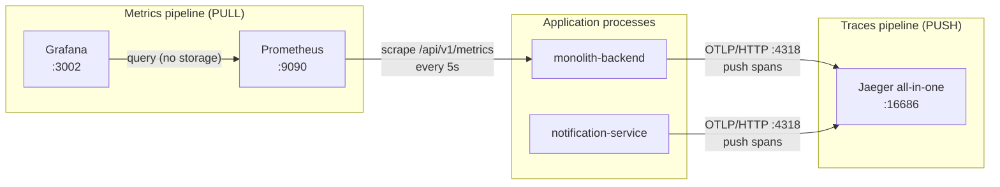
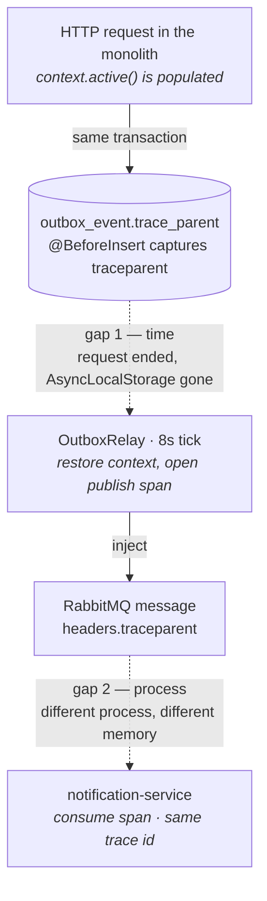

# Observability

> This is the deep dive behind the **🔭 Observability** section of the
> [README](../README.md#-observability) and [ADR-7](../README.md#adr-7--trace-context-persisted-in-the-outbox-row-not-just-in-memory).
> The README says *what* exists; this document explains *how* it is wired and — just as
> importantly — *where it stops working and why*.

Splitting the notification path out of the monolith bought real service autonomy, but it also
broke the one thing a monolith gives you for free: a request you can follow end to end. A single
notification now crosses a **database table**, a **message broker**, and a **process boundary**.
Logs on either side can each say "I did my part" while the notification silently never arrives.
The whole point of the observability work is to make *"what happened to **this** order's
notification?"* answerable again.

---

## 1. Two independent pipelines

Traces and metrics are often lumped together as "monitoring", but they are two separate systems
with opposite data-flow directions. Keeping them straight is what makes the setup easy to reason
about.



**Traces are pushed.** Each service exports spans over **OTLP/HTTP** to Jaeger (`:4318`). The
application decides when to emit; Jaeger only receives. Nothing polls the app for traces.

**Metrics are pulled.** **Prometheus** reaches *into* the monolith and scrapes its
`/api/v1/metrics` endpoint every 5 seconds. The app never pushes a metric anywhere — it just
exposes the current values and waits to be asked.

**Grafana stores nothing.** It is a query-and-render layer pointed at Prometheus. Every panel is a
PromQL query executed live against Prometheus' TSDB. If Prometheus loses its data, Grafana has
nothing to show — a distinction that matters for the retention limit below.

### One asymmetry worth stating plainly

| | Traces | Metrics |
|---|---|---|
| Direction | push (app → Jaeger) | pull (Prometheus → app) |
| Covers the monolith | ✅ | ✅ |
| Covers the notification service | ✅ | ❌ **no metrics endpoint yet** |

**Both services are traced; only the monolith exposes metrics.** The notification service has no
`/metrics` endpoint, so the Prometheus scrape job for it is **commented out** in
[`observability/prometheus.yml`](../observability/prometheus.yml) — an enabled job would sit
permanently red with a 404 and turn any future `up == 0` alert into a boy-who-cried-wolf. This is a
deliberate gap, not an oversight: the notification service is a **consumer**, so HTTP-shaped RED
metrics are close to meaningless there. What deserves measuring is events processed, DLQ depth,
retry count, and per-event processing time — a different metric set that hasn't been built yet.

---

## 2. Carrying trace context across two gaps

This is the interesting part, and the subject of [ADR-7](../README.md#adr-7--trace-context-persisted-in-the-outbox-row-not-just-in-memory).

Auto-instrumentation propagates trace context for free **as long as the work stays inside one
call stack** — an incoming HTTP span becomes the parent of the `pg` query span underneath it
without any manual wiring. The outbox pattern breaks that assumption twice.



### Gap #1 — a gap in *time* (request → relay)

The request writes an `outbox_event` row and returns. Up to 8 seconds later, on a separate
`@Interval` tick, the relay wakes up and publishes that row. By then the originating request's
in-memory context — the OpenTelemetry `AsyncLocalStorage` that held the active span — is **long
gone**. There is nothing in memory left to be a parent.

The carrier that survives this gap is the **outbox row itself**, because the row is *already* the
thing that crosses from request-time to relay-time. So the W3C `traceparent` is written into a
[`outbox_event.trace_parent`](../backend/src/modules/orders/entities/outbox-event.entity.ts)
column by a `@BeforeInsert` hook, **while the code is still inside the request** and the context is
still live:

```ts
@BeforeInsert()
captureTraceParent(): void {
  try {
    const carrier: Record<string, string> = {};
    propagation.inject(context.active(), carrier);
    this.trace_parent = carrier.traceparent ?? null;
  } catch {
    this.trace_parent = null;
  }
}
```

An entity hook rather than a change in each service was chosen on purpose: roughly ten call sites
across orders, payouts, returns and engagements write to the outbox — some of them on the
money path — and every one of them uses `manager.save()`, so a single `@BeforeInsert` listener
covers them all **without touching a line of business logic**. The hook also swallows every error
and leaves `trace_parent` null: observability must never be able to fail an order.

Later, the relay
([`outbox.relay.ts`](../backend/src/modules/engagements/outbox.relay.ts)) reads the column back,
`extract`s it into a parent context, and opens the publish span underneath it — so the publish span
becomes a child of the request that happened seconds earlier.

### Gap #2 — a gap in *process* (relay → notification service)

The relay and the notification service are **different OS processes with different memory**. No
in-process mechanism can bridge them; the context has to travel *with the message*.

The carrier here is the **RabbitMQ message**, because — same principle as gap #1 — the message is
the thing that already crosses the process boundary. The relay `inject`s the publish span's context
into the message headers, and the consumer
([`notification-service` broker](../notification-service/src/modules/broker/rabbitmq.service.ts))
`extract`s it at the top of `handleMessage` and opens a `SpanKind.CONSUMER` span under it:

```ts
const headers = (msg.properties.headers ?? {}) as Record<string, string>;
const parentCtx = propagation.extract(otelContext.active(), headers);
// ... startSpan(`consume ${routingKey}`, { kind: SpanKind.CONSUMER })
```

### The one rule that ties it together

> **Each gap needs its own carrier, and the carrier is always the thing that already crosses that
> particular boundary.** The outbox row crosses time; the message crosses processes. You cannot
> reuse one for the other — a message header would be gone by the time the relay runs, and a
> database column is invisible to a consumer in another process.

The result is that one HTTP request lands **both services under a single trace id**, from the HTTP
handler through the outbox `INSERT`, the publish, the broker, the consume, and the notification
`INSERT` — **16–20 spans depending on the flow**.


### Why the span count is a range, and one honest edge case

The count is **16–20**, not a fixed number, because Express/router-layer middleware spans are
switched off (`instrumentation-express` **and** `instrumentation-router`, symmetrically, in both
services' `tracing.ts`) to keep the waterfall readable — so the exact span count depends on how
many `pg` queries a given flow issues, not on framework noise.

There is also a graceful edge case worth calling out, because it looks like a bug and isn't. If an
event is produced by code that **did not initialise the tracing SDK** (for example a throwaway test
script that doesn't `import './tracing'`), then `context.active()` is empty, `propagation.inject`
writes nothing, and `trace_parent` is stored as **NULL**. The relay handles NULL by simply starting
a fresh, standalone trace instead of attaching to a parent. Nothing breaks — this is exactly the
"observability must never fail business logic" contract, visible from the outside.

---

## 3. Metrics: RED + an outbox-lag gauge

The monolith exposes Prometheus metrics from
[`metrics.interceptor.ts`](../backend/src/modules/metrics/metrics.interceptor.ts) →
[`/api/v1/metrics`](../backend/src/modules/metrics/metrics.controller.ts). The core is a single
histogram plus one gauge.

**RED, from one histogram.** `http_request_duration_seconds` (a
[`prom-client` Histogram](../backend/src/modules/metrics/metrics.service.ts), labelled
`method` / `route` / `status`) is enough to derive all three RED signals in Grafana:

| Signal | PromQL (sketch) |
|---|---|
| **R**ate | `sum(rate(http_request_duration_seconds_count[1m])) by (route)` |
| **E**rrors | `sum(rate(http_request_duration_seconds_count{status=~"5.."}[1m]))` |
| **D**uration (p95) | `histogram_quantile(0.95, sum(rate(http_request_duration_seconds_bucket[1m])) by (le, route))` |

The `route` label is the route **pattern** (`/products/:id`), never the raw URL, so an id in the
path can't explode metric cardinality.

**Outbox-lag gauge.** `outbox_oldest_unpublished_age_seconds` reports the age of the oldest
unpublished outbox row, refreshed every 10s. It is the single most useful health signal for the
outbox: if the relay stalls or the broker is unreachable, this climbs steadily, whereas the RED
panels would look perfectly healthy (the HTTP writes still succeed).


**Dashboard as code.** The datasource and the RED dashboard are provisioned from
[`observability/grafana/**`](../observability/grafana) at container start, so the dashboard lives in
git and survives even `docker compose down -v`. Nothing is clicked together by hand in the Grafana
UI — a hand-built dashboard would evaporate the first time the volume is wiped and would be
invisible to anyone reading the repo.

---

## 4. Known limitations

These are the honest edges of the setup. Most are consequences of *where* the instrumentation sits,
not defects — but each one is a place where a naive reading of the dashboard would mislead.

**The interceptor cannot see 401 / 403 / 404 / 429.** In the NestJS request lifecycle, **guards run
before interceptors**. The global JWT guard and the `ThrottlerGuard` reject a request (401/403/429)
*before* the metrics interceptor's timer ever starts, and a 404 for a route with no handler never
reaches an interceptor at all. So those responses are **not counted**. What *is* counted: 4xx from
the validation pipe (which runs after the interceptor is on the stack) and **every 5xx**. The 429
blind spot is the one to keep in mind — throttled traffic goes uncounted exactly when the system is
under load, which is precisely when you'd want the number.

**The interceptor deliberately skips `/metrics` itself.** Prometheus scrapes every 5s, so counting
the scrape endpoint would add a permanent ~0.2 req/s of "self-observation" that drowns out real
routes on the RED dashboard when human traffic is low. The interceptor short-circuits by comparing
the handler **class** (not the path string, which would silently stop matching if the route or
global prefix changed).

**Jaeger all-in-one keeps traces in RAM.** There is no volume behind it. A `docker compose down`, a
Docker Desktop restart, or a machine reboot wipes every trace. That is why the trace waterfall above
is a committed screenshot (plus an exported `trace-waterfall.json`) rather than a live link — the
image is the durable evidence.

**Prometheus retention is the default 15 days.** Metrics scraped during the load-baseline work
(late July) expire around **mid-August**. The before/after search comparison planned for later
therefore **cannot** be done by scrolling Grafana back in time — the raw samples will be gone.
Baseline numbers have to live in documentation and screenshots (see the README's
[baseline section](../README.md#baseline-before-optimising)), not in the TSDB. Raising retention was
rejected on purpose: waiting weeks costs disk and is still fragile — a single `down -v` erases it.

**No sampling, no OTel Collector — yet.** Tracing runs at **100%** (every request is traced) and
each service exports **straight to Jaeger** over OTLP, with no collector in between. Both are the
right call at this scale: at local/dev traffic, 100% sampling is what makes a specific order's
trace guaranteed to be there when you go looking, and a collector only earns its keep once you need
to fan out to multiple backends, buffer/batch centrally, or re-tag spans in flight. Head-based
sampling and a collector are the first two things to add if this ever runs at production traffic —
noted here so the omission reads as a decision, not a gap.

---

## 5. Running it locally

The observability stack is a **separate** compose file so the app stack stays lean by default:

```bash
docker compose -f docker-compose.observability.yml up -d
```

Then set `OTEL_ENABLED=true` in **both** `backend/.env` and `notification-service/.env` and restart
both services. Instrumentation is opt-in behind that flag, so nothing is exported until you ask for
it — the production write path pays nothing for tracing it isn't using.

| Component | URL / port |
|---|---|
| Jaeger UI (traces) | http://localhost:16686 |
| Prometheus | http://localhost:9090 |
| Grafana (RED dashboard, auto-provisioned) | http://localhost:3002 |
| Monolith metrics endpoint | http://localhost:8080/api/v1/metrics |

> Grafana is on **3002**, not its usual 3000 — those are taken by the Next.js frontend (3000) and
> the notification service (3001). Prometheus is 9090, Jaeger 16686.

To see a full distributed trace: bring up the app stack, place an order (or trigger any domain
event), wait one relay tick (≤8s), then open Jaeger → service `monolith-backend` → find the request
and expand the spans. The consume span from `notification-service` will be in the **same** trace.
