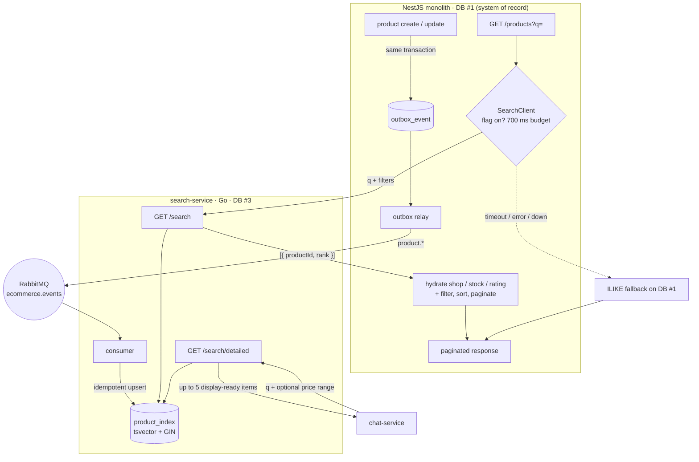
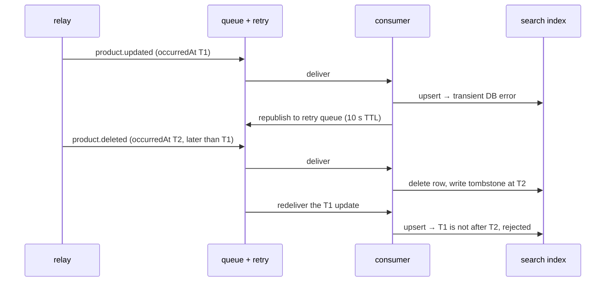

# Search service: event-driven index and two-stage retrieval

_Last updated: 11:13 ICT · 05/09/2026_

Product search was a `LIKE '%term%'` query inside the NestJS monolith. It scanned the whole `product`
table, was blind to Vietnamese accents (`dien thoai` never matched `Điện thoại`), and had no relevance
ranking. It moved to a dedicated Go service that owns a Postgres full-text index, wired into the monolith
behind a feature flag with a fallback to the old query.

The query plans and load numbers are in [search-explain.md](search-explain.md). This note is the shape of
the system and the decisions behind it.

## Overview



## Write path — the index is a CQRS read model

Product writes already emit domain events through a transactional outbox. The search service subscribes
to `product.*` and maintains `product_index` as a second read model (the first is the notification
service's own store). Key properties, all inherited from patterns already used elsewhere in the system:

- **Database-per-service.** The index lives in its own Postgres (DB #3), not in the monolith's database.
- **Transactional outbox.** The event is written in the same transaction as the product, so a committed
  write cannot lose its corresponding event before publication. Delivery still has to complete for the
  index to converge.
- **Idempotent consumer.** A `processed_events` table with a unique `event_id` makes at-least-once
  delivery safe to replay — the same dedupe approach the notification service uses.
- **`tsvector` + GIN + `unaccent`.** A trigger builds the search vector as weighted
  `to_tsvector('simple', unaccent(...))` values for name (`A`) and description (`B`). The `simple`
  config has no stemmer, which suits Vietnamese, so a name match outranks a description match and
  accent-free queries match accented text.

Each guarantee and the thing that actually enforces it:

| Guarantee | Enforced by | Fails how, without it |
|---|---|---|
| A committed write cannot lose its event before publication | outbox row written in the product's transaction | a write commits without an event, so the index has no path to converge |
| Redelivery is harmless | `processed_events`, unique on `event_id`, written in the same transaction as the index row | at-least-once delivery double-applies |
| A stale update cannot overwrite a newer one | `WHERE updated_at < EXCLUDED.updated_at` on upsert | retry queues reorder events and an old name wins |
| A stale update cannot resurrect a deleted product | `deleted_products_tombstone` | the row is gone, so there is no timestamp left to compare against |
| Those two tables do not grow forever | `RetentionGC.tick`, hourly, capped batches | a 0.5 GB managed Postgres fills with rows nothing reads |
| Deleting is safe to switch off, measuring is not | `SEARCH_RETENTION_GC_ENABLED` gates `deleteExpired` but never `refreshGauges` | nothing to look at while deciding whether to enable deletion |
| Accent-free queries match accented text | `unaccent` applied on both sides, in the trigger and the query | `dien thoai` misses `Điện thoại` — the original bug |
| Typos still return something | `pg_trgm` `<%` pass, only when full-text counts zero | a single wrong letter returns an empty page |

## Out-of-order delivery, and the retention it forces

Deduplication answers "have I seen this event?". It says nothing about "did this event happen before the
one I already applied?" — and with a retry queue in the picture, events routinely arrive out of order:



Ordering is settled by comparing timestamps, not arrival: a delete only removes a row whose `updated_at`
is at or before the deletion, and an update only wins if it is newer. The awkward case is the one above.
Once the row is gone there is nothing left to compare against, so a `deleted_products_tombstone` row
stands in for it — the memory of a row that no longer exists.

**Before retention was added, that correctness mechanism was also a leak.** A tombstone was dropped only
if the product came back, and `processed_events` gained a row for every event. Both tables grew without a
bound on a 0.5 GB managed Postgres shared with the index itself.

They cannot simply be trimmed. A tombstone deleted too early stops guarding, and the stale update it
would have rejected resurrects a deleted product in search results. Safe retention has to outlast the
oldest message that could still be delivered — **and that number lived in RabbitMQ, not in Postgres.** The
queues were declared without arguments, so the honest answer was "unbounded", and no retention window was
defensible until that changed.

So the queue was bounded first: a 30-day message TTL, and a dead-letter route so expired messages land in
the DLQ instead of being dropped silently — a bare TTL would let the index drift from the source of record
with no trace. The subtlety is that **the TTL clock restarts when a message is dead-lettered**, so the
real bound is 30 days in the main queue plus 30 more in the DLQ. Retention is written as
`mainQueueTTL + dlqTTL + margin` rather than the 61 days it currently evaluates to, so changing a TTL
cannot silently leave the cutoff behind. A background sweep then deletes past that cutoff in capped
batches, hourly, while the row-count and database-size gauges it reports stay on unconditionally — the
switch that gates deletion does not gate observation, or there would be nothing to look at while deciding
whether to turn it on.

## A query's path through the service

Two stages are described below at the level of the system. Inside the service, one `GET /search` runs a
shorter and more mechanical sequence:

```
searchHandler → Service.Search → CountSearchProducts → [ SearchProducts | searchTrgm ]
```

| Step | Function | What it decides |
|---|---|---|
| Parse | `searchHandler` (`internal/httpapi`) | `q` missing → `400` before any database work |
| Clamp | `Service.Search` (`internal/search`) | `page` floors at 1, `limit` defaults to 20 and is capped at **300** — the ceiling the monolith's candidate window is matched to |
| Count | `CountSearchProducts` | the total, and — because it runs **first** — whether full-text matched anything at all |
| Page | `SearchProducts` | the ranked window, only when the count was non-zero |
| Fallback | `searchTrgm` | the trigram pass, taken instead of the page query when the count was zero |

Running the count before the page query is what makes the fallback cheap. A zero count proves the
full-text page query would also come back empty, so it is skipped outright rather than executed and
discarded.

The trigram branch is the one place the service opens a transaction, and not for atomicity — both
queries are read-only. It exists to scope `SET LOCAL pg_trgm.word_similarity_threshold = 0.3`, because
the default of `0.6` is too strict for the case that motivated the fallback: a prefix like `die` does not
clear it. `SET LOCAL` keeps the loosened threshold inside that one transaction instead of leaking onto a
pooled connection that other queries will reuse.

**A cancelled request is not an error.** When the monolith's 700 ms `AbortController` fires it drops the
connection, the in-flight query returns `context.Canceled`, and the handler records that as **`499` /
`client_canceled`** with an `INFO` log — deliberately separate from the `500` / `error` bucket. Without
that split, the fail-open design on the monolith side would manufacture an error rate on the search side
every time it did exactly what it was built to do.

## Read path — two-stage retrieval

On its main endpoint the service returns **ranked product IDs, not full documents** — the monolith
hydrates them from its own database (Pattern B):

1. **Retrieve.** The monolith calls `/search`, which uses the GIN index to rank matches and returns a
   bounded window of `{ productId, rank }` (the top ~300 candidates).
2. **Filter, sort, paginate — authoritatively.** The monolith runs one query over those candidate IDs
   that re-applies the things the index deliberately does *not* hold: shop status, minimum rating,
   out-of-stock ordering, and any user-chosen sort. Total count and pagination are computed here, so they
   stay correct.
3. **Hydrate.** Only the final page (~20 products) is loaded with its relations (shop, variants, images).

**Full-text first, trigram as a recall backstop.** Full-text search matches whole lexemes, so a typo or a
half-typed word — `dienn`, `laptp`, `die` — matches nothing at all. When the full-text pass returns zero
rows, and only then, a second pass uses `pg_trgm`'s word-similarity operator `<%` against
`name_unaccent`, with `word_similarity_threshold` set to `0.3` via `SET LOCAL` so the threshold belongs to
that transaction rather than to the session. Rank comes from the similarity score, so the closest
spelling leads. A dedicated GIN trigram index (migration `000003`) keeps that pass from degrading into a
scan. Ordering the two passes this way matters: trigram is a **backstop for recall**, not a competitor to
full-text, and running it first would let loose fuzzy matches outrank exact ones.

**A second read contract, for the bot.** `GET /search/detailed` serves the chat service rather than the
monolith, and it deliberately breaks the ranked-ids rule above: the bot has no database to hydrate from,
so this endpoint returns up to five display-ready items — `productId`, `name`, `slug`, `price` — while
`total` still reports the true match count in the index, so the caller can say "30 products matched, here
are five". It accepts `q` plus an optional price range and nothing else; no `page`, `limit`, `shop_id` or
`category_ids`, because the bot does not send them and every accepted parameter is one more thing to
validate.

What it omits is the interesting part. **`description` is excluded on purpose**: it is seller-authored
text, and feeding it to a model would be a direct prompt-injection path into the model's context. Shop
name is absent for a duller reason — `product_index` does not store it, and neither does the outbox
payload, so adding it would mean changing three places. The search service, in other words, knows one of
its callers is an LLM and trims its own attack surface accordingly.

**Why keep volatile data out of the index.** Stock, rating and shop status change far more often than a
product's name or description, and they are owned by the monolith. Denormalizing them into the index
would mean every stock change fans out an index write and every read risks serving a stale number.
Instead the index holds only what is stable, and the source-of-record database answers for the rest at
read time — the same retrieve-then-hydrate split that systems like Elasticsearch use when they return
document IDs and let the application load the records. The bounded candidate window is the honest cost of
this choice: results are the top-K most relevant matches, re-filtered and re-ranked.

## Graceful degradation

Search is an optimization, never a dependency. The client is **fail-open**:

- A **700 ms timeout** (via `AbortController`) plus a check on the HTTP status — `fetch` does not throw on
  5xx — means any timeout, error, or bad shape returns `null`, and the caller falls back to the old
  `ILIKE` query. If the service is asleep or down, the storefront still returns results.

  The budget started at 300 ms and had to be raised: a warm `/search` answers in roughly 170–300 ms, so
  the original threshold was expiring on a service that was working perfectly well. 700 ms leaves room
  for that spread while staying far below a cold start (~13 s), which is what keeps the intended
  behaviour intact — a sleeping service still blows the budget and still falls back.
- An empty result (HTTP 200, zero matches) is a **valid answer**, not a failure — it is returned as-is,
  not retried against `ILIKE`.
- A `SEARCH_SERVICE_ENABLED` flag (default off) is the kill switch: turning it off routes every request
  back through the monolith with no deploy.

## Results

See [search-explain.md](search-explain.md): the GIN index turns a full-table `Seq Scan` into a bitmap
index scan (6.7 ms vs 24.7 ms on 20k rows at the plan level), and end-to-end under load at 50k products
the p95 at 100 VU is **186 ms vs 6.07 s** — the old scan is O(rows), the indexed path stays roughly flat.

## Status and limitations

- **Live in production since 20 August 2026.** `SEARCH_SERVICE_ENABLED` is on, so real storefront traffic
  is served by the indexed path with `ILIKE` behind it as the fallback. The behaviour is externally
  checkable: an accent-free `dien thoai` returns accented products, and `laptp` still returns laptops —
  neither is something the old query could do.
- **Top-K window.** Deep pagination past the candidate window is out of scope by design.
- **Reindex backfill.** The admin-only `POST /api/v1/admin/products/reindex` endpoint re-emits every
  non-deleted product as a `product.updated` snapshot through the transactional outbox. Its `202`
  response reports how many events were queued; the refresh remains asynchronous, so operators must
  also drain the retry queue and inspect the DLQ before treating the index as ready. This refresh does
  not truncate DB#3 or remove an orphan left by a previously missed delete.
- **Replaying from the DLQ has a shelf life.** Retention is sized for the 60-day window a message can
  survive in the queues, so a message replayed by hand after that window may find its tombstone already
  collected. The sweep is deliberately the conservative side of that trade: it keeps rows longer than
  strictly needed rather than shorter.
