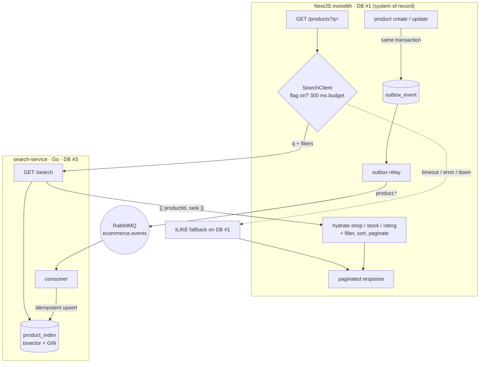

# Search service: event-driven index and two-stage retrieval

Product search was a `LIKE '%term%'` query inside the NestJS monolith. It scanned the whole `product`
table, was blind to Vietnamese accents (`dien thoai` never matched `Điện thoại`), and had no relevance
ranking. It moved to a dedicated Go service that owns a Postgres full-text index, wired into the monolith
behind a feature flag with a fallback to the old query.

The query plans and load numbers are in [search-explain.md](search-explain.md). This note is the shape of
the system and the decisions behind it.

## Overview

## Write path — the index is a CQRS read model

Product writes already emit domain events through a transactional outbox. The search service subscribes
to `product.*` and maintains `product_index` as a second read model (the first is the notification
service's own store). Key properties, all inherited from patterns already used elsewhere in the system:

- **Database-per-service.** The index lives in its own Postgres (DB #3), not in the monolith's database.
- **Transactional outbox.** The event is written in the same transaction as the product, so the index
  can never diverge from a committed write.
- **Idempotent consumer.** A `processed_events` table with a unique `event_id` makes at-least-once
  delivery safe to replay — the same dedupe approach the notification service uses.
- **`tsvector` + GIN + `unaccent`.** A trigger builds the search vector as
  `setweight(unaccent(name),'A') || setweight(unaccent(description),'B')` with the `simple` config (no
  stemmer, which suits Vietnamese), so a name match outranks a description match and accent-free queries
  match accented text.

## Read path — two-stage retrieval

The service returns **ranked product IDs, not full documents** — the monolith hydrates them from its own
database (Pattern B):

1. **Retrieve.** The monolith calls `/search`, which uses the GIN index to rank matches and returns a
   bounded window of `{ productId, rank }` (the top ~300 candidates).
2. **Filter, sort, paginate — authoritatively.** The monolith runs one query over those candidate IDs
   that re-applies the things the index deliberately does *not* hold: shop status, minimum rating,
   out-of-stock ordering, and any user-chosen sort. Total count and pagination are computed here, so they
   stay correct.
3. **Hydrate.** Only the final page (~20 products) is loaded with its relations (shop, variants, images).

**Why keep volatile data out of the index.** Stock, rating and shop status change far more often than a
product's name or description, and they are owned by the monolith. Denormalizing them into the index
would mean every stock change fans out an index write and every read risks serving a stale number.
Instead the index holds only what is stable, and the source-of-record database answers for the rest at
read time — the same retrieve-then-hydrate split that systems like Elasticsearch use when they return
document IDs and let the application load the records. The bounded candidate window is the honest cost of
this choice: results are the top-K most relevant matches, re-filtered and re-ranked.

## Graceful degradation

Search is an optimization, never a dependency. The client is **fail-open**:

- A **300 ms timeout** (via `AbortController`) plus a check on the HTTP status — `fetch` does not throw on
  5xx — means any timeout, error, or bad shape returns `null`, and the caller falls back to the old
  `ILIKE` query. If the service is asleep or down, the storefront still returns results.
- An empty result (HTTP 200, zero matches) is a **valid answer**, not a failure — it is returned as-is,
  not retried against `ILIKE`.
- A `SEARCH_SERVICE_ENABLED` flag (default off) is the kill switch: turning it off routes every request
  back through the monolith with no deploy.

## Results

See [search-explain.md](search-explain.md): the GIN index turns a full-table `Seq Scan` into a bitmap
index scan (6.7 ms vs 24.7 ms on 20k rows at the plan level), and end-to-end under load at 50k products
the p95 at 100 VU is **186 ms vs 6.07 s** — the old scan is O(rows), the indexed path stays roughly flat.

## Status and limitations

- **Integrated behind a flag and measured, not yet enabled for users in production.** The read path has
  been verified end-to-end locally (happy path, fallback, and filters) and load-tested; the production
  flag is still off pending the remaining rollout work.
- **Top-K window.** Deep pagination past the candidate window is out of scope by design.
- **No fuzzy matching yet.** A misspelling that full-text search misses is not caught; a `pg_trgm`
  similarity branch is the intended next step for that.
- **Reindex.** A backfill command to rebuild the index from the monolith's catalog (for a long outage or
  a schema change) is planned.
